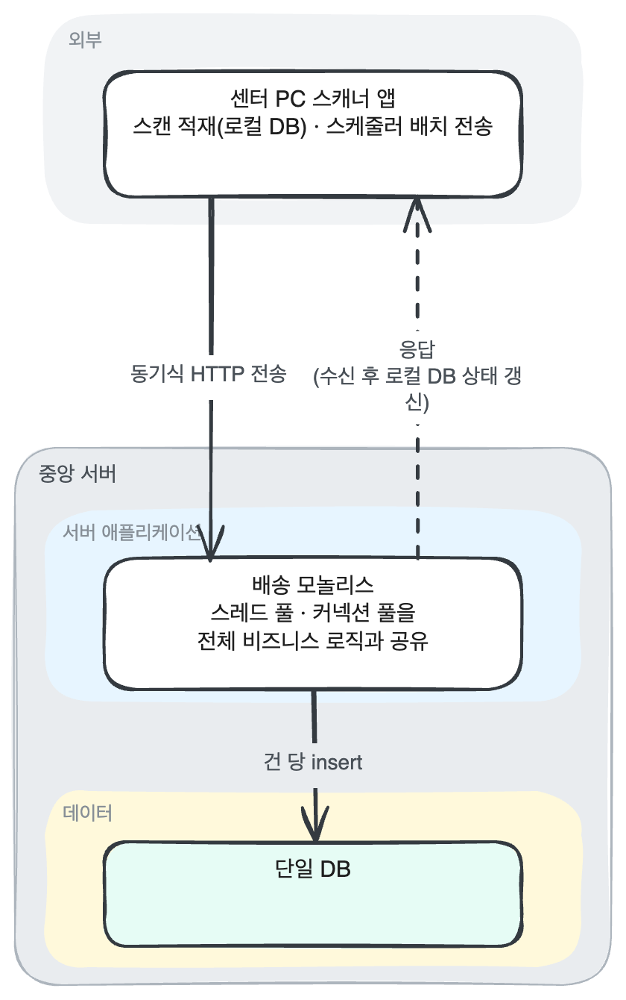
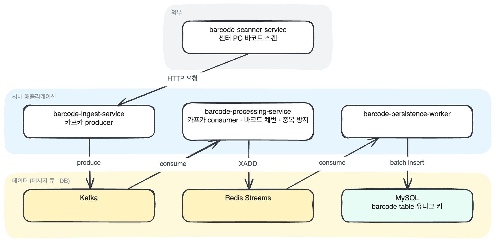
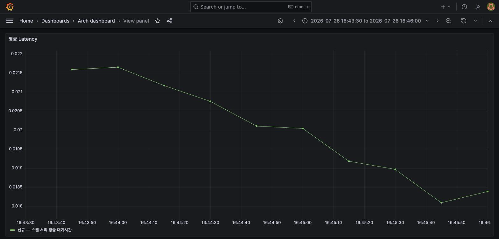
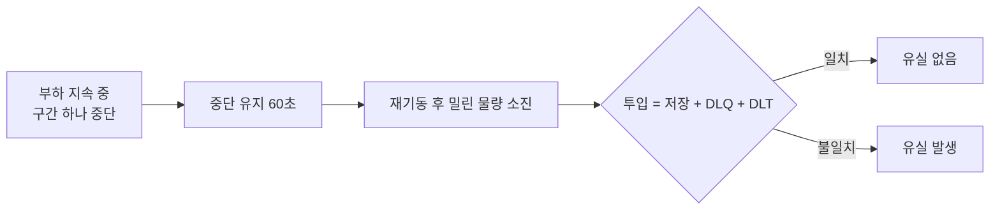
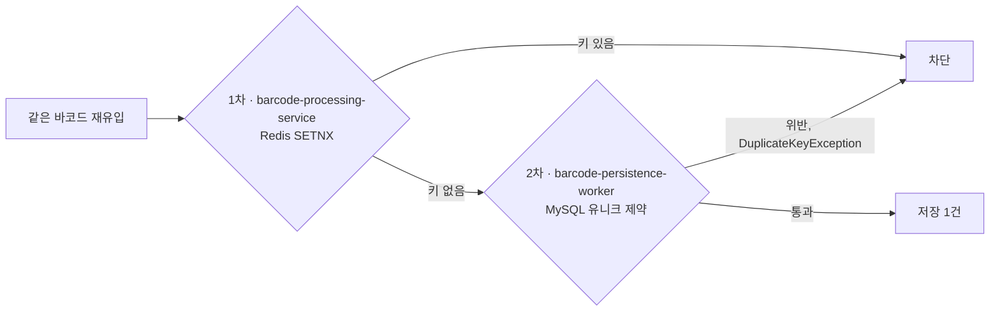

# 대규모 스캔 물량 분산 처리를 위한 비동기 Kafka/Redis Streams 파이프라인 구축

## 목차

1. [프로젝트 개요](#프로젝트-개요) — 기술 스택
2. [문제 상황](#문제-상황) — 핵심 문제 정의
3. [설계 결정](#설계-결정)
4. [검증 설계](#검증-설계) — 성능, 장애 전파, 유실, 중복

 

## 프로젝트 개요

Kafka와 Redis Streams 기반의 비동기 부하 분산 아키텍처를 도입하여 기존 동기식 DB 병목 현상과 시스템 동시성(Concurrency) 문제를 해결하고, 장애가 특정 구간을 넘어 번지지 않도록 격리하고, 중단 시에도 유실 없이 복구되는 처리 흐름을 설계했습니다.

 

## 기술 스택

| 구분 | 사용 기술 | 비고 |
| :--- | :--- | :--- |
| 언어 · 런타임 | Java 21 | 네 모듈 공통 |
| 프레임워크 | Spring Boot 3.5.7 | Web, WebFlux, Validation, Data JPA, Data Redis |
| 메시지 · 스트림 | Apache Kafka(cp-kafka 8.1.0), Redis Streams(redis alpine) | 유입 완충 큐 / 저장 직전 버퍼 큐 |
| 데이터 저장 | MySQL 8 | JPA와 JdbcTemplate 배치 저장 병행 |
| 모니터링 | Actuator, Micrometer, Prometheus 2.47.1, Grafana 10.1.5 | MySQL · Kafka · Redis exporter 포함 |
| 부하 테스트 | Apache JMeter | 신구 구조를 같은 조건으로 비교 |
| 빌드 · 실행 | Gradle 8.14.3, Docker Compose | 인프라와 애플리케이션 compose 파일 분리 |

[목차로 돌아가기](#목차)

 

## 문제 상황

프로모션이나 명절과 같이 물량이 몰리는 날이면, 대량의 바코드 스캔이 한꺼번에 유입되면서 바코드 처리와 저장에 병목이 발생했습니다.

센터 PC의 바코드 처리는 동기식으로 중앙 서버 DB의 처리 완료 결과를 받아야 사용 가능했으며, 서버 성능 지표가 전반적으로 높은 시간의 현장에서는 최악의 경우 4시간 이상 바코드 스캔 결과가 처리되지 않아, 새벽 배송의 실질적인 업무에 큰 차질을 빚었습니다.

예상 원인은 중앙 MySQL의 커넥션 사용이 한계를 넘어 사용, 트레이스 지연, 동시간대 다건의 엑셀 주문 업로드의 자원 점유 등 여러 요소의 복합적인 영향이었습니다.

매년 반복되는 악순환의 고리를 끊기 위해서라도, 구조적 개편은 필수적이었습니다.

 

## 핵심 문제 정의

**병목의 구조**
- 처리 지연 — 동기식 요청이 DB 커밋이 끝날 때까지 스레드를 붙잡습니다. 물량이 폭증하면 대기가 쌓여 스캔 적체로 이어집니다.
- 자원 경합 — 모든 로직이 한 애플리케이션에 묶인 모놀리스라, 한 곳의 점유가 공유 스레드 풀·커넥션 풀을 고갈시켜 전체 업무로 번집니다.
- 운영 종속 — 센터 PC마다 바코드 연동 설정이 물리 기기에 묶여, 원격 접속과 출근 인원에 의존합니다.

[목차로 돌아가기](#목차)

 

## 설계 결정

레거시 구조는 변경 자체가 리스크입니다. 문제 해결 여부와 무관하게 의도치 않은 장애가 전체로 번질 수 있기 때문입니다. 그래서 구조 전체를 바꾸는 대신 병목의 시작점인 바코드 유입 구간만 분리해, 개선의 효과와 장애의 영향 범위를 모두 이 구간 안에 격리하는 것이 최적이라고 판단했습니다.

레거시 구조와 개편한 아키텍처 구조도 비교입니다.

**기존 구조 — [barcode-old-pipeline](https://github.com/buss-sooin/barcode-old-pipeline)**

물류 센터의 바코드 스캔이 본사 서버의 동기 처리와 배치 동기화에 그대로 묶여 있는 구조.

 

**개선 구조 — [barcode-ingest-pipeline](https://github.com/buss-sooin/barcode-ingest-pipeline)**

Kafka는 파티션 분산 배치로 바코드 스캔 데이터가 폭발적으로 늘어도 유연하게 대응할 수 있으므로 스캔 데이터의 전송 입구로 설계했습니다. Redis Streams는 인메모리로 빠르고, 읽은 위치를 기록하는 Kafka의 오프셋과 달리 건별로 처리 여부를 추적하기 때문에 DB 저장의 연결 통로로 설계했습니다.

 

**구간별 설계 결정**

| 구성 요소 | 역할 | 책임 |
| :--- | :--- | :--- |
| barcode-ingest-service | 수신 즉시 Kafka로 전달, 응답 반환 | 응답 시간을 DB 지연에서 분리 |
| Kafka | 유입과 처리 사이의 완충 큐 | 이후 처리 단계에 장애가 생겨도 원본 데이터 보존 |
| barcode-processing-service | 바코드 이벤트 소비 후 사내 바코드 채번 | 바코드 중복 선별 |
| Redis Streams | DB 저장 직전의 버퍼 큐 | 폭주하는 유입을 소비 가능하고 DB가 감당할 양으로 배치 전달 |
| barcode-persistence-worker | 전달받은 배치를 일괄 저장 | 건당 저장 대비 DB 쓰기 부하 절감 |

 

**성능 개선 항목**

- 응답과 저장의 분리 — 스캔 요청을 받으면 Kafka로 넘기고 바로 응답합니다. 요청 후 중앙 서버에서 진행될 DB 커밋을 기다리지 않습니다.
- 자원의 분리 — 유입과 저장을 별도 프로세스로 나눠, 한쪽의 스레드 풀·커넥션 풀 고갈로 인한 지연이 다른 쪽의 프로세스에 영향을 주지 못하게 했습니다.
- 유입 속도와 저장 속도의 분리 — Redis Streams를 DB 앞에 두고, barcode-persistence-worker가 감당할 만큼만 꺼내 가게 했습니다.
- 건별 INSERT의 배치 전환 — JdbcTemplate의 batchUpdate 메서드와 rewriteBatchedStatements 설정을 활성화해, 다중 INSERT가 하나의 INSERT SQL로 실행되도록 했습니다.
- 소비의 분산 — barcode-persistence-worker를 여러 인스턴스로 띄워, 한 인스턴스가 막혀도 다른 인스턴스가 소비를 이어갑니다.

기존의 자바 애플리케이션의 비즈니스 서비스와 DB 트랜잭션 단위로 묶인 처리를 메시지 큐와 같은 별도 시스템으로 분리하면, 큐를 통한 전송이란 트레이드 오프로 데이터 전송 간의 유실과 중복이라는 부수적인 문제가 발생합니다. 이 두 가지는 아래 별도 절에서 설계와 검증을 함께 다룹니다.

[목차로 돌아가기](#목차)

 

## 검증 설계

개선이 실제로 효과가 있었는지 두 관점으로 나눠 확인했습니다.

1. 평상시 물량의 성능 개선 효과 — 응답 시간과 DB 쓰기 부하
2. 성능 저하로 장애 상황이 발생했을 때 지연 전파의 여부와 정도

기존 동기 구조와 재설계한 비동기 구조를 같은 조건의 컨테이너에 올려 같은 부하를 흘렸습니다.

> 원활한 성능 비교를 위해 병목이 관측 가능한 수준의 스케일로 축소함

 

## 평상시 물량의 성능 개선 결과

**검증 테스트 시나리오 구성**

- 목적: 응답 시간과 DB 쓰기 부하 비교
- 부하 대상: `POST /scan/barcode` — 센터 스캐너가 바코드를 전송하는 스캔 경로입니다.

| 구분 | 실행 조건 |
| :--- | :--- |
| 동시 테스트 요청 스레드 수 | 10개 |
| 지속 시간 | 180초 + 120초 |
| 목표 처리량 | 초당 100건 |

평상시 물량에 해당하는 부하를 신구 양쪽에 같은 조건으로 흘려 비교했습니다.

**API 응답 시간** (클라이언트 기준, JMeter old-first·new-first 2회 평균)

| 구분 | 구형 | 신규 | 개선 |
| :--- | :--- | :--- | :--- |
| 평균 응답 시간 | 약 11.2ms | 약 4.9ms | 약 2.3배 |
| 최대 응답 시간 | 약 148~158ms | 약 60~61ms | 약 2.5배 |

동기 구조에서 장애 지연 전파의 직접적인 원인 중 하나인, 커넥션 스레드를 점유하는 DB I/O를 비동기 전환으로 개선한 결과입니다.

구형과 신규의 스캔 엔드포인트 응답시간을 시간순으로 정렬한 그래프.

 

MySQL InnoDB의 초당 쓰기 횟수. 건별 저장을 배치로 묶어 디스크 I/O 부하를 낮춘 결과로, 구형은 안정 수준에 도달하지 못하고 계속 증가하는 반면 신규는 낮은 수준을 유지합니다.

 

## 장애 상황에서의 지연 전파 해소 결과

**검증 테스트 시나리오 구성**

- 목적: 저장 계층 포화가 어디까지 번지는지 관측
- 부하 대상: `POST /api/barcode/touch-recent?limit=5` — 스캔 API를 호출하지 않고 저장 계층(구형 delivery-monolith, 신규 barcode-persistence-worker)을 직접 호출해 커넥션 풀을 포화시킵니다.

| 구분 | 실행 조건 |
| :--- | :--- |
| HikariCP maximumPoolSize | 구형(delivery-monolith) 10개, 신규(barcode-persistence-worker) 20개 |
| 동시 테스트 요청 스레드 수 | 구형(delivery-monolith) 30 → 50 → 80개, 점진적으로 늘려 지연 전파를 관측. 신규(barcode-persistence-worker) 80개 |
| 지속 시간 | 60초(격리 확인), 180초(전파 확인) |
| 목표 처리량 | 제한 없음, 커넥션 풀이 찰 때까지 |

저장 계층의 커넥션 풀을 포화시켜, 그 여파가 유입 구간까지 번지는지 경로를 따라가며 관측했습니다.

**구형 — 여파가 스캔 응답까지 번짐**

본사 서버(delivery-monolith)의 DB 커넥션 풀을 포화시키자, 센터-본사 배치 동기화(barcode-scheduler)가 지연되며 그 여파가 센터 스캐너(barcode-input-simulator)의 응답시간까지 번졌습니다. 평시 약 11~12ms에서 최대 약 72ms(약 6배)로 늘었고, 센터 쪽 미동기화 건수는 최대 1,511건까지 쌓였습니다.

delivery-monolith의 커넥션 풀이 한계에 도달해 밀린 요청이 대기와 처리를 반복하는 구간.

본사 서버 과부하 여파가 barcode-scheduler를 거쳐 센터 쪽에 쌓이는 모습. 장애 시작 후 180초 동안 미전송 바코드가 최고 1,511건까지 늘다가, 장애가 풀리자 수십 초 만에 0 근처로 정리됩니다.

 

**신규 — 유입 구간이 영향받지 않음**

같은 방식으로 barcode-persistence-worker의 DB 커넥션 풀을 완전히 포화시켜도(대기 중인 요청 약 55건 지속), barcode-ingest-service의 응답시간은 평시와 같은 수준을 유지했습니다. Kafka와 Redis Streams가 유입과 저장을 갈라놓았기 때문입니다. 저장 계층 안에서도 포화된 워커 인스턴스의 미처리 메시지는 최대 9건, 15초 안에 해소됐고 전체 처리 지연은 사실상 0에 머물렀습니다. 다른 워커 인스턴스가 계속 소비했기 때문입니다.

worker-1의 커넥션 풀이 60초간 한계에 머무는 장애 구간(worker-2 풀은 내내 여유). 아래 두 그래프는 같은 구간에서 이 장애가 어디까지 번지는지 보여줍니다.

 

같은 구간의 barcode-ingest-service 스캔 처리 평균 응답시간(서버 측정). 포화 내내 18~22ms 범위에서 상승 없이 유지 — 저장 계층의 포화가 유입 계층으로 번지지 않습니다.

 

같은 구간에서 worker-1의 미처리 메시지(PEL)는 최대 9건, 15초 만에 해소되고 worker-2는 내내 0을 유지. 한 인스턴스가 막혀도 다른 워커가 이어받아 병목이 확산되지 않습니다.

두 경우 모두 에러 없이(0%) 재현했고, 장애 해소 후 정상 수준으로 회복됨을 확인했습니다.

 

## 유실 대비

**설계**

- Kafka: 받은 메시지를 디스크 로그에 남기고 보존 기간 동안 유지. 브로커가 강제로 종료돼도 재기동 후 그 로그에서 이어감
- Redis Streams: AOF로 쓰기 명령을 디스크에 기록. 재기동 시 스트림 복원
- ack와 PEL: barcode-persistence-worker가 읽어 간 메시지는 PEL에 남고, MySQL 저장을 마친 건만 ack해 목록에서 빠짐. 워커가 중간에 멈추면 ack되지 않은 건만 다른 워커가 가져가 다시 처리
- DLT·DLQ: 재시도로도 처리하지 못한 건은 따로 빼내 격리

**검증**

Kafka, barcode-processing-service, Redis, barcode-persistence-worker를 각각 강제로 중단시켜 투입한 바코드가 전부 저장되는지 확인했습니다. 네 시나리오 모두 유실이 없었습니다.

중단 구간을 하나씩 바꿔 가며 같은 절차를 반복한 검증 흐름입니다.

| 중단 구간 | 투입 | 저장 | DLQ·DLT |
| :--- | :--- | :--- | :--- |
| Kafka | 3,657 | 3,657 | 0건 |
| barcode-processing-service | 3,655 | 3,655 | 0건 |
| Redis | 3,658 | 3,658 | 0건 |
| barcode-persistence-worker(2개 동시) | 3,635 | 3,635 | 0건 |

이 검증은 Kafka와 Redis의 컨테이너만 중단했다 다시 띄우는 경우만을 상정했습니다. 프로세스만 멈췄을 뿐 디스크에 쌓인 Kafka의 로그 파일과 Redis의 AOF 파일은 그대로 남아 있었고, 복구가 된 것도 그 파일들이 있었기 때문입니다.

컨테이너 자체를 지우는 경우와 Kafka 브로커들이 죽는 경우는 다루지 않았습니다. 컨테이너 자체를 지우는 경우는 데이터를 컨테이너 밖의 저장소에 두어야 대비되고, Kafka 브로커들이 죽는 경우는 브로커를 한 대만 두지 않고 복제본을 둬야 대비됩니다. 다만 복제본을 두더라도, 리더 브로커가 죽고 새 리더를 뽑는 사이에 아직 복제되지 않은 메시지가 사라질 수 있어 유실을 막는 방식 자체가 달라집니다.

DLT와 DLQ도 지금은 실패한 건이 쌓이기만 하고 보존 기간이 지나면 지워집니다. 운영에서는 이를 따로 보관하고, 쌓였을 때 운영자에게 알리는 장치가 필요합니다.

 

## 중복 대비

**설계**

- 1차 · Redis SETNX로 원자성 확보: 키가 없을 때만 기록에 성공하므로 검사와 기록이 한 번에 끝남. 중복을 Redis 발행 전에 걸러내 소수의 중복 데이터가 DB 배치 저장 시에 전체 실패 유발을 방지함
- 2차 · MySQL 필수 키 유니크 제약으로 정합성 확보: SETNX 단계에서 문제가 생겨 예외로 유입되어도 저장 단계에서 차단

**검증**

중복된 바코드 데이터를 흘려보내 SETNX와 유니크 제약으로 중복을 걸러내 최종적으로 1건의 데이터만 저장됐는지 확인했습니다.

같은 바코드가 다시 들어왔을 때 두 단계 중 어디서 걸리는지를 나타낸 경로입니다.

| 시나리오 | 조건 | 저장 건수 변화 | DLQ·DLT 적재 |
| :--- | :--- | :--- | :--- |
| 클라이언트 중복 재전송 | 같은 바코드 5회 연속 전송 | 0 (Redis SETNX에서 차단) | 0건 |
| Kafka 재소비(오프셋 되감김) | Redis SETNX 키가 남아 있는 상태 | 0 (Redis SETNX에서 차단) | 0건 |
| Redis 키 소실 후 재소비 | SETNX 키를 지운 상태 | 0 (MySQL 유니크 제약에서 차단) | 0건 |

중복은 어느 경로로 들어와도 한 건만 저장됩니다.

[목차로 돌아가기](#목차)
