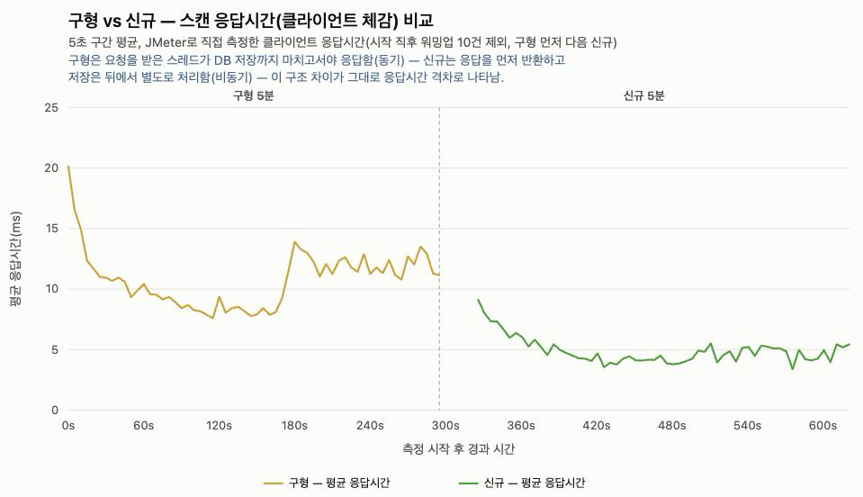
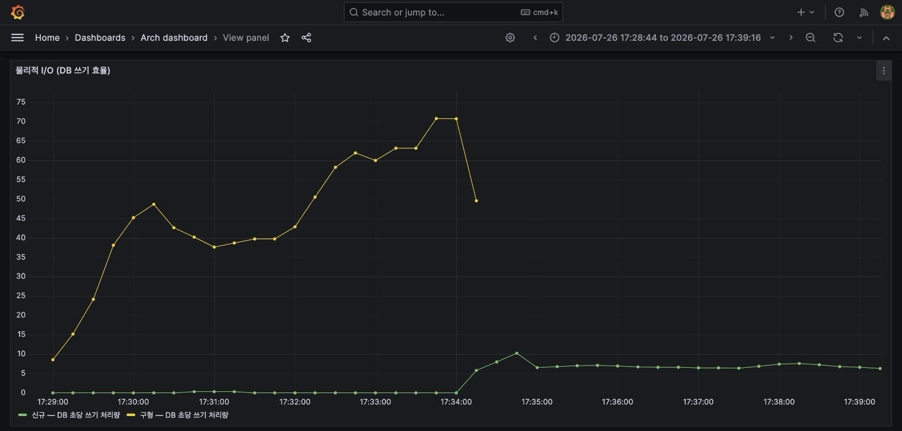
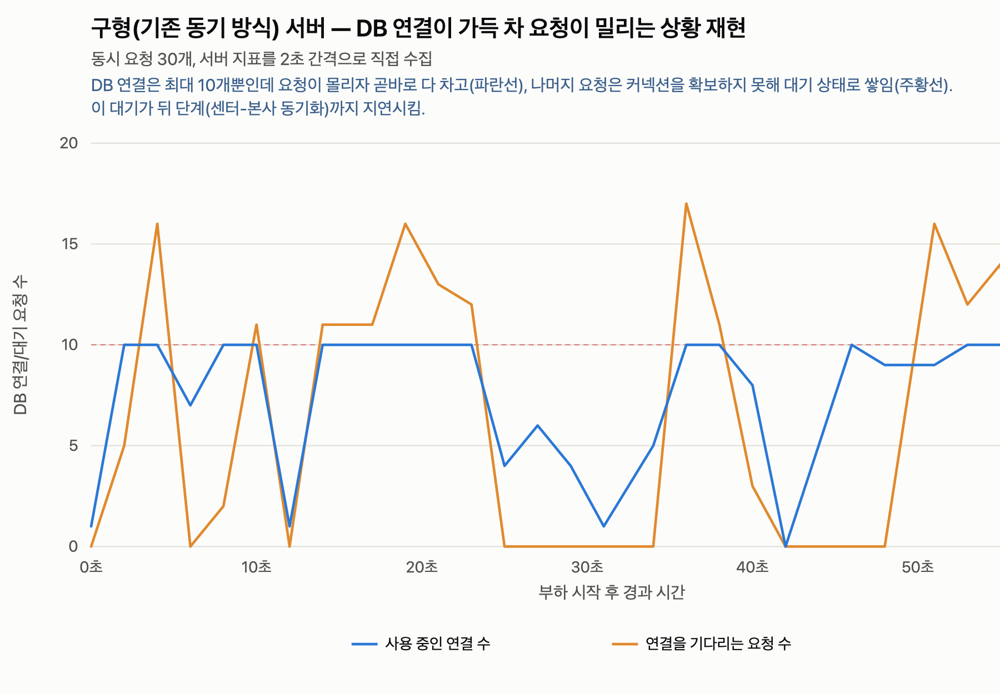
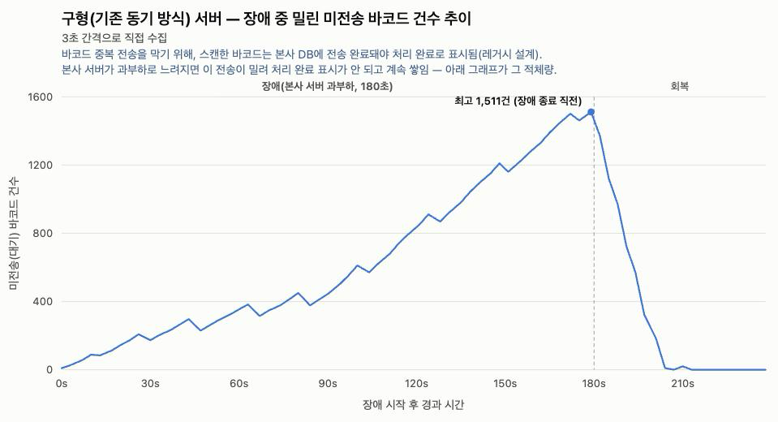
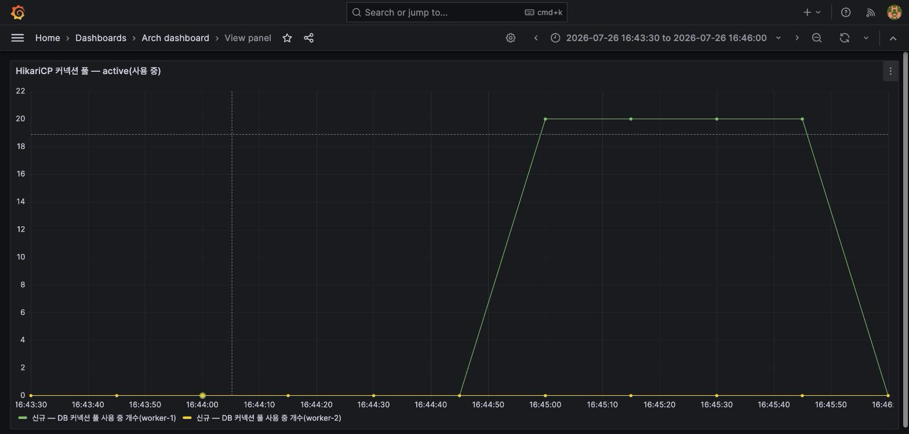
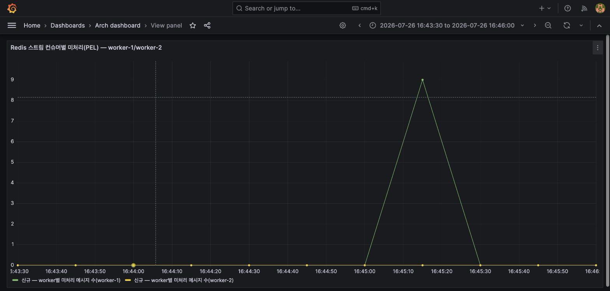

# 대규모 스캔 물량 분산 처리를 위한 비동기 Kafka/Redis Streams 파이프라인 구축

## 프로젝트 개요

Kafka와 Redis Streams 기반의 비동기 부하 분산 아키텍처를 도입하여 기존 동기식 DB 병목 현상과 시스템 동시성(Concurrency) 문제를 해결하고, 장애가 특정 구간을 넘어 번지지 않도록 격리하고, 중단 시에도 유실 없이 복구되는 처리 흐름을 설계했습니다.

## 문제 해결 동기

프로모션이나 명절과 같이 물량이 몰리는 날이면, 대량의 바코드 스캔이 한꺼번에 유입되면서 바코드 처리와 저장에 병목이 발생했습니다. 현장에서는 최악의 경우 4시간 이상 바코드 스캔 결과가 처리되지 않아, 새벽 배송의 실질적인 업무에 큰 차질을 빚었습니다. 매년 반복되는 악순환의 고리를 끊기 위해서라도, 구조적 개편은 필수적이었습니다.

## 핵심 문제 정의

**병목의 구조**
- 처리 지연 — 동기식 요청이 DB 커밋이 끝날 때까지 스레드를 붙잡습니다. 물량이 폭증하면 대기가 쌓여 스캔 적체로 이어집니다.
- 자원 경합 — 모든 로직이 한 애플리케이션에 묶인 모놀리스라, 한 곳의 점유가 공유 스레드 풀·커넥션 풀을 고갈시켜 전체 업무로 번집니다.
- 운영 종속 — 센터 PC마다 바코드 연동 설정이 물리 기기에 묶여, 원격 접속과 출근 인원에 의존합니다.

## 설계 결정

레거시 구조는 변경 자체가 리스크입니다. 문제 해결 여부와 무관하게 의도치 않은 장애가 전체로 번질 수 있기 때문입니다. 그래서 구조 전체를 바꾸는 대신 병목의 시작점인 바코드 유입 구간만 분리해, 개선의 효과와 장애의 영향 범위를 모두 이 구간 안에 격리하는 것이 최적이라고 판단했습니다.

**구간별 설계 결정**

| 구성 요소 | 역할 | 책임 |
| :--- | :--- | :--- |
| ingest | 수신 즉시 Kafka로 전달, 응답 반환 | 응답 시간을 DB 지연에서 분리 |
| Kafka | 유입과 처리 사이의 완충 큐 | 이후 처리 단계에 장애가 생겨도 원본 데이터 보존 |
| processing | 바코드 이벤트 소비 후 사내 바코드 채번 | 바코드 중복 선별 |
| Redis Streams | DB 저장 직전의 버퍼 큐 | 폭주하는 유입을 소비 가능하고 DB가 감당할 양으로 배치 전달 |
| worker | 전달받은 배치를 일괄 저장 | 건당 저장 대비 DB 쓰기 부하 절감 |

**바코드 중복 무결성**
- Redis SETNX: 이미 처리한 바코드를 표시해 두고, 같은 바코드가 다시 들어오면 저장 전에 걸러냄
- MySQL 유니크 제약(`internalBarcodeId`): 중복이 DB까지 도달해도 저장 단계에서 차단
- DB 저장 애플리케이션이 MySQL 저장을 마치면 Redis Streams에 완료를 표시하고, 표시되지 않은 메시지는 일정 시간 후 다시 꺼내 재저장 — 저장 중 중단돼도 유실 방지

## 측정과 결과

기존 동기 구조 앱과 재설계한 비동기 구조 앱에 같은 부하를 각각 흘려보내 컨테이너 기준으로 비교했습니다.

> 원활한 성능 비교를 위해 병목이 관측 가능한 수준의 스케일로 축소함

**API 응답 시간(클라이언트 기준, JMeter old-first·new-first 2회 평균)**

| 구분 | 구형 | 신규 | 개선 |
| :--- | :--- | :--- | :--- |
| 평균 응답 시간 | 약 11.2ms | 약 4.9ms | 약 2.3배 |
| 최대 응답 시간 | 약 148~158ms | 약 60~61ms | 약 2.5배 |
| 에러율 / 정합성 | 0%, 투입=저장 완전 일치 | 0%, 투입=저장 완전 일치, DLQ/DLT 0건 | - |

동기 구조에서 응답 시간의 대부분을 차지하던 DB I/O 대기(스레드 점유)를 비동기 전환으로 응답 경로에서 걷어낸 결과입니다.


JMeter가 실제로 때린 스캔 엔드포인트(구형: barcode-input-simulator, 신규: scanner)의 응답시간을 5초 구간 평균으로 이어붙인 것(시작 직후 워밍업 10건은 제외). 위 표의 수치가 바로 이 데이터에서 나옴. (정상 부하 라운드, 위 표와 같은 회차)


MySQL InnoDB의 초당 데이터 쓰기 횟수. 건별 저장을 배치 저장으로 묶어 물리적 디스크 I/O 부하를 낮춤(구형은 정상상태 도달 못 하고 계속 증가하는 경향, 신규는 낮은 수준에서 안정). (정상 부하 라운드)

## 장애 시나리오 검증

DB 저장 계층이 완전히 막히는 장애 상황을 실제 API 부하로 재현해, 그 영향이 어디까지 번지는지 확인했습니다.

- 구형: 본사 서버(delivery-monolith)의 DB 커넥션 풀을 포화시키자, 센터-본사 배치 동기화(barcode-scheduler)가 지연되며 그 여파가 센터 스캐너(barcode-input-simulator)의 응답시간까지 번짐 — 평시 약 11~12ms에서 최대 약 72ms(약 6배)로 증가, 센터 쪽 미동기화 건수(도메인 적체)는 최대 1,511건까지 쌓임.


delivery-monolith의 HikariCP 커넥션 풀(최대 10)이 동시성 30 조건에서 반복적으로 완전 포화(active 10/10)와 대기 급증(pending 최대 17)을 오가는 구간. 이 여파가 barcode-scheduler를 거쳐 센터 스캐너 응답시간·도메인 적체로 번짐. (Grafana가 이 순간을 스크랩하지 못해, 해머 스크립트가 actuator를 2초 간격으로 직접 폴링한 원본 수치로 그림) (장애 재현 라운드)


본사 서버 과부하 여파가 barcode-scheduler를 거쳐 센터 쪽에 그대로 쌓이는 모습. 장애 시작 후 180초 동안 미전송 바코드가 최고 1,511건까지 단조 증가하다가, 장애가 풀리자 수십 초 만에 0 근처로 빠르게 정리됨. (장애 재현 라운드, 위와 같은 동시성80 회차)

- 신규: 같은 방식으로 저장 계층(worker)의 DB 커넥션 풀을 완전히 포화시켜도(대기 중인 요청 약 55건 지속), 유입 계층(ingest)의 응답시간은 전혀 영향받지 않음(오히려 평시와 동일 수준) — Kafka·Redis Streams가 유입과 저장을 분리한 결과. 저장 계층 내부에서도, 포화된 워커 인스턴스의 미처리 메시지는 최대 9건·15초 내 해소에 그치고 시스템 전체 처리 지연은 사실상 0에 머묾(다중 워커 중 다른 인스턴스가 계속 소비).


worker-1의 HikariCP 커넥션 풀이 60초간 완전히 포화(active 20/20)되는 동안에도 ingest 응답시간은 영향받지 않음. (장애 재현 라운드)


같은 구간에서 worker-1의 미처리 메시지(PEL)는 최대 9건·15초 만에 해소되고, worker-2는 내내 0을 유지 — 한 인스턴스가 막혀도 다른 워커가 이어받아 병목이 확산되지 않음. (장애 재현 라운드, 위와 같은 구간)

- 두 경우 모두 에러 없이(0%) 재현했고, 장애 해소 후 정상 수준으로 회복됨을 확인.

## 실행 방법

**컨테이너로 전체 기동**
```bash
docker compose -f docker-compose.yml -f docker-compose.apps.yml -f monitoring-compose.yml -p barcode-pipeline up -d --build
```

**DLQ/DLT 적재 확인**
```bash
docker exec redis redis-cli XLEN barcode:stream:dlq
```

**Grafana 대시보드**: http://localhost:3000 (계정 `admin` / `.env`의 `GRAFANA_ADMIN_PASSWORD`)

## 근거 자료

이 README의 수치·주장은 아래 문서로 뒷받침됩니다. 내용을 검토·수정할 때 이 파일들을 함께 참고하세요.

- `docs/measurements/2026-07-26-1728-old-first.md`, `2026-07-26-1741-new-first.md` — "측정과 결과" 절의 응답시간·InnoDB 쓰기 수치 근거(컨테이너 기준, 2회 반복으로 순서 편향 없음 확인)
- `docs/measurements/2026-07-26-1723-touch-recent-connection-contention.md` — "장애 시나리오 검증" 절 전체 근거(구형 전파 경로, 신규 격리 확인, 동시성별 단계 실험)
- `TECH-NOTES.md` — MySQL InnoDB 잠금·격리 수준 등 재검증에 쓰인 공식 문서 확인 기록
- `FIX-PLAN-DONE.md` 항목7·18·21 — 컨테이너화 경위, host-direct 기준 원 측정, DB 지연 주입 자원 경합 최초 검증
