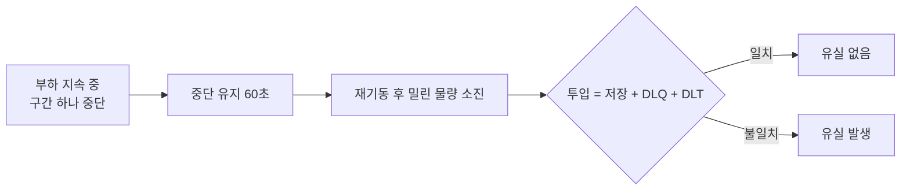
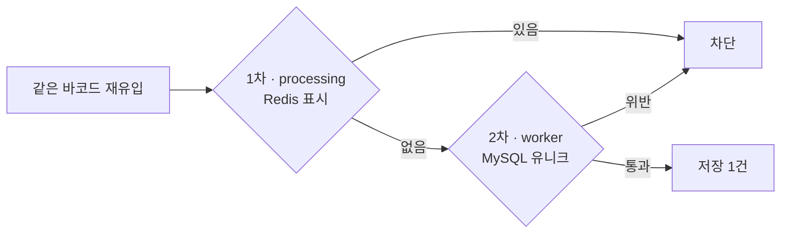

# 대규모 스캔 물량 분산 처리를 위한 비동기 Kafka/Redis Streams 파이프라인 구축

## 프로젝트 개요

Kafka와 Redis Streams 기반의 비동기 부하 분산 아키텍처를 도입하여 기존 동기식 DB 병목 현상과 시스템 동시성(Concurrency) 문제를 해결하고, 장애가 특정 구간을 넘어 번지지 않도록 격리하고, 중단 시에도 유실 없이 복구되는 처리 흐름을 설계했습니다.

## 문제 해결 동기

프로모션이나 명절과 같이 물량이 몰리는 날이면, 대량의 바코드 스캔이 한꺼번에 유입되면서 바코드 처리와 저장에 병목이 발생했습니다. 현장에서는 최악의 경우 4시간 이상 바코드 스캔 결과가 처리되지 않아, 새벽 배송의 실질적인 업무에 큰 차질을 빚었습니다. 매년 반복되는 악순환의 고리를 끊기 위해서라도, 구조적 개편은 필수적이었습니다.

## 핵심 문제 정의

**병목의 구조**
- 처리 지연 — 동기식 요청이 DB 커밋이 끝날 때까지 스레드를 붙잡습니다. 물량이 폭증하면 대기가 쌓여 스캔 적체로 이어집니다.
- 자원 경합 — 모든 로직이 한 애플리케이션에 묶인 모놀리스라, 한 곳의 점유가 공유 스레드 풀·커넥션 풀을 고갈시켜 전체 업무로 번집니다.
- 운영 종속 — 센터 PC마다 바코드 연동 설정이 물리 기기에 묶여, 원격 접속과 출근 인원에 의존합니다.

## 설계 결정

레거시 구조는 변경 자체가 리스크입니다. 문제 해결 여부와 무관하게 의도치 않은 장애가 전체로 번질 수 있기 때문입니다. 그래서 구조 전체를 바꾸는 대신 병목의 시작점인 바코드 유입 구간만 분리해, 개선의 효과와 장애의 영향 범위를 모두 이 구간 안에 격리하는 것이 최적이라고 판단했습니다.

센터의 스캔이 본사 서버의 동기 처리와 배치 동기화에 그대로 묶여 있는 구조.

유입 구간을 떼어내 Kafka와 Redis Streams를 사이에 둔 구조.

**구간별 설계 결정**

| 구성 요소 | 역할 | 책임 |
| :--- | :--- | :--- |
| ingest | 수신 즉시 Kafka로 전달, 응답 반환 | 응답 시간을 DB 지연에서 분리 |
| Kafka | 유입과 처리 사이의 완충 큐 | 이후 처리 단계에 장애가 생겨도 원본 데이터 보존 |
| processing | 바코드 이벤트 소비 후 사내 바코드 채번 | 바코드 중복 선별 |
| Redis Streams | DB 저장 직전의 버퍼 큐 | 폭주하는 유입을 소비 가능하고 DB가 감당할 양으로 배치 전달 |
| worker | 전달받은 배치를 일괄 저장 | 건당 저장 대비 DB 쓰기 부하 절감 |

기존의 자바 애플리케이션의 비즈니스 서비스와 DB 트랜잭션 단위로 묶인 처리를 메시지 큐와 같은 별도 시스템으로 분리하면, 큐를 통한 전송이란 트레이드 오프로 데이터 전송 간의 유실과 중복이라는 부수적인 문제가 발생합니다. 두 가지 모두 뒤의 장애 시나리오 검증에서 확인했습니다.

**바코드 중복 무결성**
- Redis SETNX: 이미 처리한 바코드를 표시해 두고, 같은 바코드가 다시 들어오면 저장 전에 걸러냄
- MySQL 유니크 제약(`internalBarcodeId`): 중복이 DB까지 도달해도 저장 단계에서 차단
- DB 저장 애플리케이션이 MySQL 저장을 마치면 Redis Streams에 완료를 표시하고, 표시되지 않은 메시지는 일정 시간 후 다시 꺼내 재저장 — 저장 중 중단돼도 유실 방지

## 측정과 결과

기존 동기 구조 앱과 재설계한 비동기 구조 앱 컨테이너들에 같은 부하를 인입시켜 비교했습니다. 서버가 평상시의 원활한 물량을 처리할 때의 성능을 측정하는 부하와, 서버가 장애 상황을 유발할 수 있는 급격한 물량 인입의 상황을 측정하는 부하로 나눠서 수행했습니다.

> 원활한 성능 비교를 위해 병목이 관측 가능한 수준의 스케일로 축소함

**API 응답 시간(클라이언트 기준, JMeter old-first·new-first 2회 평균)**

| 구분 | 구형 | 신규 | 개선 |
| :--- | :--- | :--- | :--- |
| 평균 응답 시간 | 약 11.2ms | 약 4.9ms | 약 2.3배 |
| 최대 응답 시간 | 약 148~158ms | 약 60~61ms | 약 2.5배 |

동기 구조에서 장애 지연 전파의 직접적인 원인 중 하나인, 커넥션 스레드를 점유하는 DB I/O를 비동기 전환으로 개선한 결과입니다.

구형과 신규의 스캔 엔드포인트 응답시간을 시간순으로 이어 붙인 것. 위 표의 수치가 이 그래프에서 나옵니다. (평상시 물량)

MySQL InnoDB의 초당 쓰기 횟수. 건별 저장을 배치로 묶어 디스크 I/O 부하를 낮춤. 구형은 안정 수준에 도달하지 못하고 계속 증가하는 반면 신규는 낮은 수준을 유지. (평상시 물량)

## 장애 시나리오 검증

### 지연 전파와 격리 검증

DB 저장 계층이 완전히 막히는 장애 상황을 실제 API 부하로 재현해, 그 영향이 어디까지 번지는지 확인했습니다.

- 구형: 본사 서버(delivery-monolith)의 DB 커넥션 풀을 포화시키자, 센터-본사 배치 동기화(barcode-scheduler)가 지연되며 그 여파가 센터 스캐너(barcode-input-simulator)의 응답시간까지 번짐 — 평시 약 11~12ms에서 최대 약 72ms(약 6배)로 증가, 센터 쪽 미동기화 건수(도메인 적체)는 최대 1,511건까지 쌓임.

delivery-monolith의 커넥션 풀이 한계에 도달해 밀린 요청이 대기와 처리를 반복하는 구간. 이 여파가 barcode-scheduler를 거쳐 센터 스캐너의 응답시간과 적체로 번짐. (급격한 물량 인입)

본사 서버 과부하 여파가 barcode-scheduler를 거쳐 센터 쪽에 그대로 쌓이는 모습. 장애 시작 후 180초 동안 미전송 바코드가 최고 1,511건까지 증가하다가, 장애가 풀리자 수십 초 만에 0 근처로 정리됨. (급격한 물량 인입)

- 신규: 같은 방식으로 저장 계층(worker)의 DB 커넥션 풀을 완전히 포화시켜도(대기 중인 요청 약 55건 지속), 유입 계층(ingest)의 응답시간은 전혀 영향받지 않음(오히려 평시와 동일 수준) — Kafka·Redis Streams가 유입과 저장을 분리한 결과. 저장 계층 내부에서도, 포화된 워커 인스턴스의 미처리 메시지는 최대 9건·15초 내 해소에 그치고 시스템 전체 처리 지연은 사실상 0에 머묾(다중 워커 중 다른 인스턴스가 계속 소비).

worker-1의 커넥션 풀이 60초간 한계에 머무는 동안에도 ingest 응답시간은 영향받지 않음. (급격한 물량 인입)

같은 구간에서 worker-1의 미처리 메시지(PEL)는 최대 9건·15초 만에 해소되고, worker-2는 내내 0을 유지 — 한 인스턴스가 막혀도 다른 워커가 이어받아 병목이 확산되지 않음. (급격한 물량 인입)

- 두 경우 모두 에러 없이(0%) 재현했고, 장애 해소 후 정상 수준으로 회복됨을 확인.

### 유실 대비 검증

전송의 흐름을 담당하는 메시지 큐 시스템이 중단됐을 때도 데이터는 유실이 되면 안 됩니다. Kafka는 받은 메시지를 디스크 로그에 남기고 보존 기간 동안 유지하므로, 브로커가 강제로 종료돼도 재기동 후 그 로그에서 이어집니다. Redis Streams는 AOF로 명령을 디스크에 기록해 재기동 시 스트림을 되살립니다. 처리하지 못하거나 예상하지 못한 예외가 난 건은 DLT와 DLQ로 보내 따로 처리합니다. 다음 순서로 확인했습니다.

| 중단 구간 | 투입 | 저장 | DLQ·DLT | 재기동 후 소진 |
| :--- | :--- | :--- | :--- | :--- |
| Kafka | 3,657 | 3,657 | 0건 | 부하 종료 시점 이미 0 |
| processing | 3,655 | 3,655 | 0건 | 약 24~39초 |
| Redis | 3,658 | 3,658 | 0건 | 약 15~30초 |
| worker(2개 동시) | 3,635 | 3,635 | 0건 | 약 15~30초 |

네 구간 모두 투입과 저장이 일치했습니다.

이 검증은 프로세스만 재시작되고 디스크는 유지되는 경우를 전제로 합니다. 인스턴스 교체까지 견디는 영속 볼륨, 브로커 이중화, DLT와 DLQ의 영구 보관과 알림은 이 프로젝트 규모에서 다루지 않았습니다. 다만 이중화를 하면 순서, 재처리, 리더 선출에서 유실이 새로 생겨 대비 방식이 달라진다는 점은 확인해 두었습니다.

### 중복 대비 검증

같은 바코드가 여러 번 들어오는 상황을 실제로 만들어, 두 겹의 방어선이 각각 작동하는지 확인했습니다.

| 시나리오 | 조건 | 저장 건수 변화 | DLQ/DLT 적재 |
| :--- | :--- | :--- | :--- |
| 클라이언트 중복 재전송 | 같은 바코드 5회 연속 | 0 (1차에서 차단) | 0건 |
| Kafka 재소비(오프셋 되감김) | Redis 표시 살아있음 | 0 (1차에서 차단) | 0건 |
| 1차 방어선 무력화 후 재소비 | Redis 표시 삭제 | 0 (2차에서 차단) | 0건 |

중복은 어느 경로로 들어와도 한 건만 저장됩니다.
