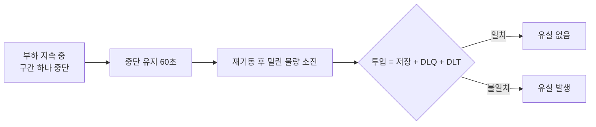
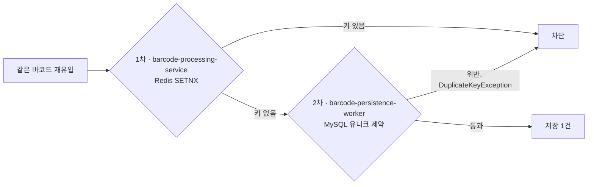
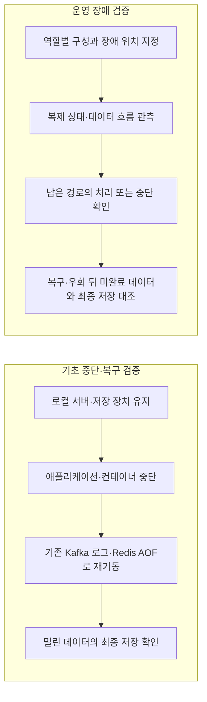

# 대규모 스캔 물량 분산 처리를 위한 비동기 Kafka/Redis Streams 파이프라인 구축

## 목차

1. [프로젝트 개요](#프로젝트-개요) — 기술 스택
2. [문제 상황](#문제-상황) — 핵심 문제 정의
3. [설계 결정](#설계-결정)
4. [검증 설계](#검증-설계) — 성능과 장애 전파
5. [데이터 정합성 검증](#데이터-정합성-검증) — 유실, 중복, 기초 중단·복구
6. [운영 장애 검증](#운영-장애-검증) — 장애 위치별 처리와 복구
7. [AI를 활용한 엔지니어링](#ai를-활용한-엔지니어링)

 

## 프로젝트 개요

Kafka와 Redis Streams 기반의 비동기 부하 분산 아키텍처를 도입하여 기존 동기식 DB 병목 현상과 시스템 동시성(Concurrency) 문제를 해결하고, 장애가 특정 구간을 넘어 번지지 않도록 격리하며, 중단 후 미완료 데이터를 다시 처리하는 흐름을 설계했습니다.

기존 구조와 성능·장애 전파를 비교하고, 데이터 정합성 및 제한된 로컬 운영 장애 조건에서의 처리·복구 결과를 별도로 검증했습니다.

 

## 기술 스택

| 구분 | 사용 기술 | 비고 |
| :--- | :--- | :--- |
| 언어 · 런타임 | Java 21 | 네 모듈 공통 |
| 프레임워크 | Spring Boot 3.5.7 | Web, WebFlux, Validation, Data JPA, Data Redis |
| 메시지 · 스트림 | Apache Kafka(cp-kafka 8.1.0), Redis Streams(redis alpine) | 유입 완충 큐 / 저장 직전 버퍼 큐 |
| 데이터 저장 | MySQL 8 | JPA와 JdbcTemplate 배치 저장 병행 |
| 모니터링 | Actuator, Micrometer, Prometheus 2.47.1, Grafana 10.1.5 | MySQL · Kafka · Redis exporter 포함 |
| 부하 테스트 | Apache JMeter | 신구 구조를 같은 조건으로 비교 |
| 빌드 · 실행 | Gradle 8.14.3, Docker Compose | 인프라와 애플리케이션 compose 파일 분리 |

[목차로 돌아가기](#목차)

 

## 문제 상황

프로모션이나 명절과 같이 물량이 몰리는 날이면, 대량의 바코드 스캔이 한꺼번에 유입되면서 바코드 처리와 저장에 병목이 발생했습니다.

센터 PC의 바코드 처리는 동기식으로 중앙 서버 DB의 처리 완료 결과를 받아야 사용 가능했으며, 서버 성능 지표가 전반적으로 높은 시간의 현장에서는 최악의 경우 4시간 이상 바코드 스캔 결과가 처리되지 않아, 새벽 배송의 실질적인 업무에 큰 차질을 빚었습니다.

예상 원인은 중앙 MySQL의 커넥션 사용이 한계를 넘어 사용, 트레이스 지연, 동시간대 다건의 엑셀 주문 업로드의 자원 점유 등 여러 요소의 복합적인 영향이었습니다.

매년 반복되는 악순환의 고리를 끊기 위해서라도, 구조적 개편은 필수적이었습니다.

 

## 핵심 문제 정의

**병목의 구조**
- 처리 지연 — 동기식 요청이 DB 커밋이 끝날 때까지 스레드를 붙잡습니다. 물량이 폭증하면 대기가 쌓여 스캔 적체로 이어집니다.
- 자원 경합 — 모든 로직이 한 애플리케이션에 묶인 모놀리스라, 한 곳의 점유가 공유 스레드 풀·커넥션 풀을 고갈시켜 전체 업무로 번집니다.
- 운영 종속 — 센터 PC마다 바코드 연동 설정이 물리 기기에 묶여, 원격 접속과 출근 인원에 의존합니다.

[목차로 돌아가기](#목차)

 

## 설계 결정

레거시 구조는 변경 자체가 리스크입니다. 문제 해결 여부와 무관하게 의도치 않은 장애가 전체로 번질 수 있기 때문입니다. 그래서 구조 전체를 바꾸는 대신 병목의 시작점인 바코드 유입 구간만 분리해, 개선의 효과와 장애의 영향 범위를 모두 이 구간 안에 격리하는 것이 최적이라고 판단했습니다.

레거시 구조와 개편한 아키텍처 구조도 비교입니다.

**기존 구조 — [barcode-old-pipeline](https://github.com/buss-sooin/barcode-old-pipeline)**

물류 센터의 바코드 스캔이 본사 서버의 동기 처리와 배치 동기화에 그대로 묶여 있는 구조.

 

**개선 구조 — [barcode-ingest-pipeline](https://github.com/buss-sooin/barcode-ingest-pipeline)**

Kafka는 파티션 분산 배치로 바코드 스캔 데이터가 폭발적으로 늘어도 유연하게 대응할 수 있으므로 스캔 데이터의 전송 입구로 설계했습니다. Redis Streams는 인메모리로 빠르고, 읽은 위치를 기록하는 Kafka의 오프셋과 달리 건별로 처리 여부를 추적하기 때문에 DB 저장의 연결 통로로 설계했습니다.

 

**구간별 설계 결정**

| 구성 요소 | 역할 | 책임 |
| :--- | :--- | :--- |
| barcode-input-simulator | 센터의 바코드 스캔 요청 생성 | 입력 부하와 재전송 경로 재현 |
| barcode-ingest-service | 수신 즉시 Kafka로 전달, 응답 반환 | 응답 시간을 DB 지연에서 분리 |
| Kafka | 유입과 처리 사이의 완충 큐 | 이후 처리 단계에 장애가 생겨도 원본 데이터 보존 |
| barcode-processing-service | 바코드 이벤트 소비 후 사내 바코드 채번 | 바코드 중복 선별 |
| Redis Streams | DB 저장 직전의 버퍼 큐 | 폭주하는 유입을 소비 가능하고 DB가 감당할 양으로 배치 전달 |
| barcode-persistence-worker | 전달받은 배치를 일괄 저장 | 건당 저장 대비 DB 쓰기 부하 절감 |

 

**성능 개선 항목**

- 응답과 저장의 분리 — 스캔 요청을 받으면 Kafka로 넘기고 바로 응답합니다. 요청 후 중앙 서버에서 진행될 DB 커밋을 기다리지 않습니다.
- 자원의 분리 — 유입과 저장을 별도 프로세스로 나눠, 한쪽의 스레드 풀·커넥션 풀 고갈로 인한 지연이 다른 쪽의 프로세스에 영향을 주지 못하게 했습니다.
- 유입 속도와 저장 속도의 분리 — Redis Streams를 DB 앞에 두고, barcode-persistence-worker가 감당할 만큼만 꺼내 가게 했습니다.
- 건별 INSERT의 배치 전환 — JdbcTemplate의 batchUpdate 메서드와 rewriteBatchedStatements 설정을 활성화해, 다중 INSERT가 하나의 INSERT SQL로 실행되도록 했습니다.
- 소비의 분산 — barcode-persistence-worker를 여러 인스턴스로 띄워, 한 인스턴스가 막혀도 다른 인스턴스가 소비를 이어갑니다.

DB 트랜잭션에 묶여 있던 처리를 메시지 큐와 여러 서비스로 분리하면 응답 지연과 장애 전파를 줄일 수 있습니다. 대신 각 전달 경계에서 유실과 중복을 다뤄야 합니다. 이를 아래 데이터 정합성 검증에서 확인했습니다.

[목차로 돌아가기](#목차)

 

## 검증 설계

개선이 실제로 효과가 있었는지 두 관점으로 나눠 확인했습니다.

1. 평상시 물량의 성능 개선 효과 — 응답 시간과 DB 쓰기 부하
2. 성능 저하로 장애 상황이 발생했을 때 지연 전파의 여부와 정도

기존 동기 구조와 재설계한 비동기 구조를 같은 조건의 컨테이너에 올려 같은 부하를 흘렸습니다.

> 원활한 성능 비교를 위해 병목이 관측 가능한 수준의 스케일로 축소함

 

## 평상시 물량의 성능 개선 결과

**검증 테스트 시나리오 구성**

- 목적: 응답 시간과 DB 쓰기 부하 비교
- 부하 대상: `POST /scan/barcode` — 센터 스캐너가 바코드를 전송하는 스캔 경로입니다.

| 구분 | 실행 조건 |
| :--- | :--- |
| 동시 테스트 요청 스레드 수 | 10개 |
| 지속 시간 | 180초 + 120초 |
| 목표 처리량 | 초당 100건 |

평상시 물량에 해당하는 부하를 신구 양쪽에 같은 조건으로 흘려 비교했습니다.

**API 응답 시간** (클라이언트 기준, JMeter old-first·new-first 2회 평균)

| 구분 | 구형 | 신규 | 개선 |
| :--- | :--- | :--- | :--- |
| 평균 응답 시간 | 약 11.2ms | 약 4.9ms | 약 2.3배 |
| 최대 응답 시간 | 약 148~158ms | 약 60~61ms | 약 2.5배 |

동기 구조에서 장애 지연 전파의 직접적인 원인 중 하나인, 커넥션 스레드를 점유하는 DB I/O를 비동기 전환으로 개선한 결과입니다.

구형과 신규의 스캔 엔드포인트 응답시간을 시간순으로 정렬한 그래프.

 

MySQL InnoDB의 초당 쓰기 횟수. 건별 저장을 배치로 묶어 디스크 I/O 부하를 낮춘 결과로, 구형은 안정 수준에 도달하지 못하고 계속 증가하는 반면 신규는 낮은 수준을 유지합니다.

 

## 장애 상황에서의 지연 전파 해소 결과

**검증 테스트 시나리오 구성**

- 목적: 저장 계층 포화가 어디까지 번지는지 관측
- 부하 대상: `POST /api/barcode/touch-recent?limit=5` — 스캔 API를 호출하지 않고 저장 계층(구형 delivery-monolith, 신규 barcode-persistence-worker)을 직접 호출해 커넥션 풀을 포화시킵니다.

| 구분 | 실행 조건 |
| :--- | :--- |
| HikariCP maximumPoolSize | 구형(delivery-monolith) 10개, 신규(barcode-persistence-worker) 20개 |
| 동시 테스트 요청 스레드 수 | 구형(delivery-monolith) 30 → 50 → 80개, 점진적으로 늘려 지연 전파를 관측. 신규(barcode-persistence-worker) 80개 |
| 지속 시간 | 60초(격리 확인), 180초(전파 확인) |
| 목표 처리량 | 제한 없음, 커넥션 풀이 찰 때까지 |

저장 계층의 커넥션 풀을 포화시켜, 그 여파가 유입 구간까지 번지는지 경로를 따라가며 관측했습니다.

**구형 — 여파가 스캔 응답까지 번짐**

본사 서버(delivery-monolith)의 DB 커넥션 풀을 포화시키자, 센터-본사 배치 동기화(barcode-scheduler)가 지연되며 그 여파가 센터 스캐너(barcode-input-simulator)의 응답시간까지 번졌습니다. 평시 약 11~12ms에서 최대 약 72ms(약 6배)로 늘었고, 센터 쪽 미동기화 건수는 최대 1,511건까지 쌓였습니다.

delivery-monolith의 커넥션 풀이 한계에 도달해 밀린 요청이 대기와 처리를 반복하는 구간.

본사 서버 과부하 여파가 barcode-scheduler를 거쳐 센터 쪽에 쌓이는 모습. 장애 시작 후 180초 동안 미전송 바코드가 최고 1,511건까지 늘다가, 장애가 풀리자 수십 초 만에 0 근처로 정리됩니다.

 

**신규 — 유입 구간이 영향받지 않음**

같은 방식으로 barcode-persistence-worker의 DB 커넥션 풀을 완전히 포화시켜도(대기 중인 요청 약 55건 지속), barcode-ingest-service의 응답시간은 평시와 같은 수준을 유지했습니다. Kafka와 Redis Streams가 유입과 저장을 갈라놓았기 때문입니다. 저장 계층 안에서도 포화된 워커 인스턴스의 미처리 메시지는 최대 9건, 15초 안에 해소됐고 전체 처리 지연은 사실상 0에 머물렀습니다. 다른 워커 인스턴스가 계속 소비했기 때문입니다.

worker-1의 커넥션 풀이 60초간 한계에 머무는 장애 구간(worker-2 풀은 내내 여유). 아래 두 그래프는 같은 구간에서 이 장애가 어디까지 번지는지 보여줍니다.

 

같은 구간의 barcode-ingest-service 스캔 처리 평균 응답시간(서버 측정). 포화 내내 18~22ms 범위에서 상승 없이 유지 — 저장 계층의 포화가 유입 계층으로 번지지 않습니다.

 

같은 구간에서 worker-1의 보류 항목 목록(Pending Entries List, PEL)은 최대 9건, 15초 만에 해소되고 worker-2는 내내 0을 유지. 한 인스턴스가 막혀도 다른 워커가 이어받아 병목이 확산되지 않습니다.

두 경우 모두 에러 없이(0%) 재현했고, 장애 해소 후 정상 수준으로 회복됨을 확인했습니다.

 

## 데이터 정합성 검증

비동기 처리에서는 스캔 요청에 응답한 시점과 MySQL 저장이 끝난 시점이 다릅니다. 따라서 중간 구성 요소가 멈춰도 남은 데이터가 최종 저장까지 이어지는지, 재전송이나 재처리로 같은 바코드가 중복 저장되지 않는지 각각 확인했습니다.

### 유실 대비 및 기초 중단·복구 검증

**설계**

- Kafka: 받은 메시지를 디스크 로그에 남기고 보존 기간 동안 유지. 브로커가 강제로 종료돼도 재기동 후 그 로그에서 이어감
- Redis Streams: AOF로 쓰기 명령을 디스크에 기록. 재기동 시 스트림 복원
- `XACK`와 PEL: barcode-persistence-worker가 읽어 간 항목은 PEL에 남고, MySQL 저장을 마친 뒤 `XACK`해야 목록에서 빠짐. 워커가 중간에 멈추면 미완료 항목을 다시 가져와 처리
- DLT·DLQ: 재시도로도 처리하지 못한 건은 따로 빼내 격리

**검증**

Kafka, barcode-processing-service, Redis, barcode-persistence-worker를 각각 강제로 중단시켜 투입한 바코드가 전부 저장되는지 확인했습니다. 네 시나리오 모두 유실이 없었습니다.

```mermaid
flowchart LR
  A[부하 지속 중<br/>구간 하나 중단] --> B[중단 유지 60초]
  B --> C[재기동 후 밀린 물량 소진]
  C --> D{투입 = 저장 + DLQ + DLT}
  D -- 일치 --> E[유실 없음]
  D -- 불일치 --> F[유실 발생]
```

중단 구간을 하나씩 바꿔 가며 같은 절차를 반복한 검증 흐름입니다.

| 중단 구간 | 스캔 입력(건) | MySQL 최종 저장(건) | DLQ·DLT(건) |
| :--- | :--- | :--- | :--- |
| Kafka | 3,657 | 3,657 | 0건 |
| barcode-processing-service | 3,655 | 3,655 | 0건 |
| Redis | 3,658 | 3,658 | 0건 |
| barcode-persistence-worker(2개 동시) | 3,635 | 3,635 | 0건 |

기초 검증은 하나의 로컬 실행 환경에서 서버와 저장 장치를 정상 상태로 유지하고, 애플리케이션 또는 컨테이너를 중단한 뒤 재기동했습니다. Kafka 디스크 로그와 Redis AOF를 보존한 상태에서 밀린 데이터 처리를 확인했으며, Redis 소비자 그룹의 PEL도 미완료 항목을 추적하는 경계로 사용했습니다. 물리 서버나 저장 장치의 장애를 재현한 결과는 아닙니다.

DLT와 DLQ도 지금은 실패한 건이 쌓이기만 하고 보존 기간이 지나면 지워집니다. 운영에서는 이를 따로 보관하고, 쌓였을 때 운영자에게 알리는 장치가 필요합니다.

 

### 중복 대비

**설계**

- 1차 · Redis SETNX로 원자성 확보: 키가 없을 때만 기록에 성공하므로 검사와 기록이 한 번에 끝남. 중복을 Redis 발행 전에 걸러내 소수의 중복 데이터가 DB 배치 저장 시에 전체 실패 유발을 방지함
- 2차 · MySQL 필수 키 유니크 제약으로 정합성 확보: SETNX 단계에서 문제가 생겨 예외로 유입되어도 저장 단계에서 차단

**검증**

중복된 바코드 데이터를 흘려보내 SETNX와 유니크 제약으로 중복을 걸러내 최종적으로 1건의 데이터만 저장됐는지 확인했습니다.

```mermaid
flowchart LR
  A[같은 바코드 재유입] --> B{1차 · barcode-processing-service<br/>Redis SETNX}
  B -- 키 있음 --> S[차단]
  B -- 키 없음 --> C{2차 · barcode-persistence-worker<br/>MySQL 유니크 제약}
  C -- 위반, DuplicateKeyException --> S
  C -- 통과 --> D[저장 1건]
```

같은 바코드가 다시 들어왔을 때 두 단계 중 어디서 걸리는지를 나타낸 경로입니다.

| 시나리오 | 조건 | 저장 건수 변화 | DLQ·DLT 적재 |
| :--- | :--- | :--- | :--- |
| 클라이언트 중복 재전송 | 같은 바코드 5회 연속 전송 | 0 (Redis SETNX에서 차단) | 0건 |
| Kafka 재소비(오프셋 되감김) | Redis SETNX 키가 남아 있는 상태 | 0 (Redis SETNX에서 차단) | 0건 |
| Redis 키 소실 후 재소비 | SETNX 키를 지운 상태 | 0 (MySQL 유니크 제약에서 차단) | 0건 |

표의 세 재전송 경로에서는 같은 바코드가 추가로 저장되지 않았습니다. 이는 모든 장애에서 정확히 한 번 처리된다는 보장은 아닙니다.

[목차로 돌아가기](#목차)

 

## 운영 장애 검증

기초 중단·복구 검증은 저장 장치를 유지한 채 구성 요소를 다시 실행하고 밀린 데이터가 저장되는지 확인했습니다. 이후에는 장애가 발생한 위치와 범위에 따라 데이터 흐름이 어디서 멈추는지, 남은 구성 요소가 처리를 이어 가는지, 복구 후 미완료 데이터가 최종 저장까지 도달하는지 확인했습니다.

하나의 로컬 Docker 환경에서 Kafka broker와 controller, Redis, MySQL, 애플리케이션을 역할별로 분리했습니다. 필요한 시나리오에는 대체 Kafka 클러스터도 준비해 운영 구성의 장애 조건을 축소 재현했습니다. 데이터 흐름, 복제 상태, 장애 영향 범위와 복구 후 정합성을 관측했으며 실제 운영 규모의 장비나 데이터센터를 검증한 것은 아닙니다.

```mermaid
flowchart LR
  subgraph BASIC[기초 중단·복구 검증]
    B1[로컬 서버·저장 장치 유지] --> B2[애플리케이션·컨테이너 중단]
    B2 --> B3[기존 Kafka 로그·Redis AOF로 재기동]
    B3 --> B4[밀린 데이터의 최종 저장 확인]
  end
  subgraph OP[운영 장애 검증]
    O1[역할별 구성과 장애 위치 지정] --> O2[복제 상태·데이터 흐름 관측]
    O2 --> O3[남은 경로의 처리 또는 중단 확인]
    O3 --> O4[복구·우회 뒤 미완료 데이터와 최종 저장 대조]
  end
```

| 시나리오 | 예상 장애 상황 | 관측한 장애 흐름 | 확인 결과 |
| :--- | :--- | :--- | :--- |
| [BIP-FR-001](https://github.com/buss-sooin/barcode-ingest-pipeline/blob/6f2a0017deb91b24566457f62b2c5c4ded7b18ad/docs/operational-validation/failure-reproduction/BIP-FR-001-kafka-ingress-unavailable/TECHNICAL-REPORT.md) | 단일 Kafka broker를 사용할 수 없음 | `barcode-ingest-service`의 발행 실패 → `barcode-input-simulator`의 스캔 요청 재시도 → Kafka 복구 후 후속 처리 재개 | 고유 바코드 820개, Kafka 레코드 1,235개 중 재시도에 따른 전송 중복 415개, MySQL 고유 저장 820건. DLQ·DLT·미처리·미설명 0건 |
| [BIP-FR-002](https://github.com/buss-sooin/barcode-ingest-pipeline/blob/6f2a0017deb91b24566457f62b2c5c4ded7b18ad/docs/operational-validation/failure-reproduction/BIP-FR-002-kafka-ha-broker-failure/TECHNICAL-REPORT.md) | 복제된 Kafka의 leader broker 1대 중단 | 동기화된 복제본이 새 leader가 되고 남은 broker가 복제 조건을 충족해 쓰기·후속 처리 지속 | 고유 바코드 66개, Kafka 레코드 75개 중 요청 재전송 중복 9개, MySQL 고유 저장 66건. 최종 사용 불가·복제 부족 파티션 0개 |
| [BIP-FR-003](https://github.com/buss-sooin/barcode-ingest-pipeline/blob/96b815a5613642bc9ae9ad8824e47eb8718daeb4/docs/operational-validation/failure-reproduction/BIP-FR-003-kafka-insufficient-isr/TECHNICAL-REPORT.md) | 동기화 복제본 집합(ISR)이 1개로 감소 | leader는 살아 있지만 `min.insync.replicas=2`를 충족하지 못해 쓰기 거부 → broker 복구로 ISR 2개가 되자 설정 완화나 애플리케이션 재시작 없이 쓰기 재개 | 시험한 고유 바코드 54개 중 1개는 의도한 쓰기 거부, Kafka에 기록된 고유 바코드와 MySQL 고유 저장은 각각 53개. 업무 데이터 중복·미설명 0건 |
| [BIP-FR-004](https://github.com/buss-sooin/barcode-ingest-pipeline/blob/b113a9a8208a3ab7f520cde2e00b15d04eb15072/docs/operational-validation/failure-reproduction/BIP-FR-004-mysql-persistence-unavailable/TECHNICAL-REPORT.md) | MySQL 중단으로 저장 실패 | `barcode-persistence-worker`가 Redis Stream 항목을 읽었으나 MySQL 저장 실패로 `XACK`하지 못함 → PEL에 미완료 항목 유지 → MySQL 복구 뒤 명시적 ID로 회수·재처리 | 수용한 고유 바코드 750개가 MySQL 고유 750건으로 저장됨. 최종 PEL 항목·소비자 그룹 지연, DLQ·DLT·미설명·상태 충돌은 모두 0건 |
| [BIP-FR-005](https://github.com/buss-sooin/barcode-ingest-pipeline/blob/45d3b699aa0028dd148d4c244d2e7b88f712e9c4/docs/operational-validation/failure-reproduction/BIP-FR-005-redis-streams-unavailability/REPRODUCTION-RECORD.md) | Redis Streams를 사용할 수 없음 | Kafka를 소비하는 `barcode-processing-service`의 Redis 전달 실패 → 재시도 한도 도달 → DLT로 처리 책임 이전 | 장애 중 Redis Stream 유입이 멈췄고, Redis 복구 후 제한된 재처리로 해당 데이터가 MySQL에 저장됨. 이 시나리오의 주 신호는 PEL이 아니라 전달 실패·재시도·DLT임 |
| [BIP-FR-006](https://github.com/buss-sooin/barcode-ingest-pipeline/blob/6f2a0017deb91b24566457f62b2c5c4ded7b18ad/docs/operational-validation/failure-reproduction/BIP-FR-006-kafka-cluster-dr-failover/REPRODUCTION-RECORD.md) | 주 Kafka 클러스터 전체를 사용할 수 없음 | 주 클러스터의 생산·소비 중단 → 미리 준비한 대체 Kafka 클러스터로 처리 책임을 수동 이전 → Redis·worker·MySQL 경로 재개 | 수용한 고유 바코드 41개가 MySQL 고유 41건으로 저장됐고 미설명 0건 |

FR-002는 파티션 3개, 복제 계수 3, `min.insync.replicas=2`, producer `acks=all` 조건에서 검증했습니다. Kafka 레코드 9개가 추가된 원인은 요청 재전송 경로이며 leader 선출 자체가 레코드를 복제해서 만든 결과는 아닙니다. FR-003은 같은 복제 조건에서도 ISR이 기준 아래로 내려가면 안전한 쓰기를 거부한다는 차이를 보여줍니다.

FR-006의 첫 대체 클러스터 생산 확인은 장애 시작 약 103.613초 뒤, 대체 경로의 첫 MySQL 저장은 약 181.420272초 뒤였습니다. 이번 실행에서 주 클러스터가 수용했지만 대체 경로와 최종 저장에서 확인되지 않은 바코드는 0개였습니다. 모두 동일 호스트의 제한된 로컬 실행에서 얻은 관측값이며, 자동 전환이나 운영 환경의 복구 시간·무손실을 보장하지 않습니다.

장애 위치를 데이터 흐름과 함께 추적해 정상 처리가 이어진 범위, 멈춘 지점, 복구 후 남은 데이터가 최종 저장에 도달한 결과를 구분했습니다. 상세 조건과 판정은 각 시나리오의 연결 문서에 기록했습니다.

[목차로 돌아가기](#목차)

 

## AI를 활용한 엔지니어링

이 프로젝트는 [AI-Native Engineering Framework](https://github.com/buss-sooin/ai-native-engineering-framework)의 사람·AI 책임 분리와 근거 기반 검증 원칙을 적용했습니다. 작업의 목적, 변경 범위와 외부에 주장할 수 있는 결과는 개발자가 결정하고, 설계 분석·파일 검토·구현·반복 실행은 작업에 필요한 역량과 권한에 맞춰 분담했습니다. 확정된 결정과 결과는 대화에만 두지 않고 저장소 문서와 검증 근거에 남겼습니다.

| 실행 환경 | 이 프로젝트에서 맡은 작업 |
| :--- | :--- |
| ChatGPT 일반 Chat | 요구사항 분석, 설계 대안과 장애 시나리오 검토, 실행 결과 해석 |
| ChatGPT Work mode | 실제 저장소 파일과 문서의 직접 검토, 문서 간 대조, 산출물 수정과 독립 검토 |
| Codex CLI | 코드·설정 구현, 명령 실행, 테스트와 반복 가능한 사전 점검·검증 근거 수집, Git 작업 |

실제 사용 모델은 `GPT-5.6 Sol`, `GPT-6.0 Sol`입니다. Framework 자체는 이 모델이나 특정 ChatGPT 실행 환경에 종속되지 않습니다.

운영 장애 검증에서는 먼저 장애 목표와 성공·실패 판정 기준을 정한 뒤 실제 저장소와 실행 환경을 확인했습니다. 필요한 검증 도구를 구현하고, 사전 점검·장애 실행·로그와 상태·데이터 수집을 반복 가능하게 수행했습니다. 구현 작업과 결과 판정의 책임을 구분해, 실행이 끝났다는 보고만으로 성공을 선언하지 않았습니다.

예를 들어 BIP-FR-004의 유효하지 않은 실행은 성공 근거로 사용하지 않았습니다. 최종 실행에서도 MySQL 고유 저장 750건과 PEL 소진을 확인했지만, 개별 Redis 항목이 DB 실패부터 최종 `XACK`까지 이동한 전 과정을 직접 연결한 근거가 부족해 판정을 `PARTIALLY_REPRODUCED`로 유지했습니다. BIP-FR-006의 수동 전환 결과도 로컬 Kafka 전환 경로의 관측값으로만 설명하며 실제 데이터센터 재해 복구 성능으로 확대하지 않았습니다.

[목차로 돌아가기](#목차)
