# 대규모 스캔 물량 분산 처리를 위한 비동기 Kafka/Redis Streams 파이프라인 구축

## 목차

1. [프로젝트 개요](#프로젝트-개요) — 기술 스택
2. [문제 상황](#문제-상황) — 핵심 문제 정의
3. [설계 결정](#설계-결정)
4. [검증 설계](#검증-설계) — 성능과 장애 전파
5. [데이터 정합성 검증](#데이터-정합성-검증) — 유실, 중복, 기초 중단·복구
6. [운영 장애 검증](#운영-장애-검증) — 장애 위치별 처리와 복구
7. [AI를 활용한 엔지니어링](#ai를-활용한-엔지니어링)

<br>

## 프로젝트 개요

Kafka와 Redis Streams 기반의 비동기 부하 분산 아키텍처를 도입하여 기존 동기식 DB 병목 현상과 시스템 동시성(Concurrency) 문제를 해결하고, 장애가 특정 구간을 넘어 번지지 않도록 격리하고, 중단 시에도 유실 없이 복구되는 처리 흐름을 설계했습니다.

<br>

## 기술 스택

| 구분 | 사용 기술 | 비고 |
| :--- | :--- | :--- |
| 언어 · 런타임 | Java 21 | 네 모듈 공통 |
| 프레임워크 | Spring Boot 3.5.7 | Web, WebFlux, Validation, Data JPA, Data Redis |
| 메시지 · 스트림 | Apache Kafka(cp-kafka 8.1.0), Redis Streams(redis alpine) | 유입 완충 큐 / 저장 직전 버퍼 큐 |
| 데이터 저장 | MySQL 8 | JPA와 JdbcTemplate 배치 저장 병행 |
| 모니터링 | Actuator, Micrometer, Prometheus 2.47.1, Grafana 10.1.5 | MySQL · Kafka · Redis exporter 포함 |
| 부하 테스트 | Apache JMeter | 신구 구조를 같은 조건으로 비교 |
| 빌드 · 실행 | Gradle 8.14.3, Docker Compose | 인프라와 애플리케이션 compose 파일 분리 |

[목차로 돌아가기](#목차)

<br>

## 문제 상황

프로모션이나 명절과 같이 물량이 몰리는 날이면, 대량의 바코드 스캔이 한꺼번에 유입되면서 바코드 처리와 저장에 병목이 발생했습니다.

센터 PC의 바코드 처리는 동기식으로 중앙 서버 DB의 처리 완료 결과를 받아야 사용 가능했으며, 서버 성능 지표가 전반적으로 높은 시간의 현장에서는 최악의 경우 4시간 이상 바코드 스캔 결과가 처리되지 않아, 새벽 배송의 실질적인 업무에 큰 차질을 빚었습니다.

예상 원인은 중앙 MySQL의 커넥션 사용이 한계를 넘어 사용, 트레이스 지연, 동시간대 다건의 엑셀 주문 업로드의 자원 점유 등 여러 요소의 복합적인 영향이었습니다.

매년 반복되는 악순환의 고리를 끊기 위해서라도, 구조적 개편은 필수적이었습니다.

<br>

## 핵심 문제 정의

**병목의 구조**
- 처리 지연 — 동기식 요청이 DB 커밋이 끝날 때까지 스레드를 붙잡습니다. 물량이 폭증하면 대기가 쌓여 스캔 적체로 이어집니다.
- 자원 경합 — 모든 로직이 한 애플리케이션에 묶인 모놀리스라, 한 곳의 점유가 공유 스레드 풀·커넥션 풀을 고갈시켜 전체 업무로 번집니다.
- 운영 종속 — 센터 PC마다 바코드 연동 설정이 물리 기기에 묶여, 원격 접속과 출근 인원에 의존합니다.

[목차로 돌아가기](#목차)

<br>

## 설계 결정

레거시 구조는 변경 자체가 리스크입니다. 문제 해결 여부와 무관하게 의도치 않은 장애가 전체로 번질 수 있기 때문입니다. 그래서 구조 전체를 바꾸는 대신 병목의 시작점인 바코드 유입 구간만 분리해, 개선의 효과와 장애의 영향 범위를 모두 이 구간 안에 격리하는 것이 최적이라고 판단했습니다.

레거시 구조와 개편한 아키텍처 구조도 비교입니다.

**기존 구조 — [barcode-old-pipeline](https://github.com/buss-sooin/barcode-old-pipeline)**

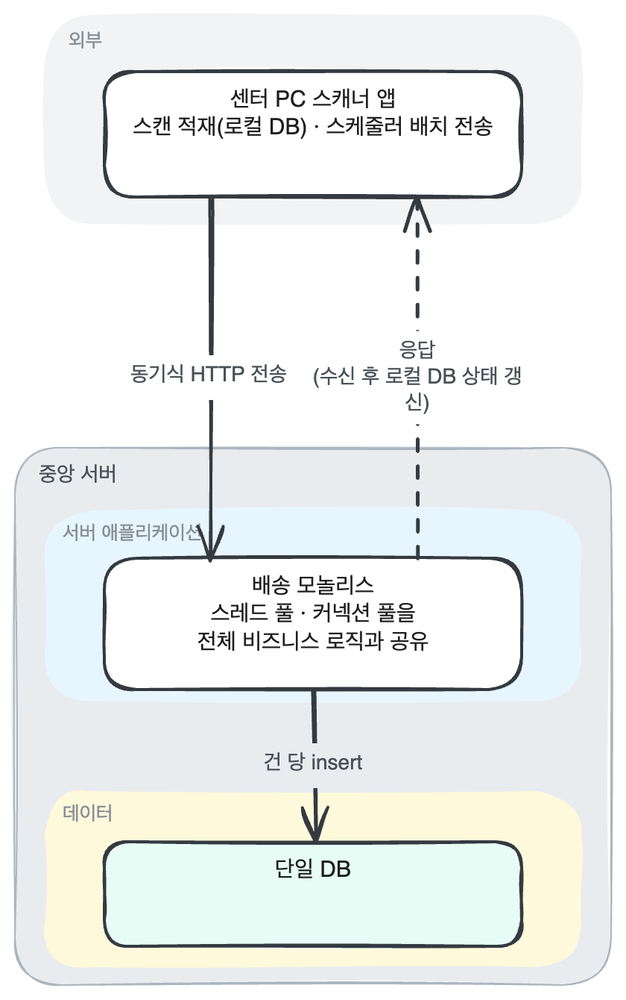

물류 센터의 바코드 스캔이 본사 서버의 동기 처리와 배치 동기화에 그대로 묶여 있는 구조.

<br>

**개선 구조 — [barcode-ingest-pipeline](https://github.com/buss-sooin/barcode-ingest-pipeline)**

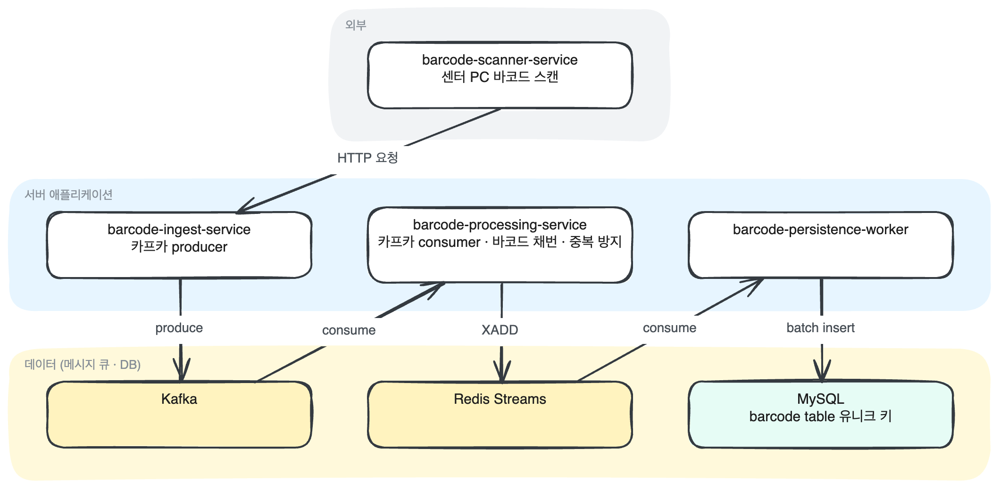

Kafka는 파티션 분산 배치로 바코드 스캔 데이터가 폭발적으로 늘어도 유연하게 대응할 수 있으므로 스캔 데이터의 전송 입구로 설계했습니다. Redis Streams는 인메모리로 빠르고, 읽은 위치를 기록하는 Kafka의 오프셋과 달리 건별로 처리 여부를 추적하기 때문에 DB 저장의 연결 통로로 설계했습니다.

<br>

**구간별 설계 결정**

| 구성 요소 | 역할 | 책임 |
| :--- | :--- | :--- |
| barcode-ingest-service | 수신 즉시 Kafka로 전달, 응답 반환 | 응답 시간을 DB 지연에서 분리 |
| Kafka | 유입과 처리 사이의 완충 큐 | 이후 처리 단계에 장애가 생겨도 원본 데이터 보존 |
| barcode-processing-service | 바코드 이벤트 소비 후 사내 바코드 채번 | 바코드 중복 선별 |
| Redis Streams | DB 저장 직전의 버퍼 큐 | 폭주하는 유입을 소비 가능하고 DB가 감당할 양으로 배치 전달 |
| barcode-persistence-worker | 전달받은 배치를 일괄 저장 | 건당 저장 대비 DB 쓰기 부하 절감 |

<br>

**성능 개선 항목**

- 응답과 저장의 분리 — 스캔 요청을 받으면 Kafka로 넘기고 바로 응답합니다. 요청 후 중앙 서버에서 진행될 DB 커밋을 기다리지 않습니다.
- 자원의 분리 — 유입과 저장을 별도 프로세스로 나눠, 한쪽의 스레드 풀·커넥션 풀 고갈로 인한 지연이 다른 쪽의 프로세스에 영향을 주지 못하게 했습니다.
- 유입 속도와 저장 속도의 분리 — Redis Streams를 DB 앞에 두고, barcode-persistence-worker가 감당할 만큼만 꺼내 가게 했습니다.
- 건별 INSERT의 배치 전환 — JdbcTemplate의 batchUpdate 메서드와 rewriteBatchedStatements 설정을 활성화해, 다중 INSERT가 하나의 INSERT SQL로 실행되도록 했습니다.
- 소비의 분산 — barcode-persistence-worker를 여러 인스턴스로 띄워, 한 인스턴스가 막혀도 다른 인스턴스가 소비를 이어갑니다.

기존의 자바 애플리케이션의 비즈니스 서비스와 DB 트랜잭션 단위로 묶인 처리를 메시지 큐와 같은 별도 시스템으로 분리하면, 큐를 통한 전송이란 트레이드 오프로 데이터 전송 간의 유실과 중복이라는 부수적인 문제가 발생합니다. 이 두 가지는 아래 별도 절에서 설계와 검증을 함께 다룹니다.

[목차로 돌아가기](#목차)

<br>

## 검증 설계

개선이 실제로 효과가 있었는지 두 관점으로 나눠 확인했습니다.

1. 평상시 물량의 성능 개선 효과 — 응답 시간과 DB 쓰기 부하
2. 성능 저하로 장애 상황이 발생했을 때 지연 전파의 여부와 정도

기존 동기 구조와 재설계한 비동기 구조를 같은 조건의 컨테이너에 올려 같은 부하를 흘렸습니다.

> 원활한 성능 비교를 위해 병목이 관측 가능한 수준의 스케일로 축소함

<br>

## 평상시 물량의 성능 개선 결과

**검증 테스트 시나리오 구성**

- 목적: 응답 시간과 DB 쓰기 부하 비교
- 부하 대상: `POST /scan/barcode` — 센터 스캐너가 바코드를 전송하는 스캔 경로입니다.

| 구분 | 실행 조건 |
| :--- | :--- |
| 동시 테스트 요청 스레드 수 | 10개 |
| 지속 시간 | 180초 + 120초 |
| 목표 처리량 | 초당 100건 |

평상시 물량에 해당하는 부하를 신구 양쪽에 같은 조건으로 흘려 비교했습니다.

**API 응답 시간** (클라이언트 기준, JMeter old-first·new-first 2회 평균)

| 구분 | 구형 | 신규 | 개선 |
| :--- | :--- | :--- | :--- |
| 평균 응답 시간 | 약 11.2ms | 약 4.9ms | 약 2.3배 |
| 최대 응답 시간 | 약 148~158ms | 약 60~61ms | 약 2.5배 |

동기 구조에서 장애 지연 전파의 직접적인 원인 중 하나인, 커넥션 스레드를 점유하는 DB I/O를 비동기 전환으로 개선한 결과입니다.

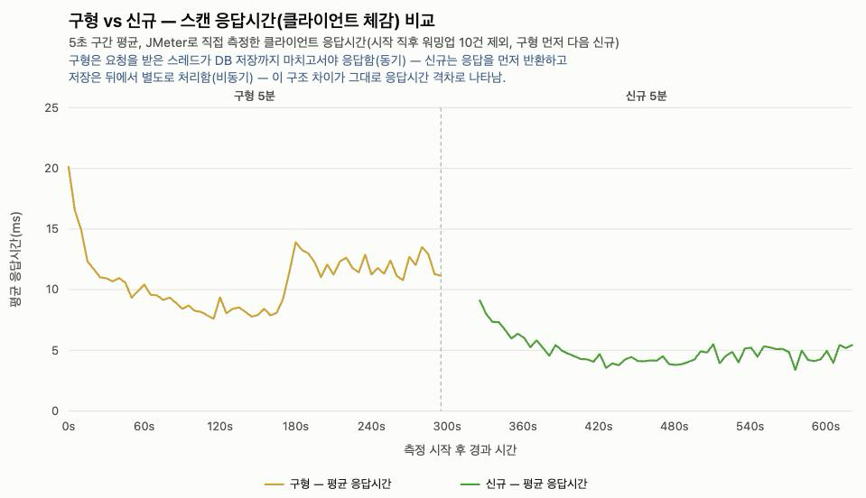

구형과 신규의 스캔 엔드포인트 응답시간을 시간순으로 정렬한 그래프.

<br>

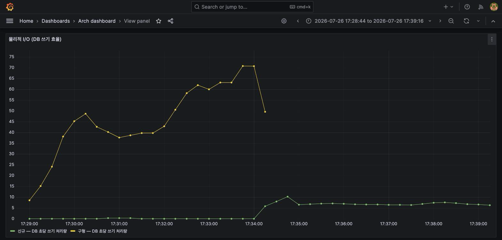

MySQL InnoDB의 초당 쓰기 횟수. 건별 저장을 배치로 묶어 디스크 I/O 부하를 낮춘 결과로, 구형은 안정 수준에 도달하지 못하고 계속 증가하는 반면 신규는 낮은 수준을 유지합니다.

<br>

## 장애 상황에서의 지연 전파 해소 결과

**검증 테스트 시나리오 구성**

- 목적: 저장 계층 포화가 어디까지 번지는지 관측
- 부하 대상: `POST /api/barcode/touch-recent?limit=5` — 스캔 API를 호출하지 않고 저장 계층(구형 delivery-monolith, 신규 barcode-persistence-worker)을 직접 호출해 커넥션 풀을 포화시킵니다.

| 구분 | 실행 조건 |
| :--- | :--- |
| HikariCP maximumPoolSize | 구형(delivery-monolith) 10개, 신규(barcode-persistence-worker) 20개 |
| 동시 테스트 요청 스레드 수 | 구형(delivery-monolith) 30 → 50 → 80개, 점진적으로 늘려 지연 전파를 관측. 신규(barcode-persistence-worker) 80개 |
| 지속 시간 | 60초(격리 확인), 180초(전파 확인) |
| 목표 처리량 | 제한 없음, 커넥션 풀이 찰 때까지 |

저장 계층의 커넥션 풀을 포화시켜, 그 여파가 유입 구간까지 번지는지 경로를 따라가며 관측했습니다.

**구형 — 여파가 스캔 응답까지 번짐**

본사 서버(delivery-monolith)의 DB 커넥션 풀을 포화시키자, 센터-본사 배치 동기화(barcode-scheduler)가 지연되며 그 여파가 센터 스캐너(barcode-input-simulator)의 응답시간까지 번졌습니다. 평시 약 11~12ms에서 최대 약 72ms(약 6배)로 늘었고, 센터 쪽 미동기화 건수는 최대 1,511건까지 쌓였습니다.

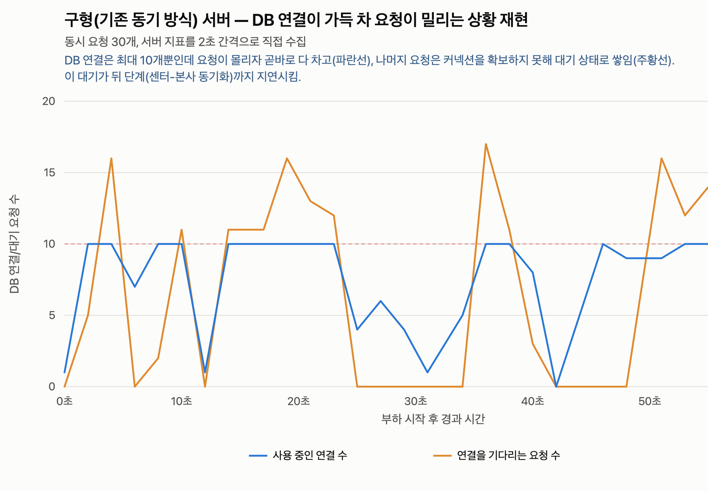

delivery-monolith의 커넥션 풀이 한계에 도달해 밀린 요청이 대기와 처리를 반복하는 구간.

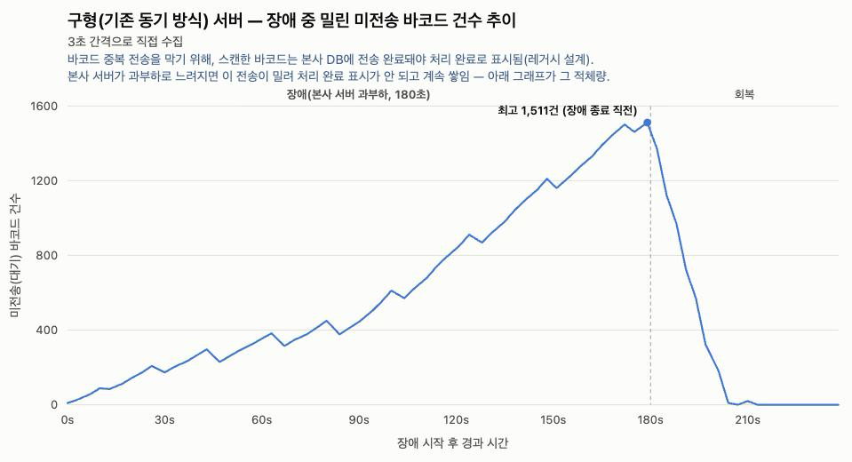

본사 서버 과부하 여파가 barcode-scheduler를 거쳐 센터 쪽에 쌓이는 모습. 장애 시작 후 180초 동안 미전송 바코드가 최고 1,511건까지 늘다가, 장애가 풀리자 수십 초 만에 0 근처로 정리됩니다.

<br>

**신규 — 유입 구간이 영향받지 않음**

같은 방식으로 barcode-persistence-worker의 DB 커넥션 풀을 완전히 포화시켜도(대기 중인 요청 약 55건 지속), barcode-ingest-service의 응답시간은 평시와 같은 수준을 유지했습니다. Kafka와 Redis Streams가 유입과 저장을 갈라놓았기 때문입니다. 저장 계층 안에서도 포화된 워커 인스턴스의 미처리 메시지는 최대 9건, 15초 안에 해소됐고 전체 처리 지연은 사실상 0에 머물렀습니다. 다른 워커 인스턴스가 계속 소비했기 때문입니다.

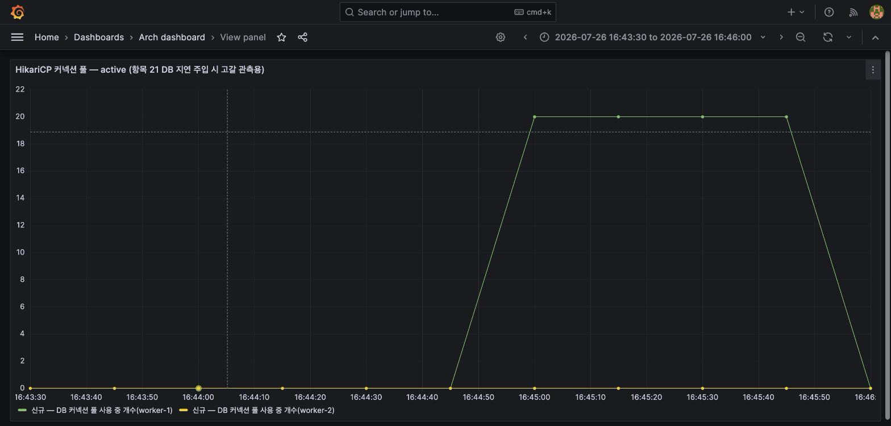

worker-1의 커넥션 풀이 60초간 한계에 머무는 장애 구간(worker-2 풀은 내내 여유). 아래 두 그래프는 같은 구간에서 이 장애가 어디까지 번지는지 보여줍니다.

<br>

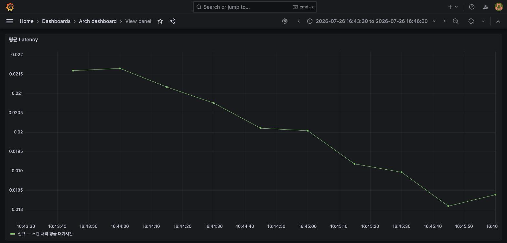

같은 구간의 barcode-ingest-service 스캔 처리 평균 응답시간(서버 측정). 포화 내내 18~22ms 범위에서 상승 없이 유지 — 저장 계층의 포화가 유입 계층으로 번지지 않습니다.

<br>

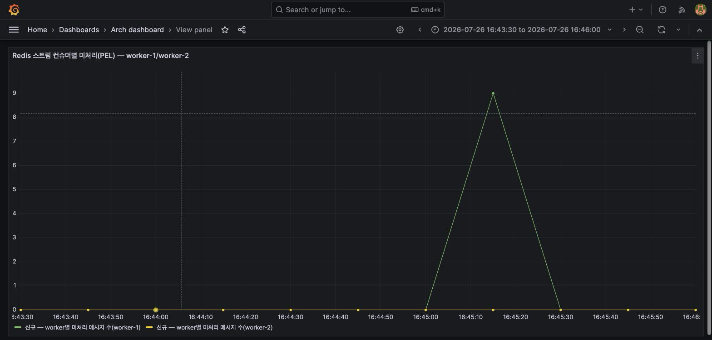

같은 구간에서 worker-1의 미처리 메시지(PEL)는 최대 9건, 15초 만에 해소되고 worker-2는 내내 0을 유지. 한 인스턴스가 막혀도 다른 워커가 이어받아 병목이 확산되지 않습니다.

두 경우 모두 에러 없이(0%) 재현했고, 장애 해소 후 정상 수준으로 회복됨을 확인했습니다.

<br>

## 데이터 정합성 검증

Kafka와 Redis Streams를 사이에 둔 비동기 구조는 DB 처리 지연이 스캔 요청까지 바로 번지는 문제를 줄여 줍니다. 대신 데이터가 여러 시스템을 거쳐 전달되기 때문에 **중간 장애에서 데이터가 사라지지 않는지**, **재전송된 데이터가 중복 저장되지 않는지**를 별도로 확인해야 합니다.

### 유실 대비

**설계**

- Kafka는 전달받은 메시지를 디스크 로그에 기록해 일정 기간 보관합니다.
- Redis Streams는 AOF를 통해 쓰기 내용을 디스크에 기록하고, 재기동할 때 이를 이용해 기존 스트림 상태를 복원합니다.
- `barcode-persistence-worker`가 읽은 메시지는 PEL에 남기고, MySQL 저장을 완료한 메시지만 `XACK`하여 처리 대상에서 제거합니다.
- 재시도로도 처리하지 못한 데이터는 DLT·DLQ로 분리해 정상 처리 흐름과 격리합니다.

**기초 중단·복구 검증**

먼저 Kafka, `barcode-processing-service`, Redis, `barcode-persistence-worker`를 하나씩 중단했다가 다시 실행하면서, 중단 중 들어온 바코드가 최종적으로 저장되거나 별도의 실패 경로로 설명되는지를 확인했습니다.

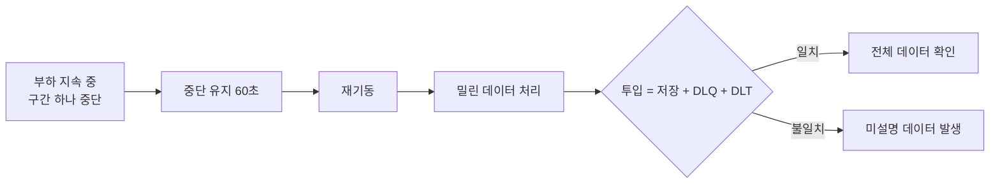
```mermaid
flowchart LR
  A[부하 지속 중<br/>구간 하나 중단] --> B[중단 유지 60초]
  B --> C[재기동]
  C --> D[밀린 데이터 처리]
  D --> E{투입 = 저장 + DLQ + DLT}
  E -- 일치 --> F[전체 데이터 확인]
  E -- 불일치 --> G[미설명 데이터 발생]
```

| 중단 구간 | 투입 | 저장 | DLQ·DLT |
| :--- | ---: | ---: | ---: |
| Kafka | 3,657 | 3,657 | 0건 |
| barcode-processing-service | 3,655 | 3,655 | 0건 |
| Redis | 3,658 | 3,658 | 0건 |
| barcode-persistence-worker 2개 동시 | 3,635 | 3,635 | 0건 |

Kafka 로그와 Redis AOF 같은 디스크 복구 기능은 **프로세스가 중단되더라도 이미 기록된 데이터를 다시 읽어 처리를 이어갈 수 있게 합니다.**

위 검증에서는 Kafka와 Redis의 컨테이너를 중단하더라도 컨테이너를 실행하는 서버와 저장 장치는 그대로 유지했습니다. 따라서 Kafka는 기존 로그를 다시 읽을 수 있었고, Redis도 AOF에 남아 있던 상태를 복원해 처리를 이어갈 수 있었습니다.

즉 이 검증은 **같은 서버와 저장 장치를 계속 사용할 수 있다는 조건에서 애플리케이션과 컨테이너의 일시적인 중단을 복구할 수 있는지 확인한 기초 검증**입니다.

하지만 실제 운영 환경의 장애는 컨테이너 내부에만 머물지 않을 수 있습니다. 컨테이너를 실행하던 서버 자체를 사용할 수 없거나, Kafka를 구성하는 여러 broker 중 일부가 동시에 영향을 받거나, 저장소나 네트워크 같은 기반 자원에서 장애가 발생할 수도 있습니다.

이 경우에는 기존 디스크를 다시 읽어 프로세스를 시작하는 것만으로 서비스가 계속될 수 있다고 판단하기 어렵습니다.

그래서 이후에는 단순한 중단·재기동을 넘어 **장애가 발생한 위치와 범위에 따라 데이터 처리 흐름이 어디까지 영향을 받는지**를 확인하는 방향으로 검증 범위를 넓혔습니다.

### 중복 대비

장애 복구와 재시도 과정에서는 같은 바코드가 여러 번 전달될 수 있습니다. 따라서 전송 과정에서 중복이 전혀 발생하지 않는다고 가정하지 않고, 최종 MySQL에는 같은 비즈니스 데이터가 한 번만 저장되도록 두 단계로 방어했습니다.

- **1차 — Redis `SETNX`**
  - 이미 처리한 바코드는 Redis Stream에 다시 발행하지 않습니다.
- **2차 — MySQL 고유 제약**
  - Redis의 중복 확인 상태가 사라진 경우에도 최종 저장 단계에서 동일한 데이터가 다시 저장되는 것을 차단합니다.

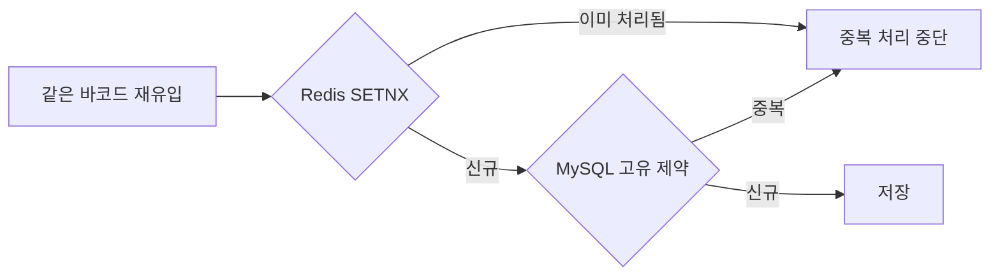
```mermaid
flowchart LR
  A[같은 바코드 재유입] --> B{Redis SETNX}
  B -- 이미 처리됨 --> D[중복 처리 중단]
  B -- 신규 --> C{MySQL 고유 제약}
  C -- 중복 --> D
  C -- 신규 --> E[저장]
```

| 시나리오 | 조건 | 결과 |
| :--- | :--- | :--- |
| 클라이언트 중복 재전송 | 같은 바코드 5회 연속 전송 | Redis에서 중복 차단 |
| Kafka 재소비 | Redis 중복 확인 상태가 유지된 경우 | Redis에서 중복 차단 |
| Redis 중복 확인 상태 소실 후 재소비 | `SETNX` 키 삭제 후 다시 소비 | MySQL 고유 제약에서 중복 차단 |

검증한 세 경로에서는 같은 바코드가 다시 전달되더라도 최종 MySQL에 동일한 비즈니스 데이터가 중복 저장되지 않았습니다.

[목차로 돌아가기](#목차)

<br>

## 운영 장애 검증

앞의 기초 검증은 **서버와 저장 장치는 정상인 상태에서 내부 애플리케이션이나 컨테이너만 제한적으로 중단하는 조건**이었습니다.

실제 운영 환경에서는 장애가 발생한 위치와 규모에 따라 시스템이 받는 영향도 달라집니다.

예를 들어 `barcode-persistence-worker` 한 대가 정상적으로 처리하지 못하는 경우에는 다른 Worker가 처리를 이어갈 수 있습니다. 반면 Kafka 자체에 메시지를 전달할 수 없다면 그보다 앞단의 스캔 요청부터 영향을 받습니다. Kafka broker 한 대가 중단되는 경우와 Kafka 클러스터 전체를 사용할 수 없는 경우에도 필요한 대응 방식은 다릅니다.

실제 운영급 장비와 물리 네트워크를 그대로 구축하는 대신, 하나의 로컬 Docker 환경 안에서 Kafka broker와 controller, Redis, MySQL, 애플리케이션을 역할별로 분리했습니다. 필요한 시나리오에는 별도의 Kafka 클러스터도 구성해 **운영 환경의 네트워크 구조와 장애 경계를 축소 재현하고, 장애 위치와 영향 범위를 단계적으로 넓혀 검증했습니다.**

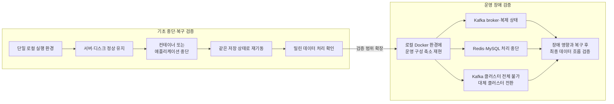
```mermaid
flowchart LR
    subgraph BASIC["기초 중단·복구 검증"]
        direction TB
        B1["단일 로컬 실행 환경"]
        B2["서버·디스크 정상 유지"]
        B3["컨테이너 또는<br/>애플리케이션 중단"]
        B4["같은 저장 상태로 재기동"]
        B5["밀린 데이터 처리 확인"]

        B1 --> B2
        B2 --> B3
        B3 --> B4
        B4 --> B5
    end

    subgraph OPS["운영 장애 검증"]
        direction TB
        O1["로컬 Docker 환경에<br/>운영 구성 축소 재현"]
        O2["Kafka broker·복제 상태"]
        O3["Redis·MySQL 처리 중단"]
        O4["Kafka 클러스터 전체 불가<br/>대체 클러스터 전환"]
        O5["장애 영향과 복구 후<br/>최종 데이터 흐름 검증"]

        O1 --> O2
        O1 --> O3
        O1 --> O4
        O2 --> O5
        O3 --> O5
        O4 --> O5
    end

    B5 -->|"검증 범위 확장"| O1
```

### 검증 목적

운영 장애 검증에서는 장애 지점을 단계별로 바꿔 가며 다음 세 가지를 확인했습니다.

1. **장애가 어느 단계까지 영향을 주는가**
2. **남아 있는 구성 요소가 처리를 계속할 수 있는가**
3. **장애가 해소된 뒤 중단 중 남은 데이터까지 정상적으로 처리되는가**

### 장애 상황별 검증

| 시나리오 | 예상 장애 상황 | 관측한 장애 흐름 | 확인 결과 |
| :--- | :--- | :--- | :--- |
| BIP-FR-001 | Kafka에 메시지를 전달할 수 없는 상태 | Kafka가 중단되자 `barcode-ingest-service`의 메시지 전송이 실패하고, 스캔 요청을 발생시키는 `barcode-input-simulator`에서 재전송이 발생했습니다. Kafka를 복구한 뒤 메시지 전달과 후속 처리가 다시 이어지면서 중단 중 밀린 데이터도 처리됐습니다. | 고유 바코드 `820개`가 재전송 과정에서 Kafka 레코드 `1,235개`로 늘어났지만, 중복 제거를 거쳐 최종 MySQL에는 원래 입력과 같은 `820건`이 저장됐습니다. |
| BIP-FR-002 | Kafka broker 한 대와 partition leader 중단 | 현재 leader인 broker를 중단하자 기존 replica 중 하나가 새 leader로 선출됐습니다. 남아 있는 broker들이 필요한 복제 조건을 충족해 장애 중에도 Kafka 기록과 이후 처리가 계속됐습니다. | 고유 바코드 `66개`가 재전송으로 Kafka 레코드 `75개`까지 늘어났고, 중복 `9개`를 제거한 뒤 최종 MySQL에는 `66건`이 저장됐습니다. |
| BIP-FR-003 | Kafka replica 수가 쓰기 조건보다 부족한 상태 | leader는 유지한 채 다른 broker를 중단해 ISR을 `1`까지 줄였습니다. 필요한 복제 수를 만족하지 못하자 새 데이터 기록이 실패했고, 중단했던 broker가 복구되어 ISR이 `2`가 되자 leader와 replica가 다시 필요한 복제 조건을 충족하면서 데이터 기록이 재개됐습니다. | 애플리케이션을 재시작하거나 Kafka 설정을 변경하지 않고 broker 복구만으로 기록이 정상화됐습니다. 테스트한 고유 바코드 `54개` 가운데 의도적으로 기록이 거부된 `1개`를 제외한 `53개`가 Kafka에 기록됐고, 최종 MySQL에도 같은 `53건`이 저장됐습니다. |
| BIP-FR-005 | `barcode-processing-service`가 Redis Streams에 데이터를 전달할 수 없는 상태 | Redis가 응답하지 않자 Kafka를 소비하는 `barcode-processing-service`는 해당 레코드의 처리를 완료하지 않고 재시도했습니다. 정해진 재시도 횟수까지 실패한 데이터는 정상 처리와 분리해 DLT로 보냈습니다. | Redis 장애로 처리하지 못한 Kafka 레코드가 성공한 것으로 넘어가지 않고, 재시도 중에는 다시 처리할 대상으로 남으며 반복 실패한 경우에는 DLT로 분리되는 흐름을 확인했습니다. |
| BIP-FR-004 | `barcode-persistence-worker`가 MySQL에 데이터를 저장할 수 없는 상태 | `barcode-persistence-worker`가 Redis Streams에서 메시지를 읽은 뒤 MySQL 저장에 실패하면 `XACK`하지 않아 해당 메시지가 PEL에 남았습니다. MySQL을 복구한 뒤 PEL에 남아 있던 메시지를 다시 가져와 저장했습니다. | 장애 중 처리하지 못한 메시지가 PEL에 유지됐고, MySQL 복구 뒤 다시 처리되면서 PEL이 `0`까지 줄었습니다. 테스트 대상 고유 바코드 `750개`도 최종 MySQL에 저장됐습니다. |
| BIP-FR-006 | 사용 중인 Kafka 클러스터 전체를 사용할 수 없는 상태 | 기존 Kafka 클러스터 전체를 중단한 뒤 해당 클러스터에서 수행하던 생산과 소비를 멈추고, 미리 준비한 별도의 Kafka 클러스터로 생산·소비를 전환했습니다. 이후 `barcode-processing-service → Redis Streams → barcode-persistence-worker → MySQL` 처리 흐름이 다시 이어지는지 확인했습니다. | 대체 Kafka 클러스터에서 이어서 처리한 고유 바코드 `41개`가 모두 최종 MySQL에 저장됐으며, 입력과 최종 저장 결과 사이에서 설명되지 않는 데이터는 없었습니다. |

표의 수치는 단순한 처리량 비교가 아니라 **각 장애를 통과하면서 데이터가 어떻게 변화했는지를 확인하기 위한 값**입니다.

BIP-FR-001에서는 Kafka 중단 중 `barcode-input-simulator`의 재전송으로 같은 바코드가 여러 번 Kafka에 전달됐습니다.

```text
고유 바코드 820개
→ Kafka 레코드 1,235개
→ 중복 제거
→ MySQL 고유 데이터 820건
```

따라서 `1,235개`는 새로운 바코드가 늘어난 것이 아니라 장애 중 재전송으로 같은 바코드가 여러 번 전달된 결과입니다. 복구 뒤에는 이 중복이 제거되어 원래 입력한 `820개`와 동일한 수의 고유 데이터가 MySQL에 남았습니다.

BIP-FR-002에서도 비슷한 현상이 발생했습니다.

```text
고유 바코드 66개
→ Kafka 레코드 75개
→ 중복 9개 제거
→ MySQL 고유 데이터 66건
```

leader broker 장애 자체가 기존 데이터를 다시 만들어 낸 것이 아니라, 장애 시점의 애플리케이션과 HTTP 재전송으로 Kafka 레코드가 추가됐습니다. 이후 중복 제거를 거쳐 최초에 생성한 고유 바코드 수와 최종 저장 결과가 다시 일치했습니다.

반대로 BIP-FR-004에서 중요한 것은 전송 중복보다 **저장이 끝나지 않은 메시지가 어디에 남는가**였습니다.

`barcode-persistence-worker`는 Redis Streams에서 메시지를 읽었다고 바로 처리를 끝내지 않습니다. MySQL 저장까지 성공해야 `XACK`하고 PEL에서 제거합니다.

```text
Redis Streams에서 읽음
→ MySQL 저장 실패
→ XACK 하지 않음
→ PEL에 유지
→ MySQL 복구
→ 다시 처리
→ 저장 성공 후 XACK
```

따라서 MySQL 장애 중에도 저장되지 않은 메시지가 사라지지 않고 PEL에 남았으며, 복구 뒤 다시 처리되어 최종 저장까지 이어지는 것을 확인할 수 있었습니다.

장애 상황에 따라 데이터 흐름이 멈추는 위치도 달랐습니다.

Kafka에 메시지를 전달하지 못하면 `barcode-processing-service`·Redis Streams·MySQL에는 새로운 데이터가 내려가지 않습니다. Kafka broker 한 대가 중단되더라도 남은 replica가 필요한 복제 조건을 충족하면 같은 Kafka 클러스터에서 처리를 이어갈 수 있습니다.

Redis가 중단되면 `barcode-processing-service`까지는 Kafka 레코드를 읽을 수 있지만 그 데이터를 Redis Streams로 넘길 수 없고, MySQL이 중단되면 그보다 뒤 단계인 `barcode-persistence-worker`가 읽어 간 메시지가 PEL에 남습니다.

Kafka 클러스터 전체를 사용할 수 없게 되면 같은 클러스터 안의 replica만으로는 더 이상 대응할 수 없기 때문에, 미리 준비한 다른 Kafka 클러스터로 생산과 소비 자체를 전환해야 합니다.

이처럼 장애 위치를 데이터 흐름과 함께 따라가면서 **어디까지 정상 처리가 가능하고, 어느 지점부터 처리가 멈추며, 장애 복구 후 남아 있던 데이터가 최종 저장까지 다시 이어지는지**를 검증했습니다.

[목차로 돌아가기](#목차)

<br>

## AI를 활용한 엔지니어링

이 프로젝트에서는 AI를 코드 작성 보조 도구로만 사용하지 않았습니다.

AI가 개발 과정에 깊게 참여할수록 중요한 것은 작업량을 많이 넘기는 것이 아니라, **사람과 AI가 각각 무엇을 결정하고 실행하며, 그 결과를 어떤 근거로 검증할 것인지 명확하게 만드는 것**이라고 보았습니다.

이를 위해 특정 프로젝트의 세부 작업을 일일이 규칙으로 만드는 대신, 설계·구현·검증 과정에서 반복해서 적용할 수 있는 사람과 AI의 협업 원칙을 별도의 [AI-Native Engineering Framework](https://github.com/buss-sooin/ai-native-engineering-framework)로 정리하고 이 프로젝트에 적용했습니다.

### 사용 환경

| 구분 | 사용 환경 |
| :--- | :--- |
| 사용 모델 | `GPT-5.6 Sol`, `GPT-6.0 Sol` |
| 설계·분석 | ChatGPT 일반 Chat |
| 저장소·문서 직접 검토 | ChatGPT Work mode |
| 구현·실행 | Codex CLI |

ChatGPT 일반 Chat은 요구사항 분석, 설계, 장애 시나리오 구성과 실행 결과 해석에 사용했습니다. 실제 저장소의 코드·설정·문서를 직접 비교해야 할 때는 Work mode를 사용하고, 코드와 설정 변경, 명령 실행, 테스트와 Git 작업은 터미널에서 동작하는 Codex CLI가 담당했습니다.

### AI 협업 규약과 개발 체계

협업 규약은 특정 장애 테스트를 수행하기 위한 명령 목록이 아닙니다.

프로젝트와 요구사항이 달라져도 **설계와 실행, 사람과 AI의 책임, 실행 권한, 검증 책임을 구분하고 그 사이의 정보를 잃지 않는 것**을 공통 원칙으로 삼았습니다.

기본적인 개발 흐름은 다음과 같습니다.

```text
요구사항과 문제 정의
→ 설계·영향 범위·검증 기준 구체화
→ 개발자의 주요 결정과 실행 범위 확정
→ 구현·테스트·반복 실행
→ 별도 검토를 통한 결과 검증
→ 근거와 최종 결과 문서화
```

각 단계에서 하나의 AI 세션이 설계부터 자신의 결과 검증까지 모두 맡도록 하지 않고, 필요한 책임에 따라 ChatGPT와 Codex의 역할을 나눴습니다.

#### 설계와 실행 책임의 분리

ChatGPT에서는 먼저 해결하려는 문제, 설계 선택지, 변경 범위와 검증 방법을 구체화했습니다.

실제 코드와 설정 변경, Docker 환경 구성, 명령 실행과 자동 테스트가 필요한 단계에서는 그 내용을 Codex CLI의 실행 책임으로 넘겼습니다.

예를 들어 운영 장애 검증에서도 ChatGPT에서 먼저 **어떤 장애 조건을 만들 것인지, 무엇을 관측할 것인지, 어떤 결과까지 검증할 것인지**를 설계하고, 실제 환경 구성과 장애 실행은 Codex CLI에서 수행했습니다.

이렇게 설계와 실행을 분리해 구현 중 편의에 따라 처음 정한 목적이나 검증 조건이 임의로 바뀌지 않도록 했습니다.

#### AI 자동화와 개발자 판단의 분리

반복 실행이 가능하고 결과를 기계적으로 확인할 수 있는 작업은 가능한 범위에서 AI가 이어서 수행하도록 했습니다.

예를 들면 다음과 같습니다.

- 저장소와 현재 구현 상태 조사
- 검증 환경 구성
- 사전 상태 점검
- 반복 명령과 테스트 실행
- 로그·상태·데이터 수집
- 정해진 기준에 따른 결과 비교
- 문서와 실행 결과 동기화

반면 개발자는 **무엇을 해결할 것인지, 어느 범위까지 변경할 것인지, 어떤 위험을 허용할 것인지, 중요한 설계 선택을 어떻게 할 것인지, 확인된 결과를 어디까지 설명할 것인지**를 결정했습니다.

사람이 AI가 작성한 명령을 계속 복사해 실행하는 것을 협업의 기본 형태로 두지도 않았습니다. 이미 범위가 정해진 반복 실행은 적합한 AI 실행 환경이 담당하고, 개발자는 실제 판단이 필요한 지점에 개입하도록 역할을 나눴습니다.

#### 실행과 검증 책임의 분리

구현을 수행한 AI가 `성공`이라고 보고했다는 이유만으로 작업이 끝났다고 판단하지 않았습니다.

실행 전에 검증할 조건을 정하고, 실제 저장소 상태·로그·데이터와 실행 결과를 근거로 별도의 검토 단계에서 다시 확인했습니다.

```text
구현 결과
→ 실제 파일·설정·실행 결과 확인
→ 사전에 정한 검증 기준과 비교
→ 통과 / 부분 확인 / 검증 불가 판정
→ 근거와 한계 기록
```

필요한 경우 구현 세션과 다른 ChatGPT 세션이나 Work mode에서 결과를 다시 검토해, 실행을 담당한 AI의 자기 보고와 검증 책임을 분리했습니다.

조건을 잘못 구성한 실행은 결과가 좋아 보여도 검증 결과에 포함하지 않았고, 근거가 일부만 확보된 경우에는 확인된 부분까지만 결과로 남겼습니다.

#### 대화가 아닌 근거와 산출물로 상태 유지

ChatGPT 대화 자체를 프로젝트의 최종 상태로 사용하지 않았습니다.

중요한 설계 결정, 실행 조건, 테스트 결과와 검증 근거는 저장소의 문서와 실행 기록으로 옮겨 이후 다른 세션이나 실행 환경에서도 같은 기준을 사용할 수 있도록 했습니다.

따라서 AI가 바뀌거나 새로운 세션에서 작업을 이어가더라도 이전 대화 내용을 추측하기보다 **승인된 설계, 실제 저장소 상태와 검증 근거를 기준으로 다음 작업을 이어가는 구조**를 만들었습니다.

### 운영 장애 검증에 적용한 협업 구조

`barcode-ingest-pipeline`의 운영 장애 검증은 이 협업 체계를 실제 개발 과정에 적용한 사례입니다.

장애를 단순 실행하는 대신 먼저 검증 목적과 조건을 설계하고, 저장소의 실제 구현을 기준으로 필요한 환경을 준비한 뒤 장애를 재현했습니다. 실행 후에는 수집한 로그와 데이터 상태를 다시 검토해 결과를 확정했습니다.

| 단계 | 개발자의 책임 | AI의 책임 |
| :--- | :--- | :--- |
| 검증 목표 설정 | 어떤 운영 문제를 검증할지, 어디까지 검증할지 결정 | 구현 상태와 가능한 검증 방법 조사, 선택지와 제약 분석 |
| 장애 시나리오 설계 | 사용할 조건과 위험 범위 결정 | 장애 조건, 관측 대상, 판정 기준 구체화 |
| 구현·환경 준비 | 승인된 변경 범위 확정 | Codex CLI에서 코드·설정·Docker 환경과 검증 도구 구현 |
| 장애 실행 | 필요한 엔지니어링 판단과 범위 변경 여부 결정 | 사전 점검, 장애 실행, 반복 상태 확인과 결과 수집 |
| 결과 검증 | 결과의 의미와 외부에 설명할 범위 결정 | 별도 검토에서 실행 조건, 로그, 데이터와 판정 기준 대조 |
| 문서화 | 최종 주장과 설명 범위 확인 | 검증 결과와 근거를 재현 기록·기술 문서에 반영 |

예를 들어 Kafka 클러스터 전체 장애를 검증할 때는 실제 데이터센터를 구축했다고 가정하지 않았습니다.

개발자는 **로컬 Docker 네트워크 안에서 주 Kafka 클러스터와 별도의 대체 Kafka 클러스터를 구성해, 클러스터 전체 중단 시 생산·소비 경로 전환 원리를 검증한다**는 범위를 결정했습니다.

ChatGPT에서는 이 범위에서 필요한 Kafka 구성, 복제 방식, 장애 조건과 검증 기준을 구체화했습니다. 이후 Codex CLI가 Docker 환경과 검증 도구를 구현하고, 사전 점검부터 장애 실행, Kafka 상태·offset·최종 MySQL 데이터 수집까지 이어서 수행했습니다.

실행이 끝난 뒤에는 별도의 검토에서 **실제로 정한 장애 조건이 만들어졌는지, 대체 Kafka 클러스터에서 처리가 이어졌는지, 최종 데이터가 입력과 맞는지**를 실행 기록과 데이터로 다시 확인했습니다.

그 결과를 바탕으로 실제 다중 데이터센터 운영을 검증했다고 확대하지 않고, 로컬 환경에서 확인한 Kafka 클러스터 전환 동작과 측정 결과까지만 문서화했습니다.

### 협업 체계의 적용 결과

이 협업 체계가 유효했는지는 AI가 작성한 코드의 양이 아니라 **설계한 과정이 실제 실행에서도 유지되고, 결과를 다시 검증할 수 있었는지**로 확인했습니다.

운영 장애 검증 과정에서는 실행 조건이 잘못된 테스트를 정상 결과와 분리해 보존했고, 근거가 충분하지 않은 경우에는 결과 범위를 축소했습니다. 반대로 반복적인 구현·사전 점검·장애 실행·상태 수집은 승인된 범위 안에서 AI가 이어서 수행할 수 있었습니다.

Kafka 클러스터 전체 장애 검증에서는 통합 실행을 시작한 뒤 구현, 사전 점검, 장애 실행과 검증 자료 수집까지 개발자가 AI 명령을 대신 전달하지 않고 하나의 제한된 Codex 실행 책임으로 이어졌습니다.

최종적으로 각 장애 검증에는 다음 관계가 남도록 했습니다.

```text
왜 검증했는가
→ 어떤 조건으로 실행했는가
→ 실제로 무엇이 발생했는가
→ 무엇으로 결과를 확인했는가
→ 어디까지 설명할 수 있는가
```

이 과정과 결과는 Chat 기록에만 남기지 않고 재현 조건, 실행 기록, 검증 자료와 기술 문서로 저장소에 보존했습니다.

AI-Native Engineering Framework는 이러한 방식을 특정 Kafka 장애 검증에 한정하지 않고, 다른 프로젝트의 기능 개발·설계 변경·검증·문서화에서도 재사용할 수 있는 사람과 AI의 협업 방법으로 정리한 것입니다.

> 협업 규약과 설계 원칙: [AI-Native Engineering Framework](https://github.com/buss-sooin/ai-native-engineering-framework)

[목차로 돌아가기](#목차)