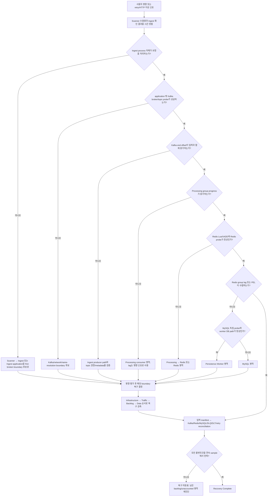

# BIP-FR-001 운영 진단 가이드

## 1. 목적과 범위

이 문서는 `BIP-FR-001 — Active Scan 중 Kafka Broker Unavailable`을 사람이 직접 추론하고 진단할 수 있게 하는 프로젝트 범위 운영 진단 산출물(Human-operable Diagnostic Artifact)이다. 핵심 질문은 “어떤 명령을 외울 것인가?”가 아니라 다음과 같다.

> 어떤 신호(Signal)로 이상을 감지하고, 그 신호가 어느 내부 경계를 나타내는지 이해한 뒤, 독립 증거로 가설을 검증하여 최초로 끊어진 경계(First Broken Boundary), 영향 범위, 올바른 복구 대상, 실제 복구 완료 여부를 어떻게 판정할 것인가?

이 문서는 다음을 목표로 한다.

- 최초 확인 신호와 교차 확인 순서를 제시한다.
- Scanner부터 MySQL까지 각 경계의 신호가 뜻하는 내부 동작을 설명한다.
- 불변조건(Invariant), 기준선(Baseline), 추세(Trend)로 정상과 비정상을 구분한다.
- 관측(Observation)에서 가설(Hypothesis)을 만들고 독립 증거로 채택하거나 기각하는 방법을 제시한다.
- application, Kafka, processing consumer, Redis, persistence worker, MySQL 장애를 구분한다.
- 복구(Recovery) 조치가 정당화되는 조건과 복구 완료(Recovery Complete)의 조건을 분리한다.

비목표는 다음과 같다.

- 명령어 암기용 Runbook을 제공하지 않는다.
- BIP-FR-001을 다시 재현하거나 다른 장애를 주입하지 않는다.
- application, Kafka, Redis, MySQL, Prometheus, Grafana 설정을 변경하지 않는다.
- 관측성 신호나 대시보드를 새로 구현하지 않는다.
- Kafka 운영 지식을 Framework 또는 Workflow 규칙으로 승격하지 않는다.
- 이 실행의 결과를 모든 Kafka 장애, replicated Kafka HA, storage loss, production RTO/RPO 또는 exactly-once 보장으로 일반화하지 않는다.
- 후속 산출물인 Learning Note, Runbook, AI ↔ Human Mapping, Technical Report 또는 README 갱신을 대신하지 않는다.

## 2. BIP-FR-001 시나리오 맥락

### 2.1 진단에 필요한 아키텍처

```text
Scanner
  └─ 메모리 배치 버퍼 / 메모리 retry queue
      → Ingest HTTP API
          → Kafka Producer
              → Kafka topic: barcode-events
                  → Processing Consumer: barcode-processing-group
                      → Redis 원자적 dedupe + XADD
                          → Redis Stream: barcode:stream
                              → Persistence Workers: barcode-persistence-group
                                  → MySQL: barcodes
```

다음은 저장소 사실(Repository Fact)이다.

- Scanner의 `/scan/barcode` HTTP `200`은 스캔이 메모리 버퍼에 수용되었다는 뜻이며 Kafka append나 MySQL 저장 성공을 뜻하지 않는다.
- Ingest는 Kafka producer future를 최대 5초 기다린다. 이 시간 안에 성공을 확인하지 못해도 future를 취소하지 않는다. 배치는 실패 index와 HTTP `207`, 단건은 HTTP `503`을 반환할 수 있다.
- Scanner는 배치에서 확인되지 않은 항목을 단건 전송으로 폴백하고, 단건 실패를 최대 10,000건의 process-local 메모리 retry queue에 넣어 5초 간격으로 재시도한다. Scanner가 재시작되거나 queue가 가득 차면 이 경로는 소실 위험이 있다.
- Ingest producer는 `barcode-events`에 `deviceId`를 key로 전송하며 `acks=all`, `retries=3`, `max.block.ms=5000`, `linger.ms=10`을 설정한다.
- Processing은 `barcode-processing-group`, concurrency `3`으로 Kafka를 소비한다. Redis Lua script가 original barcode 기반 duplicate marker 확인, `barcode:stream`의 `XADD`, 7일 TTL marker 생성을 원자적으로 수행한다.
- Processing 예외는 consumer container까지 전파되며 기본 error handler가 2초 간격으로 3회 재시도한 뒤 `DeadLetterPublishingRecoverer`의 DLT 경로를 시도한다. DLT recovery 시도 횟수는 `barcode_processing_dlt_sent_total`로 계량한다. 실제 DLT topic 상태는 별도 topic probe로 확인해야 한다.
- 두 Persistence Worker는 Redis consumer group `barcode-persistence-group`을 공유한다. 새 stream entry를 읽어 MySQL에 저장하고 성공 또는 안전한 중복 판정 뒤 `XACK`한다. ack되지 않은 entry는 PEL(Pending Entries List)에 남는다.
- Worker는 60초마다 pending을 확인하고 5분 이상 idle인 entry를 claim하여 재처리한다. Redis 연결 실패는 다음 주기에 재시도하고, MySQL 저장 실패는 분류와 제한 재시도 후 필요하면 Redis DLQ로 보낸다.
- MySQL `barcodes`에는 `internalBarcodeId`와 `originalBarcode`의 unique constraint가 있어 최종 중복에 대한 두 번째 방어 경계를 제공한다.

### 2.2 검증된 Material Failure Run 요약

아래 표는 `20260829T073503Z` 실제 실행에서 계량된 실행 증거(Run Evidence)이다. 해석이나 일반 Kafka 지식이 아니다.

| 항목 | 실행 증거 |
|---|---:|
| 최종 Workflow Outcome | `REPRODUCED` |
| Experiment Validity | `PASS` |
| Evidence Sufficiency | `PASS` |
| FS-1 ~ FS-4 | 모두 `PASS` |
| generated unique events | 820 |
| Kafka records | 1,235 |
| retry-induced duplicates | 415 |
| Processing 결과 | received 1,235 / new 820 / duplicate 415 / error 0 |
| Redis stream / group lag / PEL | 820 / 0 / 0 |
| MySQL unique persisted | 820 |
| final duplicates | 0 |
| DLQ / DLT | 0 / 0 |
| retry pending / unaccounted | 0 / 0 |

장애 구간에는 Kafka broker가 57초간 unavailable이었고, 동일 broker를 복구한 뒤 background future와 Scanner retry가 진행되었다. 최종적으로 retry backlog가 모두 배출되고 downstream reconciliation이 완료되었다. 상세 실행 기록은 [REPRODUCTION-RECORD.md](./REPRODUCTION-RECORD.md)의 `Material Failure Run — 20260829T073503Z`와 [evidence/20260829T073503Z](./evidence/20260829T073503Z/)에 있다.

## 3. 증거 분류

진단자는 모든 사실에 암묵적으로라도 다음 네 분류 중 하나를 붙여야 한다. 서로 다른 분류를 같은 확실성으로 말하지 않는다.

| 분류 | 정의 | 이 문서의 예 | 사용할 때의 규칙 |
|---|---|---|---|
| 실행 증거(Run Evidence) | 실제 BIP-FR-001 Material Failure Run에서 측정한 사실 | Kafka records 1,235, MySQL unique 820 | 해당 bounded run에만 직접 적용한다. |
| 저장소 사실(Repository Fact) | code, configuration, Compose, dashboard 또는 저장소 artifact에서 직접 확인한 동작 | Ingest 5초 확인 대기, Redis Lua dedupe, MySQL unique constraint | 구현이 바뀌면 재검증한다. |
| Kafka 참조 지식(Kafka Reference Knowledge) | Apache Kafka 공식 문서가 설명하는 일반 동작 또는 metric 의미 | `max.block.ms`, `record-retry-rate`, acknowledgment uncertainty | 현재 저장소에서 계량 가능하다는 뜻으로 바꾸지 않는다. |
| 진단 추론(Diagnostic Inference) | 앞의 증거를 결합해 사람이 내린 해석 | 최초 단절 경계가 Ingest → Kafka일 가능성이 높다 | 독립 검증 결과와 반증 조건을 함께 기록한다. |

예를 들어 “HTTP `503`이므로 event가 유실됐다”는 올바른 증거 문장이 아니다. 저장소 사실은 “Ingest가 5초 안에 Kafka 성공을 확인하지 못했다”이고, 실행 증거는 “복구 후 같은 논리 event가 Kafka에서 중복으로 나타났다”이다. 따라서 “일부 HTTP 실패는 append 실패가 아니라 acknowledgment uncertainty였고 재전송이 transport duplicate를 만들었다”가 이 run에 대한 진단 추론이다.

외부 참조 지식은 문서 끝의 [참조](#참조)에 모았다. 실행 증거의 원본 locator는 [주요 저장소 및 실행 증거](#주요-저장소-및-실행-증거)에 정리한다.

## 4. 사람 중심 문제 해결 모델

```text
신호(Signal)
→ 관측(Observation)
→ 가설(Hypothesis)
→ 검증(Verification)
→ 장애 영역 식별(Failure Domain Identification)
→ 영향 평가(Impact Assessment)
→ 복구 결정(Recovery Decision)
→ 복구 관측(Recovery Observation)
→ 정합성 확인(Reconciliation)
→ 복구 완료(Recovery Complete)
```

각 전환에는 이유가 있다.

1. **신호 → 관측**: metric 이름이나 log 한 줄을 결론으로 사용하지 않고, 시간 범위와 변화 방향을 포함한 사실 문장으로 바꾼다. 예: “consumer lag=37”보다 “입력 중인데 Kafka end offset은 증가하고 processing group offset은 멈춰 lag가 3분간 상승한다”가 유효하다.
2. **관측 → 가설**: 관측을 설명할 수 있는 첫 broken boundary 후보를 세운다. 하나의 관측은 여러 장애 원인과 양립할 수 있으므로 가설은 잠정적이다.
3. **가설 → 검증**: 같은 application error를 반복 확인하지 않고 component 밖의 독립 probe, 인접 subsystem의 건강, offset/queue/data 흐름으로 반증을 시도한다.
4. **검증 → 장애 영역 식별**: “Kafka error가 보인다”가 아니라 마지막 정상 경계와 최초 비정상 경계 사이를 좁힌다.
5. **장애 영역 식별 → 영향 평가**: 원인 추정과 data impact는 별개다. ingress가 불확실한지, backlog가 어디에 쌓이는지, duplicate/loss가 있는지 따로 계산한다.
6. **영향 평가 → 복구 결정**: 영향이 크다는 이유만으로 Kafka를 재시작하지 않는다. Kafka가 실제 first broken boundary라는 증거와 조치 위험을 비교한다.
7. **복구 결정 → 복구 관측**: 명령 성공이나 process `running`을 복구로 오인하지 않고 broker probe, 신규 publish, consumer 재개를 관측한다.
8. **복구 관측 → 정합성 확인**: traffic이 돌아와도 이전 backlog, PEL, DLQ/DLT, 중복, 누락이 남을 수 있으므로 입력 identity와 최종 상태를 대조한다.
9. **정합성 확인 → 복구 완료**: 사전에 선언한 불변조건이 연속된 관측에서 만족될 때만 완료한다.

이 모델은 어느 하나의 tool에 종속되지 않는다. Dashboard, Prometheus, CLI, logs는 서로 다른 단계의 증거를 공급할 뿐이며 진단 모델 자체가 아니다.

## 5. 진단 신호 지도

최초 확인 순서는 보통 **사용자 영향이 나타난 경계 → 바로 아래 transport 경계 → downstream 독립 상태**다. BIP-FR-001에서는 다음 묶음이 가장 정보량이 높다.

1. Scanner가 생성/수용한 logical event 수와 retry queue 변화
2. Ingest의 확인 성공·실패와 producer connection/send log
3. application과 독립된 Kafka broker/topic probe, Kafka end offset, processing group lag
4. Redis stream 길이, group lag, PEL
5. Worker read/ack/DLQ log와 MySQL/Hikari 신호
6. MySQL logical identity count와 최종 reconciliation

### 5.1 Scanner → Ingest 경계

| 신호 | 내부 동작 | 운영 의미 | 알 수 있는 것 | 알 수 없는 것 | 가용성 |
|---|---|---|---|---|---|
| Scanner `/scan/barcode` 응답 수와 status | 요청을 Scanner memory buffer에 넣는 controller | 입력을 Scanner가 수용하는지 | Scanner endpoint와 buffer acceptance | Kafka append, Redis 처리, MySQL 저장 | 현재 HTTP metric/log/driver evidence로 확인 가능 |
| batch transmit 성공/partial failure log | buffer가 batch로 drain되어 Ingest `/ingest/barcodes` 호출 | Scanner → Ingest 전송과 batch 확인 결과 | failed index와 fallback 시작 | failed index의 Kafka 확정 미append | 현재 logs로 확인 가능 |
| retry queue size/enqueue/drop/drain log | 단건 fallback 실패를 process-local queue에 보관 | upstream backlog와 drop 위험 | 관측된 queue 크기, retry success/failure, terminal remaining | 모든 시점의 정확한 queue 추세, process restart 뒤 복원 | 일부만 가능: getter와 logs는 있으나 Prometheus metric/status endpoint는 없음 |
| Scanner process/HTTP/JVM 신호 | Scanner process 자체의 생존과 요청 처리 | Scanner 장애와 downstream 장애를 분리 | process 또는 endpoint 문제 | downstream 정상성 | Actuator/Prometheus와 logs로 가능 |

핵심 제한: Scanner HTTP `200`은 “buffered successfully”이지 “persisted successfully”가 아니다.

### 5.2 Ingest → Kafka Producer 경계

| 신호 | 내부 동작 | 운영 의미 | 알 수 있는 것 | 알 수 없는 것 | 가용성 |
|---|---|---|---|---|---|
| Ingest HTTP `200`/`207`/`503` | 최대 5초 동안 producer future completion 확인 | 요청 시점에 발행을 확인했는지 | `200`: 확인 완료, `207`/`503`: 일부/단건 미확인 | 미확인 record가 결국 append되었는지 | HTTP server metric과 logs; Material Run status 수는 logs+mapping 파생치 |
| `Connection to node ... could not be established` | producer client가 broker node 연결에 실패 | Ingest → Kafka 경계 이상 후보 | producer 관점의 reachability failure | broker 자체 장애인지 DNS/network/app 문제인지 | 현재 logs로 가능 |
| `Sent ... Partition ... Offset` / send failure | future callback의 성공 metadata 또는 예외 | 실제 callback completion과 assigned offset | 성공 시 해당 호출의 append acknowledgment | 동일 logical event의 다른 호출 여부, 전체 reconciliation | 현재 logs로 가능 |
| `acks=all`, `retries=3`, `max.block.ms=5000` | producer durability/retry/blocking 정책 | timeout 및 재시도 해석의 구현 문맥 | 설정된 client 동작 경계 | 실제 retry 횟수와 latency 분포 | 설정은 확인 가능, 동적 client metric은 미확인 |
| producer retry/error/request latency/record queue time | Kafka client 내부 재시도·오류·요청 왕복·send buffer 대기 | broker 불안정과 application backlog를 조기에 구분 | 노출된다면 변화율과 병목 위치 | 현재 저장소에서 실제 scrape된 값 | **현재 미계측/Future Candidate** |

Kafka 공식 문서상 `max.block.ms`는 `send()`가 metadata 또는 buffer allocation을 기다리는 시간을 제한한다. 이 repository의 별도 5초 controller 대기는 returned future의 확인을 기다린다. 두 “5초”는 값은 같지만 동일한 대기 지점을 뜻하지 않는다.

### 5.3 Kafka Broker / Topic → Processing Consumer 경계

| 신호 | 내부 동작 | 운영 의미 | 알 수 있는 것 | 알 수 없는 것 | 가용성 |
|---|---|---|---|---|---|
| 독립 broker/topic probe | application 밖에서 broker metadata/topic 상태 요청 | Kafka reachability와 topic 존재 확인 | probe 위치에서 broker가 응답하는지, topic/partition metadata | producer의 특정 요청이 append됐는지 | Kafka CLI로 현재 가능 |
| `kafka_brokers` | kafka-exporter가 발견한 broker 수 | exporter 관점의 broker metadata 상태 | 정상 시 broker visibility | application path의 완전한 정상성 | 현재 exporter/Prometheus에서 가능. Run outage 중 exporter HTTP가 `000`이어서 stale/absence 해석 필요 |
| `kafka_topic_partitions{topic="barcode-events"}` | topic partition metadata | topic topology의 급변 감지 | run에서 10 partitions 확인 | record flow 또는 broker health 전체 | 현재 exporter에서 가능 |
| Kafka partition end offset | partition log의 다음 offset 위치 | transport record 유입량과 증가/정지 | append된 transport record 수의 변화 | logical unique event 수 | Kafka CLI로 확인; run에서 합계 1,235 확인 |
| `kafka_consumergroup_lag` / `_sum` | end offset과 committed consumer group offset의 차이 | processing backlog 방향 | consumer가 append 속도를 따라가는지 | lag 원인이 Kafka, consumer, Redis 중 무엇인지 | 현재 exporter/dashboard에서 가능 |
| Processing receive/success/duplicate/error logs | KafkaListener 수신과 Redis script 결과 | consumer가 실제로 poll하고 downstream publish하는지 | partition/offset별 처리, new/duplicate | log 유실 시 전체 계량 | 현재 logs로 가능 |
| DLT count/topic | 처리 재시도 소진 후 Kafka DLT recovery 시도 | terminal processing failure | recovery 시도 수와 DLT topic 존재 | metric만으로 실제 DLT append 성공 여부와 원인 자체 | custom metric, topic query, logs를 결합해 확인 가능 |

`consumer lag > 0`은 Kafka 장애의 증거가 아니다. broker는 정상인데 processing이 중단되거나 Redis가 느려져도 lag는 증가한다. 반대로 broker가 완전히 멈추면 exporter가 최신 end offset을 읽지 못해 lag series 자체가 사라지거나 stale할 수 있다.

### 5.4 Processing → Redis Streams 경계

| 신호 | 내부 동작 | 운영 의미 | 알 수 있는 것 | 알 수 없는 것 | 가용성 |
|---|---|---|---|---|---|
| processing new/duplicate logs | Lua script return `1` 또는 `0` | transport duplicate 흡수 여부 | 어떤 logical barcode가 새 항목인지 중복인지 | dedupe TTL 이후의 모든 경우에 대한 보장 | logs로 가능 |
| Redis reachability / `redis_up` 계열 exporter 신호 | Redis server command 응답 | processing/worker 공통 dependency 상태 | Redis가 probe에 응답하는지 | 특정 Lua/XADD와 XREADGROUP 정상성 전체 | current Redis exporter와 CLI로 확인 가능 |
| stream length | `XADD`로 생성된 unique internal event 수 | Kafka 처리 결과가 Redis에 도달했는지 | stream 누적 entry 수 | consumer가 저장했는지 | CLI로 가능; exporter는 stream check를 활성화 |
| `redis_stream_group_lag` | group에 아직 전달되지 않은 entry 수 | worker가 아직 받지 못한 backlog | delivery 대기량 | 이미 전달됐지만 ack되지 않은 수 | current exporter/dashboard와 `XINFO GROUPS`로 가능 |
| `redis_stream_group_consumer_messages_pending` / PEL | 전달됐지만 `XACK`되지 않은 entry | worker가 작업 중이거나 실패 후 보유한 backlog | consumer별 pending | pending의 정확한 원인 | current exporter/dashboard와 `XPENDING`으로 가능 |

Redis 공식 문서에서 group lag는 아직 consumer에게 전달되지 않은 entry 수이고, PEL은 전달됐지만 ack되지 않은 entry 목록이다. 그러므로 `lag=0, PEL>0`은 “전달은 끝났지만 처리 완료는 아님”이다.

### 5.5 Redis Streams → Worker → MySQL 경계

| 신호 | 내부 동작 | 운영 의미 | 알 수 있는 것 | 알 수 없는 것 | 가용성 |
|---|---|---|---|---|---|
| worker `Read N messages` | `XREADGROUP`으로 새 entry를 PEL에 전달 | worker consumption 재개/정지 | worker가 Redis에서 읽었는지 | DB commit과 XACK 완료 | logs로 가능 |
| worker save/retry/duplicate/DLQ/ack logs | batch insert, error classification, DLQ then ack | MySQL 경계 결과와 PEL 감소 이유 | 저장 성공·중복·실패·ack | 전체 데이터 정합성 | logs로 가능 |
| `barcode_worker_dlq_sent_total`, DLQ length | 영구/소진 실패를 `barcode:stream:dlq`로 이동 | final success path 밖의 event | DLQ 증가량과 현재 entry | 원인과 원본 입력 전체 | metric/CLI/log로 가능 |
| Hikari active/pending | worker DB connection pool 사용/대기 | MySQL 연결 병목 후보 | connection wait trend | DB server 원인 확정 | current Actuator/dashboard에서 가능 |
| MySQL exporter writes/threads | DB server 활동 | DB 처리와 부하 추세 | write activity, running threads | logical event completeness | current exporter/dashboard에서 가능 |
| direct SQL count/distinct/manifest join | `barcodes`의 실제 committed rows | 최종 logical identity와 누락/중복 | persisted set과 unique 제약 결과 | upstream에 남은 backlog | SQL 검증으로 가능 |

MySQL row count만으로 복구 완료를 선언할 수 없다. 입력 manifest와 비교하지 않으면 누락인지 아직 유입되지 않은 것인지 알 수 없고, Redis PEL/DLQ/DLT/retry queue를 함께 보지 않으면 terminal state를 알 수 없다.

## 6. 정상 / 비정상 해석

임의의 production threshold를 만들지 않는다. 이 local trial은 세 가지 해석 축을 사용한다.

### 6.1 불변조건(Invariant)

시스템 설계나 incident 종료 조건상 반드시 성립해야 하는 관계다.

- 같은 bounded input set에 대해 모든 logical identity는 MySQL, DLQ, DLT, pending 또는 명시적 unaccounted 중 하나로 설명되어야 한다.
- terminal reconciliation에서 같은 logical identity의 MySQL final row는 하나여야 한다.
- “복구 완료”라면 신규 publish/consume가 성공하고, retry/Kafka/Redis backlog가 수렴하며, 최종 data set이 input manifest와 일치해야 한다.
- Kafka transport record 수는 logical unique event 수와 같을 필요가 없다. retry가 있으면 더 클 수 있지만 그 차이가 설명되어야 한다.

### 6.2 기준선(Baseline)

동일한 workload와 topology에서 장애 전 건강한 구간의 비교값이다. BIP-FR-001 run의 healthy phase는 300 generated, Kafka end offset 300, Redis stream 300, Redis lag/PEL `0/0`, MySQL unique 300, DLQ/DLT 0이었다. 이 값은 production threshold가 아니라 해당 run의 비교 기준선이다.

### 6.3 추세(Trend)

한 시점의 숫자보다 증가·정지·감소의 방향이 first broken boundary를 더 잘 드러낸다.

- 입력이 계속되는데 Scanner retry queue만 상승하고 Kafka end offset이 멈추면 Ingest → Kafka 앞쪽 정체를 의심한다.
- Kafka end offset은 상승하지만 committed offset이 멈춰 lag가 상승하면 Kafka append는 동작하고 processing 이후를 의심한다.
- Kafka lag는 감소하지만 Redis group lag가 상승하면 processing은 Kafka를 따라가나 worker delivery가 뒤처진다.
- Redis group lag는 0인데 PEL이 상승·고정되면 worker가 읽었지만 저장 또는 ack를 완료하지 못한다.
- recovery 후 broker probe만 성공하고 retry/lag/PEL이 고정되면 infrastructure만 회복했을 뿐 traffic/backlog는 회복되지 않았다.

따라서 “lag 100은 비정상” 같은 임의 기준보다 “동일 입력률에서 0에 가까웠던 lag가 지속 상승하고 processing receive가 멈췄다”가 더 강한 관측이다.

## 7. 관측 → 가설 → 검증

### 7.1 Case A — Kafka publish acknowledgment 실패 또는 불확실

**관측(Observation)**
Ingest가 Kafka 전송 확인 실패 index 또는 단건 `503`을 기록하고 producer가 broker node 연결 실패를 기록한다.

**가설(Hypothesis)**
Ingest → Kafka boundary가 실패했을 수 있다.

**검증(Verification)**

- Ingest process 밖에서 broker metadata/topic probe를 실행한다.
- Kafka container/process 상태만이 아니라 실제 broker command 응답을 본다.
- `barcode-events` end offset의 증가/정지를 본다.
- 같은 시간의 Scanner retry queue, Processing receive, Redis stream, worker read, MySQL activity를 교차 확인한다.
- Ingest 자체의 CPU/JVM/HTTP saturation 또는 thread failure가 먼저였는지 반증한다.

독립 Kafka probe가 실패하고 end offset이 멈추며 Redis/MySQL은 건강하고 신규 downstream 진행만 중단됐다면 가설이 강해진다. 독립 probe는 성공하는데 Ingest만 실패한다면 Kafka 복구 조치 전에 Ingest-local path, DNS/network, executor saturation을 조사한다.

### 7.2 Case B — application은 Kafka failure를 보고하지만 Redis와 MySQL은 건강

**관측(Observation)**
Ingest producer error와 Scanner fallback/retry가 나타나지만 Redis probe, worker, MySQL probe는 정상이고 fault window에 Processing receive와 worker read가 0이다.

**가설(Hypothesis)**
최초 broken boundary는 Redis/MySQL보다 upstream인 Ingest → Kafka에 있다. Redis와 MySQL은 원인이 아니라 입력을 받지 못한 downstream일 수 있다.

**검증(Verification)**

- Kafka 독립 probe와 exporter scrape 상태를 확인한다.
- Processing consumer가 Kafka에서 record를 받지 못했는지 확인한다.
- Redis server 자체는 응답하지만 stream length가 증가하지 않는지 확인한다.
- Worker는 건강하지만 새 stream read가 없는지 확인한다.
- MySQL은 connection/write 오류가 없고 단지 new row가 늘지 않는지 확인한다.

이 검증은 “downstream activity 0”과 “downstream failure”를 구분한다. Redis와 MySQL이 조용하다는 사실만으로 건강하다고 단정하지 않고 각각 독립 probe로 확인한다.

### 7.3 Case C — Kafka records가 logical generated보다 큼

**관측(Observation)**
복구 후 Kafka transport record는 1,235인데 generated unique는 820이다.

**가설(Hypothesis)**
확인 대기 시간 안에 성공 여부가 불확실했던 background send와 Scanner의 application-level retry가 모두 성공하여 같은 logical event가 별도 Kafka send 호출로 중복 append되었다.

**검증(Verification)**

1. 저장소에서 Ingest timeout이 future를 취소하지 않는지 확인한다.
2. Scanner가 failed index를 단건 fallback/retry하는지 확인한다.
3. 실제 Processing log에서 received 1,235, new 820, duplicate 415를 확인한다.
4. Redis Lua dedupe 뒤 stream length가 820인지 확인한다.
5. MySQL unique가 820이고 final duplicate가 0인지 확인한다.
6. 다음 수식으로 모든 transport record를 설명한다.

```text
Kafka records = generated unique events + retry-induced duplicate submissions
1,235         = 820                     + 415
```

이 산술만으로 원인이 확정되는 것은 아니다. code path, timestamped fallback/retry log, processing new/duplicate 분류, downstream unique set이 같은 설명을 지지할 때 가설이 채택된다.

## 8. 장애 영역 구분

장애 영역은 error 문자열이 아니라 마지막 정상 경계와 첫 비정상 경계 사이로 식별한다.

| 후보 장애 영역 | 지지하는 교차 계층 증거 | 기각 또는 다른 영역을 시사하는 증거 |
|---|---|---|
| Scanner / Ingest application | application health/HTTP 처리 자체가 실패하고, Kafka 독립 probe와 다른 Kafka client는 정상; executor/JVM/resource 또는 DNS path 이상 | Ingest는 살아 있고 독립 Kafka probe도 실패하며 여러 client가 동시에 broker 연결 실패 |
| Kafka broker / topic | 독립 broker/topic probe 실패, producer connection failure, exporter scrape failure/`kafka_brokers` 이상, Kafka end offset 정지; Redis/MySQL 독립 health 정상 | broker/topic probe 성공, end offset 증가, 다른 producer/consumer 정상 |
| Processing consumer | Kafka broker/topic과 append는 정상, end offset 증가, processing group lag 상승, Processing receive/commit 중단; Redis 자체는 정상 | broker probe부터 실패하거나 Kafka에 새 record가 없음 |
| Redis | Kafka append/consumer receive는 존재하나 Processing Redis error와 consumer retry가 발생; Redis 독립 probe/exporter 이상; 두 worker도 Redis 연결 문제 | Redis probe와 stream write/read가 정상이고 worker의 DB error만 존재 |
| Persistence Worker | Redis는 정상이고 stream group lag 또는 PEL이 증가; 특정 worker process/loop/resource/log 이상; MySQL은 독립적으로 정상 | 두 worker가 동일하게 DB connection error를 내고 MySQL probe가 실패 |
| MySQL | Redis delivery 후 PEL이 쌓이고 worker가 DB connection/lock/timeout error를 기록; MySQL exporter/probe/Hikari pending 이상 | MySQL probe/write는 정상인데 worker가 Redis를 읽지 못함 |

### consumer lag 해석 원칙

- lag 상승은 “producer보다 consumer group의 committed progress가 느리다”는 현상이다.
- Kafka broker 장애, consumer process 장애, Redis 처리 지연, 긴 GC pause 등 여러 원인이 같은 현상을 만든다.
- lag가 0이어도 broker가 unavailable인 동안 exporter가 새 metadata를 읽지 못해 stale value를 보여줄 수 있다.
- 그러므로 lag는 영향과 backlog를 계량하는 신호이지 단독 원인 판정기가 아니다.

## 9. 진단 의사결정 트리



이 tree에서 container `running`, application error message 또는 dashboard panel 하나는 독립 probe를 대체하지 않는다. 특히 first broken boundary를 찾기 전에는 downstream component를 연쇄 재시작하지 않는다.

## 10. 영향 평가

### 10.1 Ingress 영향

Ingress는 다음 네 집합을 구분해서 계량한다.

- **generated**: Scanner/driver가 생성한 logical identity 수
- **acknowledged success**: 해당 요청 시점에 Ingest가 Kafka send completion을 확인한 수
- **uncertain outcome**: controller timeout/exception 시점에 성공을 확인하지 못한 수
- **retry backlog**: Scanner가 다시 전송해야 한다고 판단하여 queue에 보관한 수

이 repository에서는 다음 세 사건이 동치가 아니다.

```text
HTTP Failure ≠ Kafka Append Failure ≠ Event Loss
```

- Scanner HTTP `200`은 memory buffer acceptance다.
- Ingest HTTP `207`/`503`은 5초 이내 acknowledgment를 확인하지 못했다는 뜻이다.
- background future는 취소되지 않으므로 나중에 append될 수 있다.
- retry가 다시 append되면 transport duplicate가 생긴다.
- event loss 여부는 retry/DLQ/DLT/pending과 최종 logical identity reconciliation 후에만 판단한다.

Material Run의 ingress 실행 증거는 generated 820, Scanner driver HTTP `200` 820, Ingest batch 172회 중 `200` 141회/`207` 31회, 단건 415회 중 `200` 220회/`503` 195회다. 단, Ingest status 집계는 access log 직접 집계가 아니라 controller log와 고정 response mapping을 결합한 파생 증거다. 명시적 retry enqueue는 90회, 최대 관측 queue는 89/10,000, scheduled retry success 90, failed attempt 3, terminal remaining 0이었다.

### 10.2 Queue / backlog 영향

backlog 위치는 장애 전파 거리를 보여준다.

| backlog | 의미 | BIP-FR-001 fault window / terminal 해석 |
|---|---|---|
| Scanner retry queue | Kafka 확인 실패가 upstream에 보존됨 | fault 중 증가, recovery 후 0으로 drain |
| Kafka consumer lag | Kafka에 append됐지만 Processing group이 따라가지 못함 | Kafka 장애 원인의 단독 증거가 아님; terminal 0 |
| Redis stream group lag | stream에는 있으나 worker group에 아직 전달되지 않음 | terminal 0 |
| Redis PEL | worker에 전달됐으나 ack되지 않음 | terminal 0 |
| DLQ / DLT | 정상 처리 경로 밖의 terminal 또는 별도 처리 대상 | terminal 0 / 0 |

### 10.3 데이터 무결성 영향

Material Run의 data integrity 실행 증거는 다음과 같다.

- duplicate transport records: 415
- Processing duplicate detection: 415
- Redis unique stream entries: 820
- MySQL unique persisted: 820
- final duplicate rows: 0
- DLQ: 0
- DLT: 0
- retry pending: 0
- unaccounted: 0

이는 “중복이 발생하지 않았다”가 아니라 “Kafka transport에서는 중복이 발생했고, 이 bounded run에서 Redis dedupe와 MySQL uniqueness 이후 final duplicate가 남지 않았다”는 결과다.

### 10.4 장애 영향 격리(Failure Containment)

```text
Scanner      Ingest       Kafka       Processing       Redis       Worker       MySQL
수용 지속 → 확인 실패 → unavailable → 신규 수신 0 → 신규 유입 0 → 신규 read 0 → 신규 row 정지
retry 보존 ───────────────────────────────────────────────────────────────┘
```

fault window의 실행 증거는 Processing receive 0, worker-1 read 0, worker-2 read 0이다. Redis와 MySQL은 독립적으로 고장 난 것이 아니라 first broken boundary 아래에서 입력을 받지 못한 것으로 해석되었다. 최종 failure containment 판단은 각 subsystem의 독립 health evidence와 결합되었다.

## 11. 복구 결정 모델

복구는 “Kafka error를 봤으니 즉시 Kafka restart”가 아니다. Kafka를 복구 대상으로 선택하려면 최소한 다음 증거 묶음이 필요하다.

1. Ingest producer의 연결/전송 확인 실패가 같은 시간대에 증가한다.
2. application 밖의 Kafka broker/topic probe가 실패하거나 명백히 비정상이다.
3. Kafka end offset/consumer progression이 멈추며 downstream 새 입력이 사라진다.
4. Redis와 MySQL은 독립 probe에서 건강하거나 first broken boundary보다 아래에 있다.
5. Ingest process 자체의 local saturation/failure가 더 이른 원인이 아니라는 반증을 통과한다.

이 묶음이 충족되면 **실패한 dependency의 availability를 원래 상태로 복원하고 정상 retry/backlog drain을 관측하는 것**이 우선이다. BIP-FR-001에서는 의도적으로 stop한 동일 Kafka container를 start했고, 다른 component restart나 state 조작 없이 회복을 관측했다.

다음은 정상적인 first-line recovery가 아니라 별도의 중대 조치(Material Action)다.

- consumer offset reset
- topic 삭제 또는 recreation
- Redis PEL 삭제/clear
- manual DB insert/update/delete
- Scanner retry backlog purge
- DLQ/DLT 삭제 또는 원본 상태 조작

이 조치들은 data loss, duplicate, 재처리 범위 변경 또는 forensic evidence 훼손을 일으킬 수 있다. 각각 별도 영향 분석, 승인, backup/rollback 계획, 대상 identity와 offset 범위가 필요하다. 단지 backlog가 크거나 recovery가 느리다는 이유로 시행하지 않는다.

## 12. 복구 완료 모델

```text
Infrastructure Recovered
→ Traffic Recovered
→ Backlog Drained
→ Data Reconciled
```

### 12.1 Infrastructure Recovered

- broker process/container가 기대 상태다.
- application 밖 broker/topic probe가 성공한다.
- exporter가 다시 broker metadata를 읽는다.

이 단계만으로는 복구 완료가 아니다.

### 12.2 Traffic Recovered

- 신규 Kafka publish가 acknowledgment와 partition/offset을 얻는다.
- Processing receive가 재개된다.
- Redis stream write와 worker read가 재개된다.
- 신규 logical event가 MySQL까지 진행한다.

### 12.3 Backlog Drained

- Scanner retry queue가 0으로 수렴한다.
- Kafka consumer lag가 0으로 수렴한다.
- Redis group lag와 PEL이 0으로 수렴한다.
- DLQ/DLT에 새 미검토 항목이 남지 않는다.
- 한 번의 순간값이 아니라 입력 종료 뒤 연속 sample로 수렴을 확인한다.

### 12.4 Data Reconciled

- generated identity set과 MySQL persisted identity set을 비교한다.
- duplicate transport records의 원인을 설명한다.
- final duplicates, DLQ, DLT, pending, unaccounted를 함께 계산한다.

BIP-FR-001의 terminal 조건은 실행 증거로 다음과 같이 만족됐다.

```text
retry backlog = 0
Kafka consumer lag = 0
Redis group lag = 0
Redis PEL = 0
DLQ = 0
DLT = 0
pending = 0
unaccounted = 0
MySQL unique persisted = 820
final duplicates = 0

Kafka records = generated unique events + retry-induced duplicates
1,235         = 820                     + 415
```

입력 종료 뒤 `07:49:18Z`와 `07:49:34Z` 두 terminal sample에서 MySQL 820, Kafka lag 0, Redis `stream/lag/PEL = 820/0/0`, retry remaining 0, DLQ 0, DLT none이 반복 확인되었다. 그러므로 이 run에서는 **Infrastructure Recovery ≠ Recovery Complete** 구분을 통과했다.

## 13. 도구 책임

### 13.1 Dashboard

Dashboard는 여러 boundary의 패턴과 시간 상관관계를 빠르게 찾는다. Grafana나 Datadog은 구현 예시이며 진단 모델이 아니다. Dashboard는 “Kafka lag 상승 직전에 Ingest latency/error와 retry log가 증가했는가?”, “Kafka lag가 줄어드는 동안 Redis lag 또는 PEL로 backlog가 이동했는가?” 같은 질문에 적합하다. stale series, scrape failure, aggregation 오류는 별도 검증해야 한다.

### 13.2 Metrics Backend

Metrics backend는 양, 비율, 추세와 time window를 정량화한다. 현재 구현은 Prometheus이며 Spring applications, MySQL exporters, kafka-exporter, redis-exporter를 15초 간격으로 scrape한다. Prometheus의 `up`과 series freshness는 exporter가 실제 dependency 상태를 읽지 못하는 경우를 구분하는 데 함께 사용해야 한다.

### 13.3 CLI

CLI는 application 해석에서 독립된 component 검증과 정확한 terminal count에 적합하다. 명령은 반드시 “무엇을 관측하고 어느 가설을 검증하는가”와 한 묶음으로 사용한다.

| Command | 무엇을 관측하는가 | 검증하거나 기각하는 가설 |
|---|---|---|
| `kafka-topics --bootstrap-server kafka:29092 --describe --topic barcode-events` | broker metadata 응답, topic/partition topology | “Ingest error는 Kafka broker/topic unavailability 때문이다”를 application 밖에서 검증. 성공하면 broker 전체 장애 가설을 약화시킴 |
| `kafka-consumer-groups --bootstrap-server kafka:29092 --describe --group barcode-processing-group` | partition end/committed offset과 lag | “append는 되지만 Processing이 따라가지 못한다”를 검증. broker failure 자체를 단독 확정하지 않음 |
| `redis-cli XINFO GROUPS barcode:stream` | group lag, pending, consumers, last-delivered-id | “backlog가 worker delivery 전인지, delivery 후인지” 구분 |
| `redis-cli XPENDING barcode:stream barcode-persistence-group` | PEL total과 consumer ownership | “worker가 읽었지만 ack하지 못했다”를 검증 |
| `SELECT COUNT(*), COUNT(DISTINCT original_barcode), COUNT(DISTINCT scan_time) FROM barcodes;` | committed row와 logical uniqueness | “최종 persistence가 input unique set으로 수렴했다”의 일부를 검증. manifest join 없이 completeness를 단독 확정하지 않음 |
| application `/actuator/health` 및 `/actuator/prometheus` probe | process와 metric endpoint 응답 | 특정 application process failure를 검증. dependency transaction 전체 성공을 보장하지 않음 |

위 표는 실행 순서 cookbook이 아니다. 현재 가설을 가장 강하게 반증할 수 있는 독립 probe를 선택한다. 실제 Docker Compose 실행 문맥과 인증 정보는 incident 환경의 승인된 운영 절차를 따른다.

### 13.4 Logs

Logs는 event-level causal evidence와 mechanism을 제공한다. BIP-FR-001에서는 producer connection failure, failed index, Scanner fallback/enqueue, recovery 후 first publish/consume/retry success를 timestamp로 연결했다. 반면 logs count는 누락, sampling, formatting 변화에 취약하므로 양적 추세는 metrics/CLI count로 교차 확인한다.

### 13.5 상호 보완 원칙

```text
Dashboard: 어디서 언제 패턴이 바뀌었는가?
Metrics:   얼마나, 어느 방향으로 바뀌었는가?
CLI:       component가 독립적으로 실제 응답하는가?
Logs:      어떤 event와 code path가 그 변화를 만들었는가?
```

어느 하나도 나머지를 대체하지 않는다.

## 14. BIP-FR-001 실제 진단 walkthrough

아래에서 **실행 증거**, **저장소 사실**, **진단 추론**을 구분한다.

### 14.1 감지(Detect)

- **실행 증거**: `07:45:34.673Z` Ingest producer가 broker node 연결 불가를 처음 기록했다.
- **실행 증거**: `07:45:40.978Z` Ingest가 첫 batch Kafka 확인 실패 index를 기록했고, `07:45:40.985Z` Scanner가 failed items를 단건 fallback했다.
- **실행 증거**: `07:45:52.087Z` 첫 단건 실패가 retry queue에 들어갔고, `07:45:55.250Z` scheduled retry가 시작됐다.
- **실행 증거**: Kafka outage 6개 sample에서 kafka-exporter process는 `running`이었지만 metrics HTTP는 모두 `000`이었다.
- **진단 추론**: application error 하나가 아니라 producer, Scanner, exporter의 독립 경로가 같은 Kafka boundary 이상을 지시했다.

### 14.2 최초 broken boundary 식별

- **실행 증거**: fault command로 Kafka container만 stop됐고 stop 완료 기준 57초 동안 unavailable이었다.
- **실행 증거**: fault window Processing receive 0, worker-1/2 Redis read 각각 0이었다.
- **실행 증거**: Redis/MySQL 및 다른 application은 unexpected restart/OOM 없이 유지됐다.
- **진단 추론**: downstream component failure가 아니라 Ingest → Kafka broker boundary가 먼저 끊겼고, 그 아래 Processing → Redis → Worker → MySQL은 신규 입력을 받지 못했다.

### 14.3 영향 평가

- **실행 증거**: generated는 healthy 300 + outage 220 + post-recovery 300 = unique 820이었다.
- **실행 증거**: Scanner driver는 모두 HTTP `200`이었지만 이것은 Scanner buffer acceptance였다.
- **실행 증거**: outage event 220건이 batch failed indices로 나타났고, explicit retry enqueue는 90회, 최대 queue size는 89였다.
- **저장소 사실**: Ingest timeout은 producer future를 취소하지 않고 Scanner는 failed index를 재전송한다.
- **진단 추론**: HTTP failure 수를 event loss 수로 볼 수 없고, background send와 retry가 recovery 때 겹칠 가능성이 있었다.

### 14.4 복구 결정과 관측

- **복구 결정**: first broken boundary가 의도적으로 unavailable해진 Kafka임을 독립 증거로 확인했으므로 동일 Kafka broker availability 복원이 정당화됐다.
- **실행 증거**: `07:46:32Z` recovery를 시작하고 동일 container를 start했다. offset/topic/Redis/MySQL state 조작이나 다른 component restart는 없었다.
- **실행 증거**: `07:46:48.405Z` first Kafka publish, `07:46:48.823Z` first Processing consume, `07:46:49.398Z` first Scanner retry success가 나타났다.
- **실행 증거**: `07:46:50Z` independent broker probe가 완료됐고 `07:46:57.034Z` retry remaining이 0이 됐다.
- **진단 추론**: broker process뿐 아니라 traffic과 retry drain이 회복됐다.

### 14.5 정합성 확인과 완료

- **실행 증거**: Kafka 1,235 records를 Processing이 모두 받아 new 820 / duplicate 415 / error 0으로 분류했다.
- **저장소 사실**: Redis Lua script는 duplicate detection과 unique event `XADD`를 원자적으로 수행한다.
- **실행 증거**: Redis stream 820, group lag 0, PEL 0, DLQ 0이었다.
- **실행 증거**: MySQL은 820 rows이며 internal ID, original barcode, scan time distinct가 모두 820이었다. manifest 밖 extra row와 missing은 0이었다.
- **실행 증거**: DLT 없음, retry pending 0, unaccounted 0이었다.
- **진단 추론**: transport duplicate 415는 설명됐고 모든 logical input 820이 final unique set으로 수렴했다. 이 지점에서만 Recovery Complete를 선언할 수 있었다.

## 15. 증거 정합성 설명

```text
generated unique = 820
Kafka records    = 1,235
retry duplicates = 415
MySQL unique     = 820
```

분산 시스템에서 요청자가 timeout 또는 network error를 받으면 실패가 commit 전인지 commit 후 acknowledgment 전달 중인지 항상 구분할 수 있는 것은 아니다. Apache Kafka 공식 design 문서도 producer가 network error를 경험하면 message commit 전/후 어느 쪽에서 오류가 났는지 확신할 수 없다고 설명한다.

이 repository에서는 추가로 다음 구현 조건이 있다.

1. Ingest controller는 5초 안에 future가 완료되지 않으면 HTTP `207`/`503`을 반환할 수 있다.
2. 그 future는 cancel되지 않고 background에서 계속된다.
3. Scanner는 미확인 항목을 별도 application-level send로 다시 제출한다.
4. original send와 retry send가 모두 성공하면 Kafka log에는 같은 logical event의 transport record가 둘 이상 존재할 수 있다.
5. Processing Redis Lua dedupe는 같은 original barcode의 두 번째 transport record를 stream에 추가하지 않는다.
6. MySQL unique constraint는 final store에서 추가 방어를 제공한다.

따라서 1,235는 “820개 입력과 415개 원인 불명 extra”가 아니라 “820개 logical input과 code/log로 설명된 415개 retry-induced transport duplicate”다. 또한 MySQL 820은 Kafka에서 duplicate가 없었다는 뜻이 아니라 downstream이 이 run의 duplicate를 흡수했다는 뜻이다.

이 결과는 임의의 failure mode에 대한 exactly-once 보장이 아니다. dedupe key의 의미, 7일 TTL, Scanner restart, queue overflow, Kafka storage loss, Redis failure 등은 이번 run의 검증 범위 밖이다.

## 16. 현재 관측성 공백

### 16.1 Available Now

| 신호 | 확인 근거 | 진단 용도 |
|---|---|---|
| Spring application health/prometheus, HTTP request count/latency/status, JVM/process/logback | 각 application Actuator exposure와 Prometheus `spring-apps` scrape | application 생존, 요청 영향, resource trend |
| Kafka broker count, topic partitions, processing group lag/lag sum | kafka-exporter, Prometheus `kafka` job, dashboard와 run evidence | broker visibility, topology, processing backlog |
| Kafka broker/topic/group/end offset CLI | Kafka image 내 CLI와 run evidence | application 독립 reachability, exact offset/lag verification |
| Redis reachability, stream length, group lag, consumer pending/PEL | redis-exporter stream check, dashboard, Redis CLI와 run evidence | Redis health와 delivery 전/후 backlog 분리 |
| Processing DLT / Worker DLQ custom counters | `barcode_processing_dlt_sent_total`, `barcode_worker_dlq_sent_total` | 정상 경로 밖 recovery 시도 또는 DLQ 적재 증가 감지 |
| MySQL writes/threads, worker Hikari active/pending | MySQL exporter, Actuator, dashboard | DB activity와 connection pressure |
| MySQL row/distinct/manifest query | run evidence SQL | terminal data reconciliation |
| boundary별 application logs | 현재 code의 structured message와 captured logs | event-level causal chain |

### 16.2 Partially Available

| 신호 | 현재 한계 | 운영 해석 |
|---|---|---|
| Scanner retry queue size/enqueue/drop/drain | `getQueueSize()`와 logs는 있으나 Actuator endpoint/Prometheus metric이 없다 | run에서는 logs로 계량했지만 지속 dashboard 신호로 가정하지 않는다. |
| Ingest acknowledged/uncertain outcome count | HTTP metrics와 controller logs는 있으나 domain-specific counter/access log 직접 집계가 없다 | Material Run status count는 logs와 response mapping의 파생 증거다. |
| Kafka record/end offset total | CLI로 정확히 확인했으나 현재 dashboard는 processing lag 중심이다 | incident terminal reconciliation에는 CLI 또는 별도 query가 필요하다. |
| kafka-exporter broker signal | Kafka outage 중 exporter process는 살았지만 `/metrics` request가 `000`이었다 | process `running`, last sample, current broker health를 구분하고 Prometheus `up`/freshness를 함께 본다. |
| application health | endpoint가 process health를 보여도 Kafka/Redis/MySQL business flow 전체를 보장하지 않는다 | 독립 component probe가 필요하다. |
| DLQ/DLT metric | 전송 counter는 있으나 input manifest와 자동 reconciliation하지 않는다 | count 0/증가만으로 completeness를 확정하지 않는다. |

### 16.3 Not Instrumented / Future Candidate

다음 Kafka producer/client metric은 Apache Kafka 공식 monitoring 문서상 유용하지만, 이 repository의 Prometheus scrape, dashboard 또는 Material Run evidence에서 현재 노출이 확인되지 않았다. 구현하지 않았으며 “현재 볼 수 있는 metric”으로 사용하면 안 된다.

| 후보 신호 | 의미 | 진단 가치 |
|---|---|---|
| `record-retry-rate` / `record-retry-total` | 재시도된 record send의 rate/누계 | broker 불안정과 duplicate risk의 조기 신호 |
| `record-error-rate` / `record-error-total` | error로 끝난 record send의 rate/누계 | application의 확인 실패와 Kafka client 내부 최종 오류 구분 |
| `request-latency-avg` / `request-latency-max` | broker request 응답 latency | timeout 이전의 degradation 추세 탐지 |
| `record-queue-time-avg` / `record-queue-time-max` | record batch가 producer send buffer에서 대기한 시간 | metadata/buffer pressure와 broker round-trip 구분 |
| `requests-in-flight` | 응답을 기다리는 request 수 | stalled producer path 보조 진단 |

그 밖의 future candidate는 Scanner retry queue gauge/enqueue/drop counters, Ingest send-confirm success/uncertain counters, logical event ID 기반 online reconciliation, exporter series freshness alert, boundary별 throughput counter다. 이 목록은 구현 승인이 아니며 별도 observability design task가 필요하다.

현재 monitoring stack에는 Kafka broker JMX exporter가 없다. kafka-exporter의 broker/topic/group metadata와 Apache Kafka producer JMX metric을 같은 것으로 취급하지 않는다.

## 17. AI ↔ Human 진단 책임

AI와 사람은 같은 추론 lifecycle을 사용한다.

```text
증거(Evidence)
→ 관측(Observation)
→ 가설(Hypothesis)
→ 검증(Verification)
→ 결정(Decision)
→ 검증된 증거(Verified Evidence)
```

AI가 지원할 수 있는 일은 다음과 같다.

- timestamp가 다른 metrics/logs/CLI 결과의 상관관계 탐색
- 증거 분류와 요약
- 가능한 가설과 반증 probe 제안
- generated/Kafka/Redis/MySQL/DLQ/DLT/retry 수치 정합성 계산
- repository code/config에서 mechanism 근거 검색
- 빠진 증거 또는 상충하는 증거 표시

사람 운영자가 책임지는 일은 다음과 같다.

- incident의 실제 운영 문맥과 business impact 판단
- evidence가 충분한지, stale하거나 conflicting하지 않은지 해석
- 복구 대상과 허용 downtime 결정
- offset reset, topic/PEL 삭제, manual DB 변경, backlog purge 같은 위험 조치의 수락 또는 거부
- 권한, 변경 승인, 커뮤니케이션과 최종 accountability

```text
AI = 진단 가속기(Diagnostic Accelerator)
Human = 운영 권한자(Operational Authority)
```

AI가 그럴듯한 원인 문장을 만들었다는 사실은 독립 verification을 대체하지 않는다. 특히 evidence가 충돌하면 AI는 조용히 보정하지 않고 충돌, 영향을 받는 가정, 추가 검증 필요성을 사람에게 제시해야 한다.

## 18. 파생 산출물 경계

이 가이드는 이후 별도 산출물의 source가 될 수 있지만, 그 책임을 흡수하거나 이번 local trial을 Workflow/Framework 규칙으로 승격하지 않는다.

| 산출물 | 책임 질문 |
|---|---|
| `OPERATIONAL-DIAGNOSTIC-GUIDE.md` | 어떻게 추론하고 진단하는가? |
| `KAFKA-FAILURE-LEARNING-NOTE.md` | Kafka/분산 시스템 동작이 왜 발생했는가? |
| `RUNBOOK.md` | incident 중 운영자가 어떤 승인된 조치를 수행하는가? |
| AI ↔ Human Resolution Mapping | 진단 책임을 AI와 사람이 어떻게 나누는가? |
| `TECHNICAL-REPORT.md` | 무엇을 시험했고 무엇을 입증했는가? |
| `README.md` | 프로젝트가 어떤 engineering/operational capability를 보여주는가? |

이 task에서는 위 후속 산출물을 만들거나 수정하지 않는다.

## 주요 저장소 및 실행 증거

### Architecture와 동작

- [BarcodeIngestController.java](../../../../barcode-ingest-service/src/main/java/com/barcode/barcode_ingest_service/controller/BarcodeIngestController.java): 5초 send-confirm 대기, batch `207`, single `503`, timeout 후 future 미취소
- [BarcodeProducer.java](../../../../barcode-ingest-service/src/main/java/com/barcode/barcode_ingest_service/service/BarcodeProducer.java): Kafka send callback과 partition/offset log
- [Ingest application.yml](../../../../barcode-ingest-service/src/main/resources/application.yml): `acks`, retries, `max.block.ms`, `linger.ms`
- [ApiGatewayTransmitter.java](../../../../barcode-scanner-service/src/main/java/com/barcode/barcode_scanner_service/service/ApiGatewayTransmitter.java): batch partial failure의 single fallback
- [FailureRetryService.java](../../../../barcode-scanner-service/src/main/java/com/barcode/barcode_scanner_service/service/FailureRetryService.java): process-local bounded retry queue와 drain
- [BarcodeController.java](../../../../barcode-scanner-service/src/main/java/com/barcode/barcode_scanner_service/controller/BarcodeController.java): Scanner `200`의 buffer acceptance 의미
- [BarcodeEventConsumer.java](../../../../barcode-processing-service/src/main/java/com/barcode/barcode_processing_service/service/BarcodeEventConsumer.java): Kafka consume와 Redis dedupe/publish
- [dedupe-and-publish.lua](../../../../barcode-processing-service/src/main/resources/scripts/dedupe-and-publish.lua): duplicate check, XADD, TTL marker의 원자 실행
- [KafkaConfig.java](../../../../barcode-processing-service/src/main/java/com/barcode/barcode_processing_service/config/KafkaConfig.java): processing retry와 DLT counter
- [RedisStreamConsumer.java](../../../../barcode-persistence-worker/src/main/java/com/barcode/barcode_persistence_worker/service/RedisStreamConsumer.java): XREADGROUP, PEL reclaim, MySQL retry, DLQ then ack
- [BarcodeEntity.java](../../../../barcode-persistence-worker/src/main/java/com/barcode/barcode_persistence_worker/entity/BarcodeEntity.java): MySQL final unique constraint

### Monitoring

- [prometheus.yml](../../../../prometheus/prometheus.yml): Spring apps, Kafka, Redis, MySQL scrape targets
- [monitoring-compose.yml](../../../../monitoring-compose.yml): kafka-exporter, redis-exporter stream check, MySQL exporters
- [monitoring.json](../../../../grafana/provisioning/dashboards/monitoring.json): Kafka group lag, Redis group lag/PEL, DLT/DLQ, HTTP/MySQL/Hikari panels

### Material Run

- [REPRODUCTION-RECORD.md](./REPRODUCTION-RECORD.md): 승인 경계, timeline, validity, evidence sufficiency, verified claim boundary
- [29-detect-impact-recovery-summary.txt](./evidence/20260829T073503Z/29-detect-impact-recovery-summary.txt): detect/recovery timeline, retry/duplicate count, exporter outage behavior
- [30-final-event-reconciliation.txt](./evidence/20260829T073503Z/30-final-event-reconciliation.txt): generated manifest, Kafka/Redis/MySQL/DLQ/DLT/pending reconciliation
- [22-backlog-drain-observation.txt](./evidence/20260829T073503Z/22-backlog-drain-observation.txt): 연속 terminal convergence samples
- [17-healthy-baseline-verification.txt](./evidence/20260829T073503Z/17-healthy-baseline-verification.txt): healthy offset, Kafka exporter, Redis group, MySQL baseline

## 참조

아래는 repository에서 계량된 사실이 아니라 내부 mechanics와 metric semantics를 뒷받침하는 공식 참조다.

- [Apache Kafka — Message Delivery Semantics](https://kafka.apache.org/40/design/design/#messagesemantics): network error 시 commit 전/후를 producer가 확정할 수 없는 acknowledgment uncertainty, at-least-once와 idempotent delivery의 경계
- [Apache Kafka — Producer Configs](https://kafka.apache.org/40/configuration/producer-configs/): `acks`, `retries`, `delivery.timeout.ms`, `max.block.ms`의 의미
- [Apache Kafka — Monitoring](https://kafka.apache.org/40/operations/monitoring/): producer `record-retry-*`, `record-error-*`, `request-latency-*`, `record-queue-time-*`, `requests-in-flight` metric semantics
- [Redis — XREADGROUP](https://redis.io/docs/latest/commands/xreadgroup/): consumer group delivery가 PEL을 만들고 `XACK`이 pending entry를 제거하는 동작
- [Redis — XINFO GROUPS](https://redis.io/docs/latest/commands/xinfo-groups/): group `lag`, `pending`, `entries-read`, `last-delivered-id`의 의미
- [Redis — XPENDING](https://redis.io/docs/latest/commands/xpending/): PEL summary와 consumer별 pending inspection 의미
