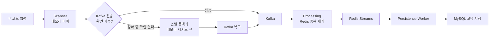

# README 반영 후보 — Kafka 유입 중단 중 입력 보존과 복구

> 상태: `HUMAN CONFIRMED — README INTEGRATION PENDING`
> 이 문서는 루트 `README.md`에 반영할 후보입니다. 실제 README 수정은 별도 승인·동기화 작업으로 수행합니다.

## Kafka 유입 중단 중 입력 보존과 복구

Kafka가 일시적으로 요청을 받을 수 없는 상황에서도 센터의 바코드 입력을 즉시 중단하지 않도록 Scanner에 배치 버퍼와 재시도 경로를 두었습니다.

**설계**

- Scanner는 입력을 메모리 버퍼에 받아 네트워크 전송과 분리합니다.
- Ingest가 제한 시간 안에 Kafka 전송 성공을 확인하지 못하면 Scanner가 실패 항목을 건별 전송으로 전환합니다.
- 건별 전송도 실패하면 Scanner의 메모리 재시도 큐에 보관하고 5초마다 다시 전송합니다.
- 원래 전송과 재시도가 모두 성공해 생기는 중복은 Processing의 Redis 원자적 중복 제거와 MySQL 유니크 제약으로 차단합니다.

Scanner의 HTTP `200`은 메모리 버퍼가 입력을 받아들였다는 의미이며 Kafka 또는 MySQL 저장 완료를 의미하지 않습니다.

**검증**

초당 5건의 입력을 유지하면서 Kafka를 57초 동안 중단했습니다. 정상 구간 300건, Kafka 중단 구간 220건, 복구 이후 300건으로 총 820개의 서로 다른 입력을 발생시켰습니다.

Kafka는 기존 컨테이너와 저장 상태를 유지한 채 다시 시작했고, 애플리케이션이나 Topic·Offset·데이터를 수동으로 조작하지 않은 상태에서 재시도와 후속 처리가 수렴하는지 확인했습니다.



Kafka가 복구되면 기존 전송과 별도 재시도가 함께 성공할 수 있습니다. 따라서 Kafka에 기록된 건수는 논리 입력보다 많아질 수 있으며, 중복 제거와 최종 데이터 대사가 함께 필요합니다.

| 확인 항목 | 결과 |
| :--- | :--- |
| 논리 입력 | 정상 300건 + 장애 중 220건 + 복구 후 300건 = 820건 |
| Kafka 기록 | 1,235건 |
| 재시도로 발생한 전송 중복 | 415건 |
| Redis Streams 고유 이벤트 | 820건 |
| MySQL 고유 저장 | 820건 |
| DLQ·DLT·미처리·미설명 입력 | 모두 0건 |

```text
Kafka records 1,235
= logical events 820
+ retry-induced transport duplicates 415
```

415건은 최종 업무 데이터의 중복이 아니라 전송 결과를 확인하지 못한 상태에서 별도 재시도가 실행돼 발생한 Kafka 전송 중복입니다. Processing이 이를 중복으로 분류했고 Redis Streams와 MySQL은 820개의 고유 데이터로 수렴했습니다.

**운영적 의미**

Kafka 프로세스가 다시 실행됐다는 사실만으로 복구 완료를 판단하지 않았습니다.

```text
Kafka 응답 복구
→ 신규 전송과 소비 재개
→ Scanner 재시도 큐 소진
→ Kafka·Redis 미처리량 수렴
→ 입력 식별자와 MySQL 최종 데이터 대사
```

최종 두 번의 연속 관측에서 Scanner 재시도 잔량, Kafka 소비자 지연, Redis Group Lag와 PEL이 모두 0으로 수렴했고, 생성한 820개 입력과 MySQL의 820개 고유 데이터가 일치했습니다.

**한계**

이번 검증의 Scanner 버퍼와 재시도 큐는 JVM 메모리에만 존재합니다. Scanner 프로세스 또는 로컬 PC가 종료되면 남아 있는 입력이 소실될 수 있고, 재시도 큐가 설정 상한에 도달하면 새 실패 입력을 버릴 수 있습니다.

또한 이 결과는 기존 저장 상태가 유지된 로컬 단일 Kafka 컨테이너의 57초 중단을 검증한 것입니다. 다음 상황까지 보장하지는 않습니다.

- Scanner 프로세스·PC 재시작
- 재시도 큐 포화
- 장시간 Kafka 장애
- Kafka 컨테이너·볼륨 삭제 또는 저장소 손실
- 다중 Broker와 자동 Leader Failover
- Network Partition
- 운영 환경의 SLA, RTO와 RPO
- 모든 장애에서의 Exactly-once 처리

[목차로 돌아가기](#목차)

## README 통합 시 구분할 기존 검증

현재 루트 `README.md`의 `유실 대비`에는 기존 Kafka 중단 검증 결과 `3,657 → 3,657`이 이미 있다. 실제 통합 시 두 결과를 단순 병렬 배치하지 않고 다음 책임을 구분한다.

- 기존 검증: 여러 Pipeline Component 중단 시 최종 유실 여부의 요약
- BIP-FR-001: 활성 입력 중 Kafka 유입 불가, Scanner 재시도, 전송 중복과 종단 간 정합성의 심화 검증

이 절은 통합 작업자를 위한 메모이며 루트 README 본문에는 그대로 포함하지 않는다.
