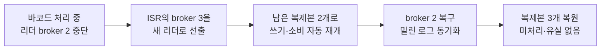

# README 반영 후보 — Kafka leader broker 장애 대응

> 상태: `HUMAN CONFIRMED — README INTEGRATION PENDING`
> 이 문서의 내용 검토는 완료됐다. 루트 `README.md` 반영은 별도 승인·동기화 작업으로 수행한다.

## Kafka 리더 브로커 장애 대비

앞의 Kafka 중단 검증은 브로커 프로세스를 다시 실행한 뒤 디스크 로그에서 처리를 이어 가는 범위였습니다. 여기서 더 나아가, 리더 브로커가 중단돼도 다른 브로커가 처리를 이어 갈 수 있도록 Kafka를 브로커 3대, 파티션별 복제본 3개로 구성했습니다.

**설계**

- 동기화 복제본 집합(ISR)이 2개 이상일 때만 쓰기 성공: `min.insync.replicas=2`, producer `acks=all`
- 최신 데이터가 보장되지 않는 복제본은 새 리더에서 제외
- 브로커 한 대가 중단돼도 애플리케이션은 남은 브로커로 자동 전환

**검증**

바코드가 계속 들어오는 동안 파티션 리더인 broker 2를 강제로 종료했습니다. Kafka는 동기화된 broker 3을 새 리더로 선출했고, 남은 두 복제본으로 쓰기와 후속 처리를 자동 재개했습니다.

리더 장애부터 복제본 복원까지 확인한 흐름입니다.

| 확인 항목 | 결과 |
| :--- | :--- |
| 장애 중 Kafka 처리 | 리더 `2 → 3`, ISR `3 → 2`, 쓰기·소비 자동 재개 |
| 데이터 유실 | 논리 입력 66건 = MySQL 고유 저장 66건 |
| 재전송 중복 | Kafka 기록 75건 중 중복 9건 감지, 최종 중복 저장 0건 |
| 복구 결과 | ISR 3개 복원, 복제 부족·사용 불가 파티션 0개 |

복구 과정에서는 재전송으로 Kafka 기록이 늘어날 수 있으므로, 브로커 복제뿐 아니라 애플리케이션의 중복 제거도 함께 필요합니다. 이번 검증은 단일 리더 브로커 장애에 대한 결과이며, 컨트롤러 장애, 브로커 두 대 이상 동시 장애, 네트워크·디스크 장애와 운영 환경의 복구 시간까지 보장하지는 않습니다.
