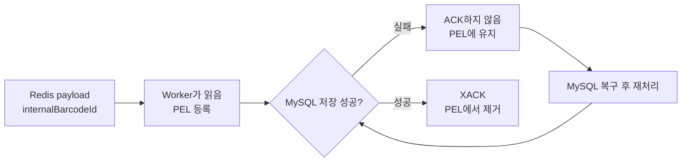

# README 반영 후보 — MySQL 장애 중 저장 대기 데이터 복구

> 상태: `HUMAN REVIEW COMPLETE — BRANCH-ONLY TRIAL ARTIFACT`
> 루트 `README.md`와 `main`에는 반영하지 않는다.

## MySQL 장애 중 저장 대기 데이터 복구

비동기 파이프라인에서 DB가 멈췄을 때 중요한 것은 MySQL 프로세스를 다시 실행하는 데서 끝나지 않습니다. 이미 스캔한 데이터가 어디까지 전달·저장됐는지 확인하고, 저장되지 않은 정확한 데이터부터 처리를 이어 갈 수 있어야 합니다.

Persistence Worker가 Redis Stream에서 읽은 데이터는 MySQL 처리가 끝날 때까지 소비자 그룹의 PEL(Pending Entries List)에 남습니다. DB 조회나 저장이 실패하면 ACK하지 않기 때문에 미완료 데이터가 사라지지 않습니다. MySQL이 복구되면 Worker가 오래된 PEL 항목을 다시 가져와 기존 저장 경로로 처리하고, 저장에 성공한 뒤에만 ACK합니다.



BIP-FR-004에서는 active scan 중 기존 MySQL 컨테이너만 중단했습니다. Worker의 DB 접근은 실패했지만 Kafka·Processing·Redis는 계속 동작했고, ACK되지 않은 Redis entry가 PEL에 최대 252개까지 쌓였습니다. 같은 MySQL 컨테이너와 volume을 복구한 뒤 신규 저장이 먼저 재개됐고, Worker가 기존 pending을 재처리하면서 PEL은 0으로 줄었습니다.

복구 결과는 건수만 비교하지 않고 ID 집합으로 확인했습니다.

| 확인 항목 | 결과 |
| :--- | ---: |
| scanner가 수락한 `scanTime` | 750개 |
| Redis와 MySQL의 `scanTime` 차이 | 0개 |
| Redis와 MySQL의 `internalBarcodeId` | 각각 750개, 양방향 차이 0개 |
| 장애 시점 PEL Record ID | 252개 |
| 위 PEL 252개 중 최종 MySQL에 없는 비즈니스 ID | 0개 |
| 최종 PEL·DLQ·DLT·미설명 ID·상태 충돌 | 모두 0개 |

즉, `750건이 들어와 750건이 저장됐다`는 수량만 확인한 것이 아닙니다. scanner에서 수락한 작업, Redis에 발행된 `internalBarcodeId`, MySQL에 저장된 동일 ID를 대사해 이미 진행한 750개 데이터 전부의 최종 위치를 확인했습니다. 이 실행 범위에서는 다시 스캔하거나 특정 중간 지점부터 재시작할 잔여 데이터가 없습니다.

```text
MySQL 응답 복구
≠ 이전 작업분까지 복구 완료

PEL 0
≠ ID 정합성 확인

입력 ID 집합 = 최종 저장 ID 집합
+ pending·DLQ·DLT·미설명 ID 없음
= 복구 완료
```

Repository의 현재 Workflow Outcome 표기는 `PARTIALLY_REPRODUCED`입니다. 원래 검증 계약이 동일 Redis Record ID의 `DB failure → PEL → XCLAIM → persistence → XACK` 전부를 하나의 직접 trace로 연결하도록 요구했지만, Worker log에는 claim·ACK 수량만 있고 각 Record ID의 전체 전이가 남지 않았기 때문입니다. 이는 Redis 전달 제어의 세부 추적 제한이며, 750개 비즈니스 데이터의 최종 저장이 일부만 확인됐다는 뜻은 아닙니다.

이번 결과는 저장 volume을 유지한 로컬 MySQL 컨테이너의 일시 중단에 한정됩니다. volume 손실·손상, storage full, 장시간 장애, 복합 장애와 production SLA·RTO·RPO를 검증한 결과는 아닙니다.

상세 Evidence와 검증 경계는 [BIP-FR-004 기술 보고서](docs/operational-validation/failure-reproduction/BIP-FR-004-mysql-persistence-unavailable/TECHNICAL-REPORT.md)에서 확인할 수 있습니다.
