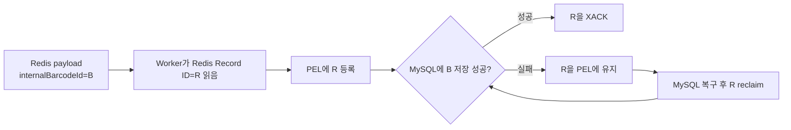

# BIP-FR-004 장애 시나리오 설명

> 상태: `HUMAN REVIEW COMPLETE`
> 대상: MySQL 장애 중 이미 진행한 데이터가 어디에 남고, 복구 후 어디서 처리를 이어 가는지 이해하려는 개발자

## 먼저 이해할 한 문장

MySQL 장애 대응의 핵심은 PEL과 DB row의 숫자가 우연히 맞는지 보는 것이 아니라, 이미 수락한 각 논리 데이터가 Redis·PEL·MySQL·DLQ 중 어디에 있고 복구 후 어디로 귀속됐는지 확인하는 것이다.

```text
장애 원인 확인
+
각 ID의 현재 위치 확인
+
미완료 ID의 재처리
+
최종 ID 집합 대사
= 복구 완료
```

## 데이터가 이동하는 경로

```text
Scanner
→ Ingest
→ Kafka
→ Processing: internalBarcodeId 채번
→ Redis Stream
→ Persistence Worker
→ MySQL
```

이 경로에는 서로 다른 책임의 ID가 있다.

| ID | 답하는 질문 |
|---|---|
| `scanTime + deviceId` | scanner가 수락한 작업이 downstream까지 도달했는가? |
| `internalBarcodeId` | Redis에 발행된 비즈니스 레코드와 MySQL 저장 행이 같은가? |
| Redis Record ID | 어떤 Stream entry가 어느 consumer의 PEL에 있고 claim·ACK됐는가? |

`internalBarcodeId`는 Processing Service가 생성한 뒤 Redis payload에 실리고 MySQL의 `internal_barcode_id`로 그대로 저장된다. 따라서 Redis 이후의 비즈니스 데이터 대사는 이 ID가 가장 직접적이다.

Redis Record ID는 `XADD` 시 Redis가 생성하는 전달 계층 식별자다. PEL, `XCLAIM`, `XACK`는 이 ID를 사용하지만, 물류 데이터의 비즈니스 ID는 아니다.

## 장애가 발생하면 데이터는 어디에 있는가

Worker가 Redis Stream entry를 읽으면 해당 Redis Record ID가 PEL(Pending Entries List)에 등록된다. MySQL 처리가 성공한 뒤 `XACK`해야 PEL에서 빠진다.



MySQL 장애 시 PEL에 있는 레코드는 “유실된 데이터”가 아니다. Redis가 아직 완료되지 않은 전달 책임을 보유한 데이터다.

그러나 PEL에 있다는 사실만으로 DB 미저장을 확정할 수도 없다. DB commit 뒤 ACK 전에 장애가 생긴 레코드는 PEL과 MySQL 양쪽에 잠시 존재할 수 있다. 그래서 PEL payload의 `internalBarcodeId`와 MySQL을 직접 대사해야 한다.

| PEL의 ID | MySQL의 같은 `internalBarcodeId` | 판단 |
|---|---|---|
| 있음 | 없음 | Redis에 보존된 미저장 작업; 이 ID부터 재처리 |
| 있음 | 있음 | 저장됐지만 ACK 전이거나 재처리 중; idempotent 처리 후 ACK 필요 |
| 없음 | 있음 | 저장 완료 후보; 전체 집합 대사로 확정 |
| 없음 | 없음 | MySQL 장애만으로 설명되지 않음; 앞 경계를 추적 |

## Group Lag, PEL과 DB row 수가 각각 말하는 것

| 값 | 의미 | 단독으로 알 수 없는 것 |
|---|---|---|
| Group Lag | 소비자 그룹에 아직 전달되지 않은 Stream entry 수 | DB 저장 완료 여부 |
| PEL 수 | 전달됐지만 ACK되지 않은 entry 수 | 정확히 어떤 비즈니스 ID가 미저장인지 |
| MySQL row 수 | 조회 범위에 저장된 행 수 | 기대한 ID가 빠지고 다른 ID가 섞였는지 |

따라서 다음 세 문장은 모두 성립한다.

```text
Group Lag 0 ≠ 처리 완료
PEL 0 ≠ 데이터 정합성 확인
기대 건수 = DB row 수 ≠ ID 집합 일치
```

건수는 진행 상황을 빠르게 보는 요약 지표다. 복구 완료는 ID 집합으로 판단한다.

## FR-004에서 실제로 발생한 일

초당 약 5건의 입력이 계속되는 동안 기존 MySQL 컨테이너만 중단했다.

```text
active traffic 유지
→ MySQL unavailable
→ Worker의 DB 접근 실패
→ 성공 처리되지 않은 Redis Record ID가 PEL에 남음
→ PEL 최대 252
```

Kafka, Processing과 Redis는 계속 동작했다. 따라서 Processing에서 채번한 `internalBarcodeId`가 Redis Stream에 계속 들어왔고, MySQL 경계에서 처리가 밀렸다.

같은 MySQL 컨테이너와 volume을 다시 시작하자 신규 저장이 먼저 회복됐다. 하지만 기존 pending은 5분 idle 조건과 scheduler 주기를 기다려야 했다.

```text
MySQL readiness 회복
→ 새 데이터 저장 재개
→ 기존 PEL 132건은 아직 남음
→ application scheduler가 explicit Redis Record ID reclaim
→ 기존 persistence path로 재처리
→ 저장 성공 뒤 XACK
→ PEL 0
```

따라서 MySQL health가 돌아온 시점은 dependency recovery이고, 이전 작업분까지 모두 처리된 시점은 그보다 뒤다.

## 실제 ID 집합 대사

주 실행 `BIP-FR-004-MR-20260908T055225Z`의 Evidence를 집합으로 다시 대사한 결과다.

| 집합 | 결과 |
|---|---:|
| scanner accepted `scanTime` | 750개, 모두 고유 |
| Redis payload `scanTime` | 750개, accepted와 차이 0 |
| MySQL `scanTime` | 750개, accepted와 차이 0 |
| Redis `internalBarcodeId` | 750개, 모두 고유 |
| MySQL `internalBarcodeId` | 750개, 모두 고유 |
| Redis ID − MySQL ID | 0개 |
| MySQL ID − Redis ID | 0개 |
| outage PEL Redis Record ID | 252개, 모두 고유 |
| 위 252개가 가리킨 `internalBarcodeId` | 252개, 모두 고유 |
| 위 252개 중 최종 MySQL에 없는 ID | 0개 |
| 최종 PEL / DLQ / DLT / unaccounted / conflict | 모두 0 |

즉, 이 실행에서 확인된 최종 상태는 단순히 `750건 = 750건`이 아니다.

```text
Accepted scan identity set
= Redis scan identity set
= MySQL scan identity set

Redis internalBarcodeId set
= MySQL internalBarcodeId set

Outage PEL이 가리킨 business identity set
⊆ Final MySQL identity set
```

이미 진행한 데이터 750개 전부의 최종 위치를 설명할 수 있으므로, 이 bounded run에서는 다시 스캔하거나 임의의 중간 지점부터 재시작할 필요가 없다.

## 어디서부터 다시 시작할 것인가

실제 장애에서는 ID 집합의 차이가 재개 지점을 결정한다.

```text
accepted에는 있으나 Redis에 없음
→ Scanner/Ingest/Kafka/Processing 구간 조사

Redis에는 있으나 MySQL에 없음
→ Redis payload가 재처리 시작점

PEL과 MySQL 양쪽에 있음
→ 이미 저장됐을 수 있으므로 새 입력 생성 대신 idempotent 재처리

MySQL에 있고 최종 PEL에서 사라짐
→ 완료된 작업으로 귀속
```

이 판단이 있어야 현장에 “전체 재스캔”, “특정 ID만 재처리”, “기존 입력 재실행 불필요” 중 무엇을 알려야 하는지 결정할 수 있다.

## Canonical Outcome과 Evidence 제한

Repository의 현재 Workflow Outcome은 `PARTIALLY_REPRODUCED`다. RC-R2가 동일 Redis Record ID 하나의 다음 전체 전이를 직접 연결하도록 요구했기 때문이다.

```text
DB failure
→ no XACK
→ PEL retention
→ explicit-ID XCLAIM
→ persistence
→ XACK
```

Worker log에는 claim·ack 수량이 남았지만 각 Redis Record ID와 `internalBarcodeId`를 모든 단계에서 함께 기록하지 않았다. 따라서 이 전달 제어 사슬의 per-record traceability는 부분적이다.

이 제한은 다음처럼 좁게 해석한다.

- 비즈니스 데이터 750개의 최종 귀속과 무손실 수렴은 ID 집합으로 직접 확인됐다.
- 개별 Redis Record ID의 모든 ownership·ACK 전이는 한 trace로 확인되지 않았다.
- 단일 scanner 유입 경로를 사용한 통제된 로컬 실행 밖의 production 일반 보장은 아니다.

`PARTIALLY_REPRODUCED`는 데이터가 일부만 저장됐다는 뜻이 아니다.

## 검증하지 않은 범위

- MySQL volume 손실·손상, storage full과 schema corruption
- Kafka·Redis·Worker와 MySQL의 복합 장애
- 장시간 장애와 production capacity·SLA·RTO·RPO
- 일반적인 exactly-once 또는 duplicate-free 보장
- 다른 topology·version·workload에서의 동일 결과

## 관련 자료

- [R2 Reproduction Contract](./REPRODUCTION-CONTRACT-R2.md)
- [Reproduction Record](./REPRODUCTION-RECORD.md)
- [Outage PEL](./evidence/BIP-FR-004-MR-20260908T055225Z/05-redis/outage-pending.txt)
- [Redis cohort](./evidence/BIP-FR-004-MR-20260908T055225Z/08-reconciliation/redis-cohort.json)
- [MySQL final cohort](./evidence/BIP-FR-004-MR-20260908T055225Z/06-mysql/final-cohort.tsv)
