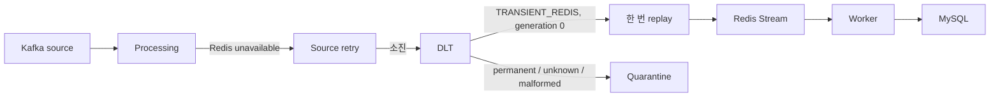

# README 반영 후보 — Redis Streams handoff 장애와 제한된 재처리

> 문서 상태: `HUMAN CONFIRMED — README INTEGRATION PENDING`
>
> 이 문서는 현재 `main`의 짧은 설명·설계·검증·한계 문체에 맞춘 통합 후보입니다. root `README.md`는 수정하지 않았습니다.

## Redis Streams handoff 장애와 제한된 재처리

Kafka의 바코드 이벤트를 소비한 뒤 Redis Streams로 넘기는 구간에서 Redis를 사용할 수 없게 되면, Processing은 원본 Kafka record를 재시도합니다. 재시도를 소진한 record는 사라지는 대신 `barcode-events-dlt`로 이동해 다음 처리 책임을 보존합니다.

검증 Run `BIP-FR-005-MR-20260915T031000Z`에서는 transient C1이 Redis command timeout 뒤 4회 delivery를 거쳐 `TRANSIENT_REDIS` DLT로 이동했습니다. Redis 복구 뒤 replay count를 `0 → 1`로 올려 한 번만 재처리했고 Redis Stream과 MySQL까지 완료했습니다. 영구 validation 오류 C2는 `PERMANENT_VALIDATION`으로 분류해 replay하지 않고 quarantine으로 종결했습니다.

복구 완료는 Redis `PONG`이나 총건수만으로 선언하지 않았습니다. 각 run-scoped identity가 source, DLT, quarantine, Redis, Worker DLQ와 MySQL 중 어디에 있는지 대조했고, C0·C1·C3은 MySQL에 저장되고 C2는 quarantine terminal state로 귀속됐으며 설명되지 않은 identity는 0이었습니다.

| 검증 항목 | 결과 |
| :--- | :--- |
| Redis handoff failure와 source retry 소진 | C1 `QueryTimeoutException`, DLT `TRANSIENT_REDIS` |
| 제한된 재처리 | C1 replay count `0 → 1`, 추가 DLT 없음 |
| 영구 실패 격리 | C2 `PERMANENT_VALIDATION`, quarantine terminal |
| 최종 처리 | C0·C1·C3 Redis/MySQL 완료, C2 quarantine |
| 최종 backlog | source/DLT lag 0, Redis group lag 0, PEL 0 |
| Outcome | `REPRODUCED / VERIFIED` |

Kafka output publish와 DLT offset commit은 하나의 transaction이 아니므로, publish 성공 뒤 commit 전에 실패하면 같은 generation의 output이 중복될 수 있습니다. 따라서 이 결과는 exactly-once replay를 보장하지 않습니다. 또한 작은 C0–C3 cohort의 로컬 실행이며 production 규모·장시간 안정성, malformed/replay-exhausted 경로의 Material Run 결과로 일반화하지 않습니다.

상세 계약, Evidence와 identity reconciliation은 [BIP-FR-005 Reproduction Record](./REPRODUCTION-RECORD.md)에서 확인할 수 있습니다.
